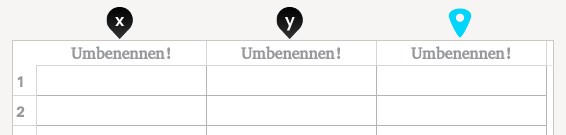

# Hilfe: Dateneingabe-Fenster

## Übersicht

[**Go to english version **](data_help_en.html)

 

Der wichtigste Bereich des Dateneingabe-Fensters ist die Datentabelle mit den ** Daten-Pins** am oberen Rand, die sich mit der Maus verschieben lassen.
Diese Pins spielen eine wichtige Rolle bei der Eingabe und der Visualisierung der Daten.

### Schwarze Pins 

  kennzeichnet die Spalte mit den Werten für die X-Achse. Entsprechendes gilt für  (Y-Achse) bzw. für  und  bei der Verwendung von Polarkoordinaten.

### Auswahl-Pin 

Der Auswahl-Pin lässt sich am oberen Rand auf oder zwischen den Spalten platzieren, ebenso am linken Rand auf einer Zeile oder zwischen zwei Zeilen. Er ermöglicht folgende Aktionen:

* **Auf Spalten:** [Füllen, Sortieren, Löschen](#ColumnActions) der markierten Spalte oder das Einfügen einer neuen Spalte, wenn er zwischen zwei Spalten platziert wird.
* **Auf Zeilen:** Löschen der markierten Zeile oder das Einfügen einer neue Zeile, wenn er zwischen zwei Zeilen platziert wird.

    

### Ausgleichskurven (Regressionsanalyse)

ZeGrapher kann Ausgleichskurven nach der Methode der kleinsten Quadrate berechnen: Die Ausgleichskurve kann entweder anhand der Datenpunkte selbst oder anhand der Abschnitte zwischen zwei benachbarten Datenpunkt berechnet werden.

**Anmerkung:** In dieser Version ist nur die Berechnung von einfachen polynomialen Ausgleichskurven möglich.

## Praktische Anwendung

### <a id=ColumnActions> Spalte bearbeiten</a>

Wenn der Auswahl-Pin  auf einer Spalte positioniert wird, sind folgende Aktionen möglich.

 

#### Umbenennen

Nach Doppelklick auf den Spaltennamen (initial "Umbenennen!") erscheint ein Dialog, in dem ein neuer Name eingegeben werden kann.

**Anmerkung:** In Spaltennamen sind nur Buchstaben und Unterstriche erlaubt.

#### Sortieren

Damit können die Werte in der Spalte sortiert werden. Wahlweise kann nur die ausgewähle Spalte oder die ganze Tabelle anhand der ausgewählten Spalte sortiert werden.

#### Füllen

Die Werte in der ausgewählte Spalte können entweder anhand einer Formel berechnet oder automatisch erzeugt werden.

 

##### 1. Berechnung ahand eines Ausdrucks

_Die in den Zellen enthaltenen Werte werden anhand des angegebenen Ausdrucks berechnet._

Zur Berechnung der Zellwerte können Werte aus einer anderen Spalte verwendet werden. Dazu muss der Spaltenname als Variable verwendet werden.

  > __Beispiel:__ x' = 2 * Volumen (Volumen ist in diesem Fall der Name einer anderen Spalte) 
  > Auf diese Weise lassen sich auch die Zellwerte einer Spalte in eine andere Spalte kopieren.

Wenn die ausgewählte Spalte bereits Werte enthält, so lassen sich diese auch selbst im Ausdruck verwenden, indem sie mit "x" oder dem eigenen Spaltennamen referenziert werden.

  > __Beispiel:__ x' = cos(x)  
  > Der Zellinhalt wird durch den Kosinus des Ursprungswertes ersetzt.

Alle gängigen Funktionen (die auf der virtuellen Tastatur) können im Ausdruck verwendet werden, ebenso eingegebene Funktionen (f,g,h... usw.).

##### 2. Automatisch befüllen

Die Spalte wird automatisch befüllt, ausgehend vom angegebenen Startwert, der bis zum Erreichen des Endwertes um das angegebene Intervall erhöht wird.

### Ausgleichskurven

_In dieser Version ist nur die Berechnung von einfachen polynomialen Ausgleichskurven möglich._

Die Ausgleichskurve nähert sich den Punkten in den mit  und  (bzw.  und ) markierten Spalten an.
Werden die Pins auf andere Spalten verschoben oder Werte in den ausgewählten Spalten hinzugefügt, so wird die Ausgleichskurve automatisch angepasst.

#### Regressionsanalyse

Der Polynomgrad der Ausgleichskurve kann ausgewählt werden, ebenso der Darstellungsbereich und die Kurvenfarbe. Die Koeffizienten der Ausgleichskurve werden im gleichnamigen Reiter angezeigt.

### Feedback

Haben Sie einen Fehler gefunden oder einen Vorschlag zur Verbesserung von ZeGrapher? Eine Mail an [contact@zegrapher.com](mailto:contact@zegrapher.com) ist jederzeit willkommen!
