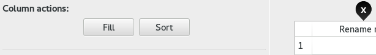
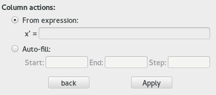

# Help: Data window

## Overview

 

The main widget in the window is the data table, hovered by **mouse draggable pins**.
These pins play an important role for the input and visualization.

### Black pins 

  points to the colunm that contains abscissa values. The same idea applies for , or  and  with polar coordinates. Moving these pins over the wanted columns automatically updates the graph with the new chosen points.

### Selection pin 

Once placed on top of a column or in the left side of a row, this pin gives the ability to execute several actions on them:

* **On columns:** [fill, sort, delete](#ColumnActions) or insert a new column if placed between two columns.
* **On lines:** delete or insert a new line if placed between two lines.

    

### Curve fitting

Fitting curves can be calculated by ZeGrapher with the linear least squares method: the curve can approach the data points or the piecewise linear function made by connecting them.

**Note:** in this version, only polynomial regression is available.

## Practical use

### <a id=ColumnActions> Column actions</a>

When the selector pin  is dragged over a column, several actions can be made on it.

 

#### Rename

To rename a column, double click on its header (where "Rename me!" is written at first show). A dialog will then appear to ask for a new name.

**Note:** Only letters and underscores are permitted.

#### Sort

The values of the column can be sorted. When the values of two cells need to be switched, you can chose to exchange the entire rows or only the cells.

#### Fill

Two filling methods are available: from an expression or an automatic fill.

 

##### 1. From an expression

_The entered expression will be applied to each of the selected column's cells._

Values from the same row, in other columns, can be used in the expression: you can refer to them by using their column's name as a variable.

  > __Example:__ x' = 2 * volume (volume here is the name of another column) 
  > You can copy a column into another this way.

If the selected column has already values in it, its values can be used in the expression: you can refer to them by either "x" or the column's name.

  > __Example:__ x' = cos(x)  
  > For each cell: replace the value by its cosine

All the common functions (present on the virtual keyboard) can be used in the expression, and also the plotted functions (f,g,h... etc).

##### 2. Auto-fill

You need to enter a start value, an end value and a step. The column will then be filled automatically.

### Curve fitting

_In the current version, only the polynomial fit is available._

After adding a fitting curve, its will approach the values contained in the columns pointed by and  (or  and ). If the pins are moved to other columns, or new values are added in the columns, the fitting curve updates itself automatically.

#### Polynomial regression

The polynomial's degree can be chosen. But also its plotting interval and its color. The values of its coefficients are displayed in "Values" tab.

### Feedback

Did you encounter a bug ? You have ideas to improve ZeGrapher ? Something else ? A mail talking about it to [contact@zegrapher.com](mailto:contact@zegrapher.com) is always welcome !
