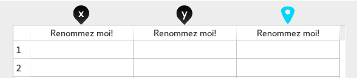
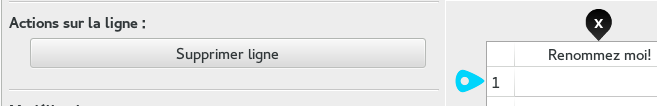
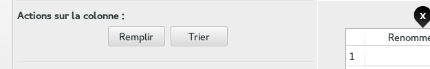
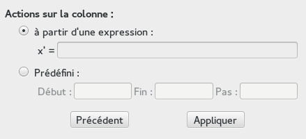
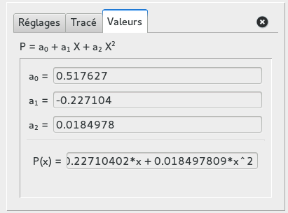

# Aide: fenêtre de saisie de données

## Présentation générale

[**Go to english version **](data_help_en.html)

   
La fenêtre de saisie de données présente comme élément centrale le tableau de données,
au dessus duquel sont présents des "pins", **déplaplaçables à la souris**, qui jouent un rôle important dans la saisie et la visualisation des données.

### Pins noirs 

 Le pin  permet de définir la colonne représentant les abscisses des points à afficher. De même pour  pour les ordonnées, ou bien  et  pour les coordonnées polaires. Il suffit alors de les positionner au-dessus des colonnes voulues pour que le logiciel affiche automatiquement les points les points en question.

###  Pin de sélection 

Le pin  permet de choisir un endroit du tableau où effectuer des actions:  

* **Sur les colonnes:** donne la possibilité de [remplir, trier ou supprimer une colonne.](#ColumnActions) Ou bien insérer une nouvelle colonne si placé entre deux colonnes.
* **Sur les lignes:** donne la possibilité de supprimer une ligne ou d'en insérer, si placé entre deux lignes.

    

### Modélisations

Un module de calcul de régressions est disponible, qui calculera la fonction qui approche le mieux les points saisis par l'utilisateur au sens des moindres carrés.  
**Note:** dans cette version, seule la régression polynomiale est disponible.

## Précisions pour l'utilisation pratique

### <a id=ColumnActions> Opérations sur une colonne</a>

 

#### Renommer

Pour renommer une colonne, il suffit de double-cliquer sur son entête (sur laquelle est écrite "Renommez moi!" à la première ouverture de la fenêtre).  
**Note:** Sont permis pour les noms de colonne que les lettres et les "\_"

#### Trier

Les valeurs d'une colonne pointée par  peuvent être triées. Lors de l'échange de valeurs entre deux cellules, il possible de choisir de permuter les lignes entières ou bien uniquement les cellules concernées.

#### Remplir

Pour ce faire, il faudra sélectionner la colonne voulue avec le pin sélecteur 

Deux méthodes de remplissage de la colonne sont proposées: à partir d'une expression ou prédéfini.

 

##### 1. À partir d'une expression

_Cette expression sera appliquée à la colonne cellule par cellule._

Il est possible d'utiliser les valeurs des cellules à la même ligne des autres colonnes, en utilisant leur nom comme variable.

  > __exemple:__ x' = 2 * volume (volume étant le nom d'une autre colonne, déjà remplie) 
  > Il est ainsi possible de copier une colonne dans une autre de cette manière.

Si la colonne à remplir est déjà remplie, ses valeurs peuvent être utilisées dans l'expression en y référant par "x" ou par le nom de la colonne qui va être remplie.

  > __exemple:__ x' = cos(x)  
  > Pour chaque cellule, remplacer sa valeur initiale par son cosinus

Toutes les fonctions usuelles (présentes dans le clavier virtuel) peuvent être utilisées. Dont les fonctions définies par l'utilisateur.

##### 2. Prédéfini

Il faudra alors saisir une valeur de départ, de fin et un pas. Et le logiciel remplira la colonne en respectant cette entrée.

### Modélisation

_Dans la version 3.0 de ZeGrapher, seule la régression polynomiale au sens des moindres carrés est proposée._

Toute régression ajoutée approche les colonnes selectionnées par les pins  et  (ou  et ). Si ceux-ci sont déplacés sur d'autres colonnes, ou que des valeurs sont ajoutées/modifées dans les colonnes, la regression se mettra à jour automatiquement

#### Régression polynomiale

Il est possible de choisir le degré du polynôme, l'intervalle sur lequel il sera graphiquement représenté, sa couleur. Et surtout, les valeurs des coefficients du polynôme sont affichés dans l'onglet "Valeurs".

### Feedback

Vous avez rencontré des bugs ? Vous avez des suggestions ? d'autres requêtes ? Un mail en parlant à [contact@zegrapher.com](mailto:contact@zegrapher.com) est le bienvenu !
