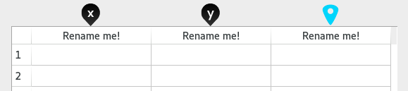
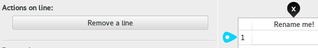
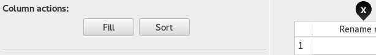
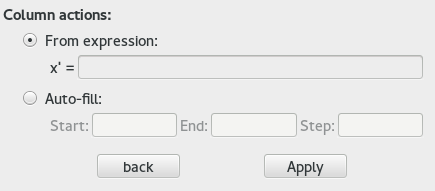
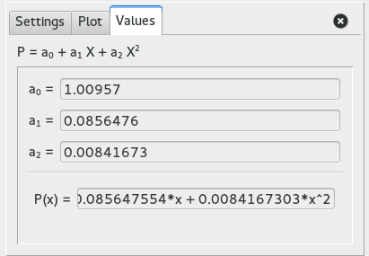

# 說明: 資料視窗

## 總覽

 

視窗中的主要單元是一個資料表格，由**滑鼠拖曳圖釘**浮游。這些圖釘在輸入與視覺化上擔任重要功能。

### 黑色圖釘 

 在橫軸上  點包含橫坐標數值。相同概念適用於或極座標中的  和 ，當把圖釘移至新的欄位上後會自動更新對應圖形。

### 已選圖釘 

當放置於橫軸上側或縱軸左側時，此圖釘便可執行數個操作:

* **於橫軸:** [填充, 排序, 刪除](#ColumnActions) 或若放置於兩欄之間就插入新欄。
* **於縱軸:** 刪除或若置於在兩行之間就插入新行。

    

### 曲線擬合 (Curve fitting)

透過ZeGrapher以最小平方法(Least squares)計算曲線擬合: 曲線可以用逼近資料點或分段線性函式(Piecewise linear function)連接而成。

**備註:** 在目前版本中只能使用多項式回歸(Polynomial regression)。

## 實際用途

### <a id=ColumnActions> 欄位動作</a>

選取的圖釘  拖進一個欄位時，有數個操作可以執行。

 

#### 更名

當要替欄位更名時，在它的標題上連點(標示"重新命名!"的最開頭)，會跳出一個對話框要求輸入新名稱。

**備註:** 只允許字母與底線。

#### 排序

欄位的數值可以被排序。而當需要交換兩個格內的數值時，你可以選擇要專換整行或是僅單格。

#### 填充

**有兩種填充模式可以使用:** 以表達式或是自動填充。

 

##### 1. 以表達式填寫

_輸入的表達式會套用在選取欄位的每一個格子。_

同一行的其他欄的數值可以使用在表達式中: 可以用欄位名稱為變數來引用它們。

  > __範例:__ x' = 2 * volume (volume 在此是其他欄位的標題) 
  > 你可以用這方法將欄位複製到其它。

如果選擇欄位中已有數值，其值可以被用在表達式中: 你可以用"x"或欄位名來引用它們。

  > __範例:__ x' = cos(x)  
  > 對所有格子: 以其COS值取代之。

所有常用函式(存在於虛擬鍵盤中的)都可用在表達式中，以及已繪製函式(f,g,h... 等)。

##### 2. 自動填寫

你需要輸入一個起始值`結束值和間隔，這整欄會自動被填充。

### 曲線擬合 (Curve fitting)

_在目前版本中只能使用多項式回歸(Polynomial regression)。_

在新增一個擬合曲線後，會以欄中[針 x](Xpin.png) 和  (或  和 )來逼近整欄包含數值。
如果圖釘移到其他欄未或欄位中增加新數值，擬合曲線會自動更新。

#### 多項式回歸(Polynomial regression)

可以選擇多項式的度數，以及其繪製間隔與顏色，這些係數的值都顯示在"數值"頁籤中。

### 意見回饋

你有遇到BUG嗎? 你有點子可以改進ZeGrapher嗎? 或是其他? 歡迎來信[contact@zegrapher.com](mailto:contact@zegrapher.com)永遠歡迎!