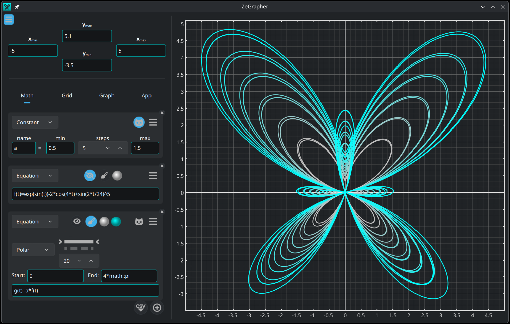

ZeGrapher is a free, open source and easy to use software for plotting mathematical objects. It can plot functions, sequences, parametric equations and data on the 2D plane.

**Official website:** [https://zegrapher.com/](https://zegrapher.com/)

------------------------------------

### Features

- Visualize functions by giving their "natural" equations (e.g. `f(x) = 2+cos(x)`)
  - All the standard mathematical functions (`cos` `cosh` `exp` ...etc) can be used.
  - Any user defined function can be used.
- Visualize numerical sequences through specific equations
  - Defined by giving a list of expressions separated with `,` or `;`
    - The last expression is the "generic" expression that is used for any other index that the first values.
    - If more than one expression is provided, the first expressions are considered as the first values of the sequence
  - Example: Fibonacci sequence `u(n) = 0 ; 1 ; u(n-2) + u(n-2)`
    - First values: `0`, `1`
    - Generic expression: `u(n-2) + u(n-1)`
- Can define "global constants", i.e. a variable that has an explicit numeric value without depending on any other object
  - Example `pi = 3.14`
  - Can be used for parametric plots of functions, sequences and parametric equations.
  - Can be made into "Schrodinger Constants" (Schrodinger cat icon): take many values at once and all dependent math objects will be plotted simultaneously for each value taken
- Can define "global variables", i.e. a function without input variables that can arbitrarily depend on other objects.
- Plotting of 2D data
  - Data can be imported from/exported to a CSV file.
    - Tested with CSV files with millions of cells
  - Excel-style table editing
    - Insert / (bulk) delete of rows
- Extensive tools for exports that look identical to the graph being previewed
  - Scalable (`svg`, `pdf`) and image (`png`, `jpeg`, `bmp` and `ppm`) formats
- Navigate on the graph
  - Select a curve to display the coordinates of its points.
  - Zoom/un-zoom
    - Globally using the scroll wheel
    - On each axis separately using CTRL + vertical/horizontal scroll
      - CTRL + SHIFT swaps vertical/horizontal scroll so regular (vertical) scroll can zoom the x axis only.
  - Move the graph.
- Customization
  - Change the grid ticks to be multiples of a given expression
    - e.g. multiples of `π`
  - Change colors: axes, background, functions...
  - Adjust the plotting precision (affects rendering speed);
  - Independent X/Y grid and sub-grid settings
    - Show / hide
    - Define number of subdivisions
  - Plot the graph on an orthonormal basis.
  - Set custom graph size
    - In _real_ centimeters: can be measured on-screen and in exported vector medium (PDF and SVG)
    - In pixels
  - A global scaling factor to change how big everything is

------------------------------------------

### Download

ZeGrapher is available in the official repositories of Debian, Fedora, Ubuntu, FreeBSD. In the Archlinux (AUR). An [AppImage](https://appimage.org/) is otherwise available, along with Windows and Mac versions in Zegrapher's [Github releases page](https://github.com/AdelKS/ZeGrapher/releases) or at [zegrapher.com](https://zegrapher.com/).

### Compile from sources

To compile from sources, ZeGrapher needs the following tools and libraries:

- C++ compiler: [clang](https://clang.llvm.org/) or [gcc](https://gcc.gnu.org/)
- [Qt](https://www.qt.io)
- [meson](mesonbuild.com)
- [glaze](https://github.com/stephenberry/glaze)

To build

```shell
meson setup build
cd build
meson compile
cd ..
```

This creates the `ZeGrapher` executable in `build/src/ZeGrapher` that you can directly run.

#### Packaging

- Linux
  - `meson install` should now be fully XDG compliant. Issues and/PRs welcome if something is missing.
  - Use [deploy/linux-bundle-appimage.sh](./deploy/linux-bundle-appimage.sh) to create an [AppImage](https://appimage.org/).
- macOS
  - Use [deploy/macos-bundle-dmg.sh](deploy/macos-bundle-dmg.sh) to create an installer.
- Windows
  - Use [deploy/windows-bundle-7z.sh](deploy/windows-bundle-7z.sh) (requires to be run from an [MSYS2](https://www.msys2.org/) terminal)
