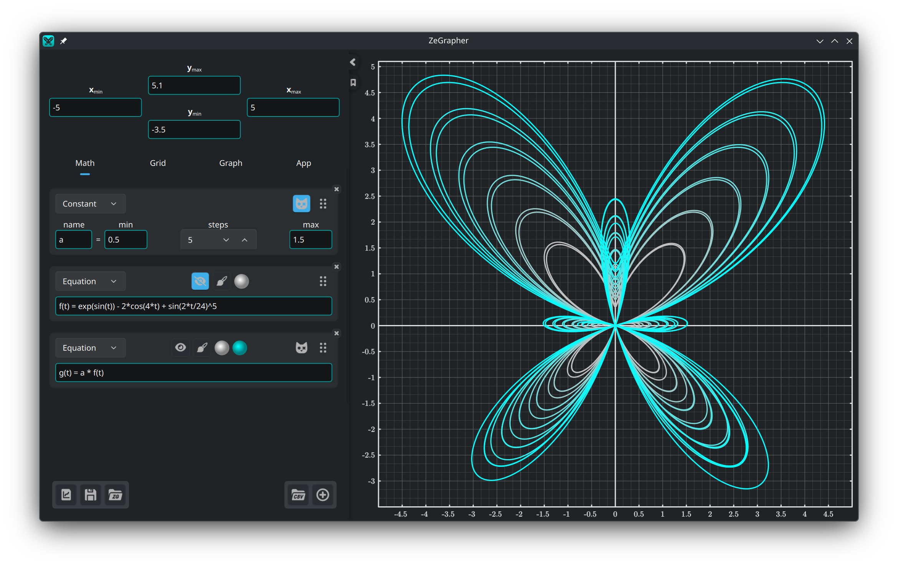

<h1>
  
  ZeGrapher
</h1>




ZeGrapher is a free, open source and easy to use software for plotting mathematical objects. It can plot functions, sequences, parametric equations and data on the 2D plane.

**Official website:** [https://zegrapher.com/](https://zegrapher.com/)

### Features

ZeGrapher plots functions, sequences, parametric equations and data. Objects
can share constants and variables. It imports and exports CSV, and it exports
the graph as an image or a vector file, identical to what you see on screen.

For more information, see [the feature list](./website/content/en/2-features.md) and
[the user documentation](./website/content/en/4-documentation.md).

### Translations

ZeGrapher and its website are translated into several languages:

- The app: one `.ts` file per language in [`translations/`](./translations).
  Open it with [Qt Linguist](https://doc.qt.io/qt-6/qtlinguist-index.html), or
  edit the XML by hand.
- The website: one folder per language under
  [`website/content/`](./website/content).
  [`website/README.md`](./website/README.md) says how to add one.

Corrections and new languages are welcome.


### Download

ZeGrapher is available in the official repositories of Debian, Fedora, Ubuntu, FreeBSD. In the Archlinux (AUR). An [AppImage](https://appimage.org/) is otherwise available, along with Windows and Mac versions in Zegrapher's [Github releases page](https://github.com/AdelKS/ZeGrapher/releases) or at [zegrapher.com](https://zegrapher.com/).

### Compile from sources

To compile from sources, ZeGrapher needs the following tools and libraries:

- C++ compiler: [clang](https://clang.llvm.org/) or [gcc](https://gcc.gnu.org/)
- [Qt](https://www.qt.io)
- [meson](mesonbuild.com)
- [glaze](https://github.com/stephenberry/glaze)

To build

```shell
meson setup build
cd build
meson compile
cd ..
```

This creates the `ZeGrapher` executable in `build/src/ZeGrapher` that you can directly run.

#### Packaging

- Linux
  - `meson install` should now be fully XDG compliant. Issues and/PRs welcome if something is missing.
  - Use [deploy/linux-bundle-appimage.sh](./deploy/linux-bundle-appimage.sh) to create an [AppImage](https://appimage.org/).
- macOS
  - Use [deploy/macos-bundle-dmg.sh](deploy/macos-bundle-dmg.sh) to create an installer.
- Windows
  - Use [deploy/windows-bundle-7z.sh](deploy/windows-bundle-7z.sh) (requires to be run from an [MSYS2](https://www.msys2.org/) terminal)

------------------------------------

### Licensing

ZeGrapher is licensed under the [GNU Affero General Public License v3](./LICENSE) or later.

The unmodified bundled [Latin Modern Math font](./fonts/latinmodern-math.otf), is (re)distributed under the [GUST font license](./fonts/latinmodern-math-license.txt)
