# Handbuch

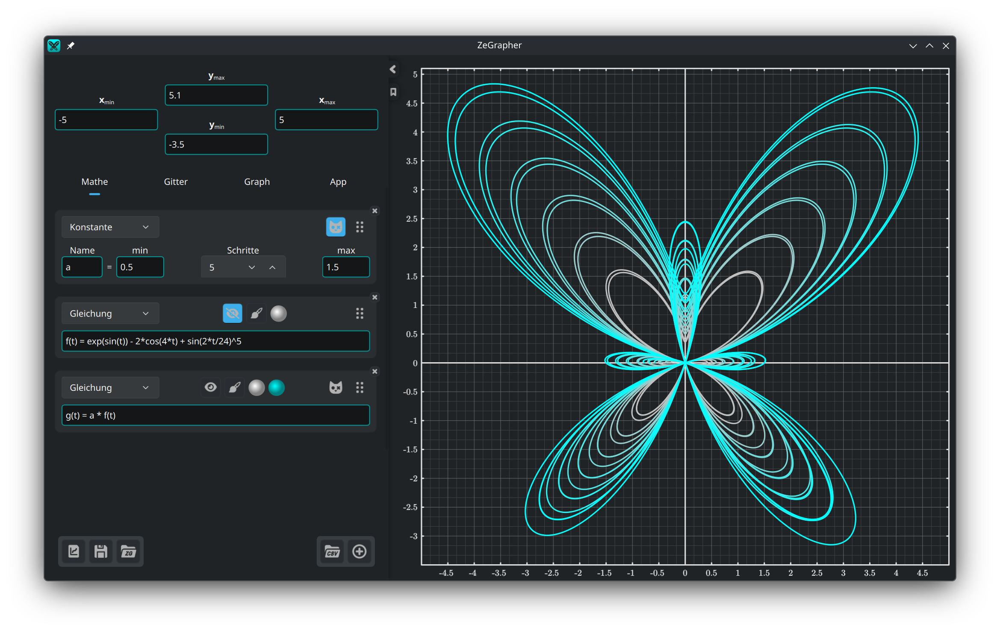

- [1. Der Graph](#1-der-graph)
  - [1.1. Verschieben und zoomen](#11-verschieben-und-zoomen)
- [2. Die Eingabeleiste](#2-die-eingabeleiste)
  - [2.1. Grenzen der Ansicht](#21-grenzen-der-ansicht)
  - [2.2. Dateien](#22-dateien)
- [3. Der Reiter Mathe](#3-der-reiter-mathe)
  - [3.1. Ein Objekt hinzufügen](#31-ein-objekt-hinzufügen)
  - [3.2. Funktionen und Folgen](#32-funktionen-und-folgen)
  - [3.3. Konstanten](#33-konstanten)
    - [3.3.1. Animation](#331-animation)
    - [3.3.2. Mehrere Werte auf einmal](#332-mehrere-werte-auf-einmal)
  - [3.4. Parameterdarstellungen](#34-parameterdarstellungen)
  - [3.5. Daten](#35-daten)
    - [3.5.1. Die Datentabelle](#351-die-datentabelle)
    - [3.5.2. Eine Spalte aus einem Objekt füllen](#352-eine-spalte-aus-einem-objekt-füllen)
    - [3.5.3. Eine CSV-Datei laden](#353-eine-csv-datei-laden)
  - [3.6. Zeichenstil](#36-zeichenstil)
- [4. Der Reiter Gitter — Teilstriche und Gitter](#4-der-reiter-gitter--teilstriche-und-gitter)
- [5. Der Reiter Graph — Aussehen und Genauigkeit](#5-der-reiter-graph--aussehen-und-genauigkeit)
- [6. Der Reiter App](#6-der-reiter-app)

## 1. Der Graph


Der Graph ist, was du rechts siehst, und was du ausgibst. Die Reiter
[Gitter](#4-der-reiter-gitter--teilstriche-und-gitter) und
[Graph](#5-der-reiter-graph--aussehen-und-genauigkeit) legen sein Aussehen, seine
Genauigkeit und seine Größe fest.

### 1.1. Verschieben und zoomen

Den Graphen steuerst du mit der Maus:

| Aktion | Maus |
|--------|------|
| Ansicht verschieben | Mit der linken Taste ziehen |
| Beide Achsen zugleich zoomen | Mausrad |
| Nur die y-Achse zoomen | `Strg` + senkrecht scrollen |
| Nur die x-Achse zoomen | `Strg` + waagerecht scrollen, oder <br/> `Strg` + `Umschalt` + senkrecht scrollen |

Beim Zoomen bleibt der Punkt unter dem Zeiger, wo er ist.

## 2. Die Eingabeleiste

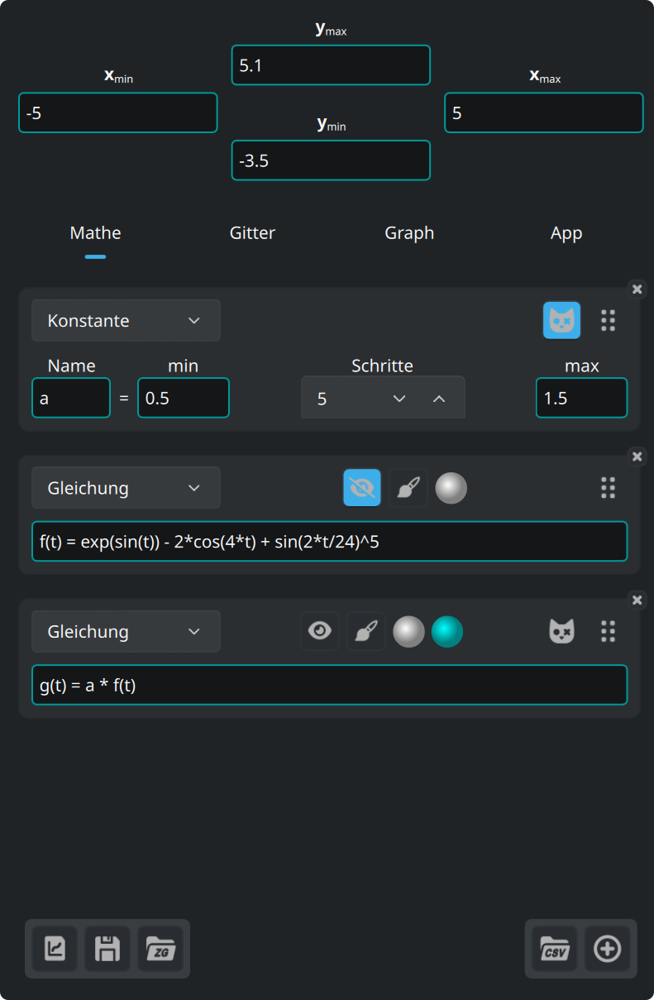

Die vier Felder oben in der Leiste sind die Grenzen der Ansicht. Darunter liegen
vier Reiter:

| Reiter | Was darin steht |
|--------|-----------------|
| **Mathe** | was du zeichnest: Gleichungen, Konstanten, Parameterdarstellungen, Daten |
| **Gitter** | Teilstriche, Gitter und Untergitter |
| **Graph** | Größe, Schrift, Hintergrund, Achsen |
| **App** | Sprache, Schrift, Syntaxfarben, Updates |

Die drei Knöpfe unten links sind für [Dateien](#22-dateien).

Der Pfeil am Rand der Leiste klappt sie ein und wieder aus. Die Linie am rechten
Rand ändert die Breite der Leiste.

Der Lesezeichen-Knopf darunter öffnet dieses Handbuch und schließt es wieder.

### 2.1. Grenzen der Ansicht

Die vier Felder oben in der Leiste nehmen Ausdrücke an, nicht nur Zahlen. Jedes
Minimum muss unter seinem Maximum bleiben, und jeden anderen Wert weisen die
Felder ab.

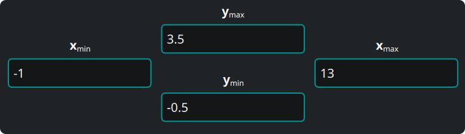

### 2.2. Dateien

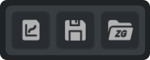

Die drei Knöpfe unten links in der Leiste sind der Reihe nach:

1. Den Graphen, den du siehst, **ausgeben**, als Vektor (`svg`, `pdf`) oder als
   Bild (`png`, `jpeg`, `bmp`, `ppm`). Die Datei sieht genauso aus wie der Graph
   auf dem Bildschirm.
2. Alles **speichern** — Objekte, Daten, Ansicht, Einstellungen — in einem
   ZeGrapher-Dokument (`.zg`).
3. So ein Dokument **öffnen**.

Beim nächsten Start öffnet ZeGrapher deine letzte Arbeit wieder. Gibst du auf der
Kommandozeile eine `.zg`-Datei an, öffnet das Programm stattdessen diese Datei.

## 3. Der Reiter Mathe

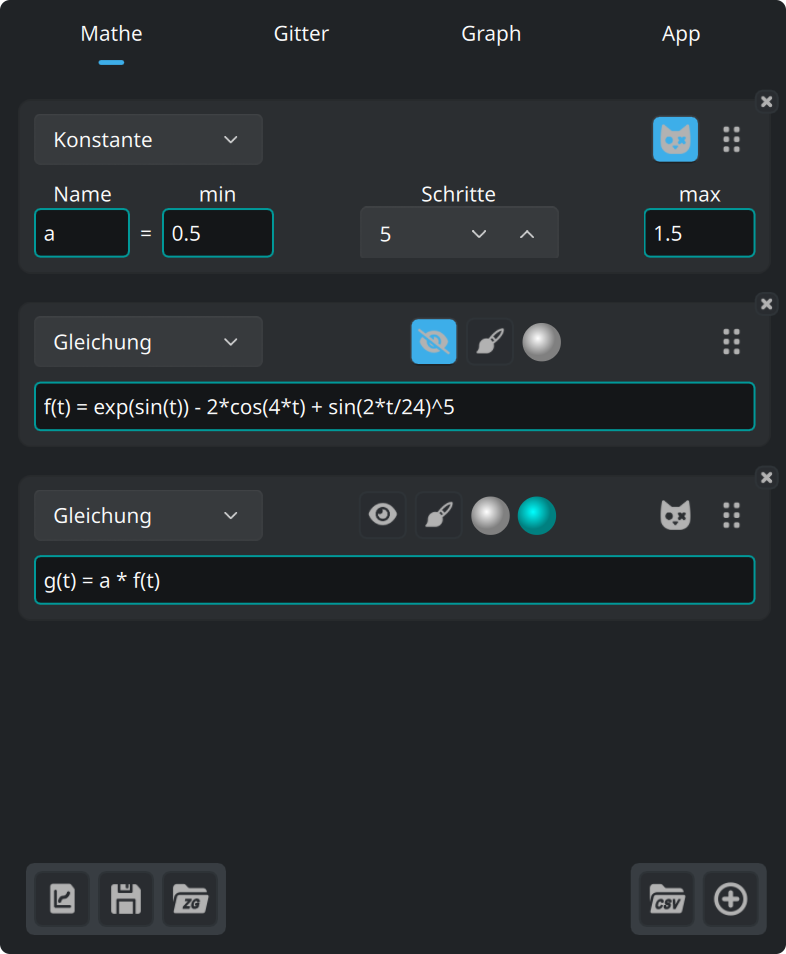

Dieser Reiter legt die Objekte fest, die gezeichnet werden oder in anderen
Objekten stecken: Funktionen, Folgen, Konstanten (die nie gezeichnet werden),
Parameterdarstellungen und Datenspalten.

### 3.1. Ein Objekt hinzufügen

Dieser Knopf unten im Reiter fügt ein Objekt hinzu.


Die Liste oben auf der neuen Karte wählt die Art des Objekts.

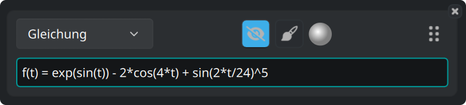

Jede Karte trägt dieselben Knöpfe:

- Das Auge zeigt die Kurve oder verbirgt sie.
- Der Pinsel öffnet den [Zeichenstil](#36-zeichenstil).
- Die Scheibe ist die Farbe der Kurve.
- Der Griff rechts sortiert die Objekte um, wenn du ihn ziehst.
- Das **×** in der Ecke löscht das Objekt.

### 3.2. Funktionen und Folgen

Eine Funktion schreibst du als ihre natürliche Gleichung:

```
f(x) = 2 + cos(x)
```

Diese Funktionen sind eingebaut und stehen in jedem Ausdruck zur Verfügung:

| Art | Funktionen |
|-----|------------|
| Trigonometrie | `cos`, `sin`, `tan`, `acos`, `asin`, `atan` |
| Hyperbolisch | `cosh`, `sinh`, `tanh`, `acosh`, `asinh`, `atanh` |
| Hyperbolisch, kurze Namen | `ch`, `sh`, `th`, `ach`, `ash`, `ath` |
| Potenzen und Logarithmen | `sqrt`, `exp`, `ln` (Basis e), `log` (Basis 10), `lg` (Basis 2) |
| Runden | `floor`, `ceil` |
| Mit zwei Argumenten | `max`, `min` |
| Weitere | `abs`, `erf`, `erfc`, `gamma` (auch `Γ` geschrieben) |

Diese Konstanten sind eingebaut:

| Name | Wert |
|------|------|
| `math::pi`, `math::π` | 3.141592653589793 |
| `physics::kB` | die Boltzmann-Konstante, 1.380649e-23 |
| `physics::h` | das plancksche Wirkungsquantum, 6.62607015e-34 |
| `physics::c` | die Lichtgeschwindigkeit im Vakuum, 299792458 |

Die drei Konstanten aus der Physik stehen in SI-Einheiten.

Eine Folge ist eine Liste von Ausdrücken, getrennt durch `,` oder `;`. Die
vorderen Ausdrücke sind die ersten Glieder. Der **letzte** ist das allgemeine
Glied, und es gilt für alle weiteren Indizes.

```
u(n) = 0 ; 1 ; 0.5*(u(n-2) + u(n-1))
```

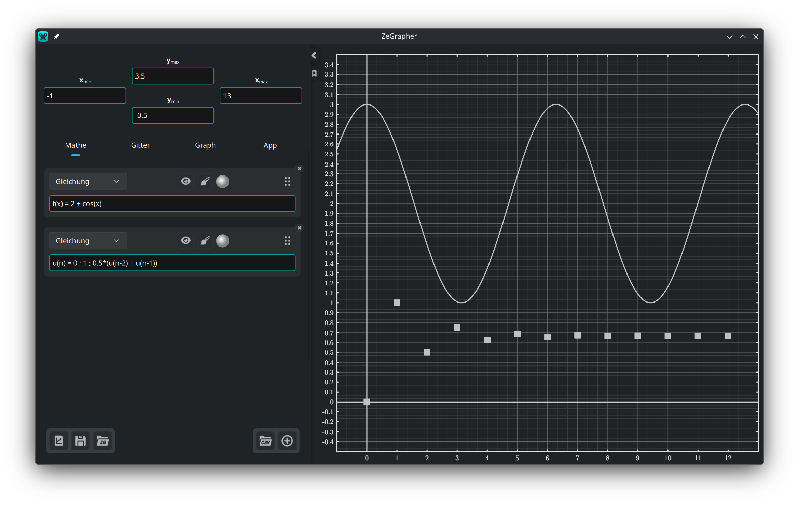

Der Rahmen eines Feldes nimmt eine Farbe an, die zeigt, ob der Ausdruck gültig
ist. Ist er es nicht, steht der Grund darunter.

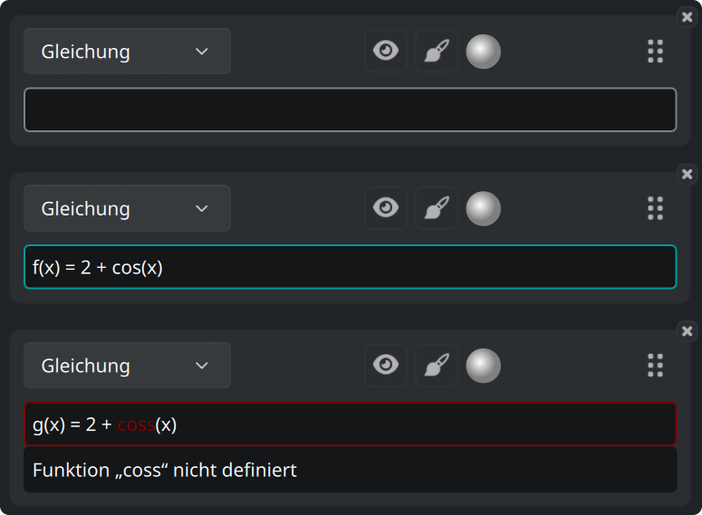

Ein Feld, das einen Wert erwartet, etwa eine Grenze der Ansicht, kann stattdessen
die Warnfarbe tragen: der Ausdruck ist gültig, liefert aber keine Zahl.

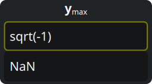

Diese drei Farben wählst du im [Reiter App](#6-der-reiter-app).

### 3.3. Konstanten

Eine **Konstante** ist ein Name mit einem Zahlenwert. Jedes andere Objekt, außer
einer weiteren Konstante, darf sie dann in seinem Ausdruck verwenden.

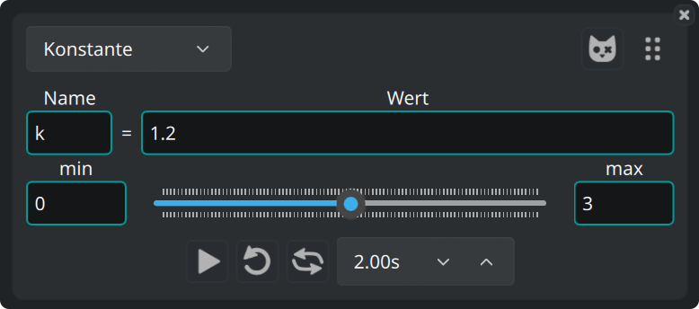

#### 3.3.1. Animation

Der Regler darunter führt den Wert von **min** nach **max**, und alle Kurven, die
die Konstante benutzen, gehen mit. Zieh den Regler von Hand, oder lass ihn
laufen. Die Reihe unter dem Regler steuert die Animation: abspielen, Schleife,
hin und zurück, und die Dauer eines Durchgangs.

#### 3.3.2. Mehrere Werte auf einmal

Dieser Knopf auf einer Konstantenkarte macht sie zu einer
**Schrödinger-Konstante**.


Die Konstante nimmt dann `Schritte + 1` Werte an, in gleichen Abständen von min
bis max. Jedes Objekt, das sie benutzt, wird einmal je Wert gezeichnet.

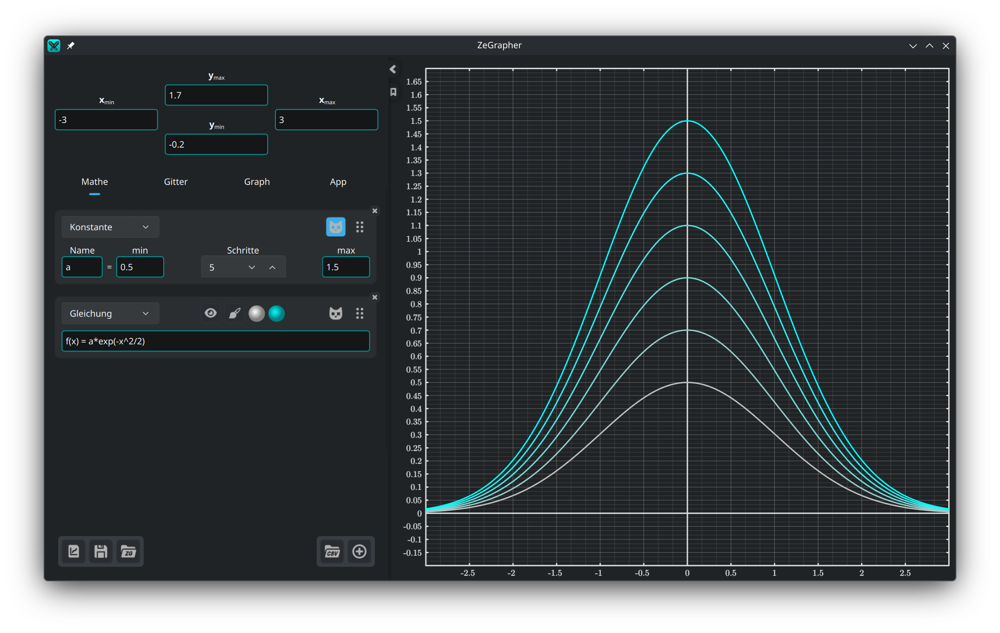

Diese Objekte bekommen eine zweite Farbscheibe. Die Kurvenschar wird als Verlauf
von der ersten Farbe zur zweiten gezeichnet.

### 3.4. Parameterdarstellungen

Eine Parameterdarstellung ist ein Paar von Objekten, das die Koordinaten jedes
Punktes der Kurve angibt. Ihre Namen schreibst du in die zwei Felder:

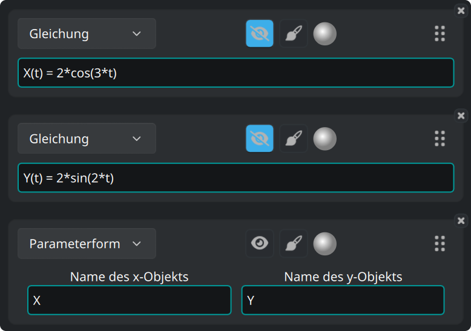

Das Paar wird zwischen **Anfang** und **Ende** gezeichnet, die im
[Zeichenstil](#36-zeichenstil) der Parameterdarstellung stehen.

### 3.5. Daten

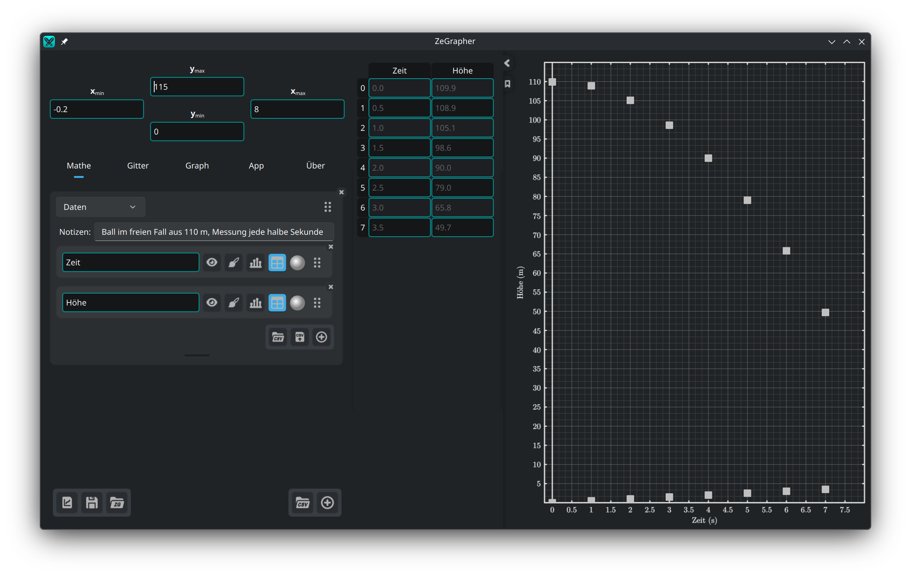

Ein Datenobjekt ist ein Blatt aus Spalten mit Namen. Jede Spalte ist selbst ein
mathematisches Objekt. Sie hat einen Namen, einen Augenknopf, einen Zeichenstil,
eine Farbe, einen Griff zum Umsortieren, und ein **×** in der Ecke, das sie
löscht.

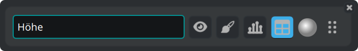

Die Werte einer Spalte werden über ihren Index gezeichnet: der erste Wert bei
x = 0, der zweite bei x = 1, und so weiter. Um eine Spalte über eine andere zu
zeichnen, nimm eine [Parameterdarstellung](#34-parameterdarstellungen).

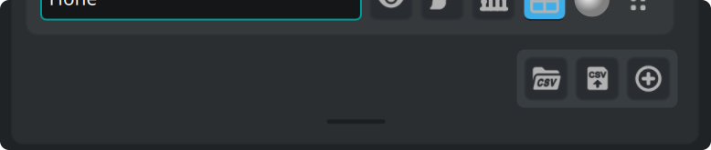

Die Knöpfe unten rechts am Blatt laden eine CSV-Datei, schreiben die Spalten in
eine CSV-Datei, und fügen eine Spalte hinzu. Der Balken darunter ändert die Höhe
des Blatts. Ein Doppelklick darauf gibt ihm seine Standardhöhe zurück.

#### 3.5.1. Die Datentabelle

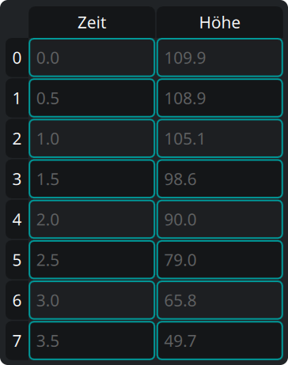

Der **Tabellen**-Knopf einer Spalte zeigt sie in der Tabelle neben der Leiste. In
der Tabelle:

- klicke eine Zelle an und tippe, um sie zu ändern, oder drücke `Eingabe`, um den
  Editor zu öffnen,
- klicke einen Kopf an, um eine ganze Zeile oder eine ganze Spalte zu wählen,
- zieh, um ein Rechteck aus Zellen zu wählen,
- drücke `Rücktaste`, um die gewählten Zellen zu leeren, und `Entf`, um sie zu
  löschen,
- das Menü der rechten Maustaste hat dieselben zwei Aktionen unter *Leeren* und
  *Löschen*, dazu *Zeile darüber einfügen* und *Zeile darunter einfügen*. Beide
  Einfügungen gehen von der aktiven Zelle aus.

Löschst du eine ganze Spalte, verschwindet auch das Spaltenobjekt.

#### 3.5.2. Eine Spalte aus einem Objekt füllen

Der Knopf mit dem Balkendiagramm öffnet ein kleines Formular: nenne ein Objekt, und
gib **Anfang**, **Ende** und **Schritt** an. Der Haken nimmt die Werte des
Objekts und schreibt sie in die Spalte.

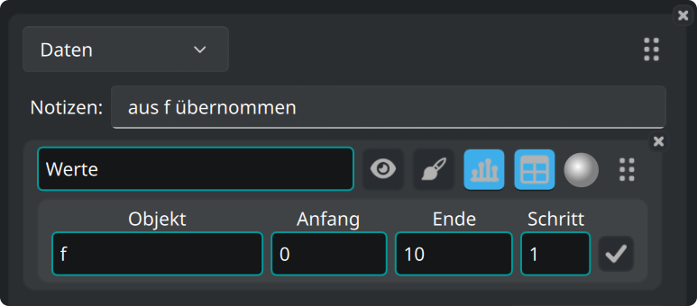

#### 3.5.3. Eine CSV-Datei laden

Der CSV-Knopf sitzt auf einem Blatt, oder unten im Reiter Mathe für ein neues
Blatt.

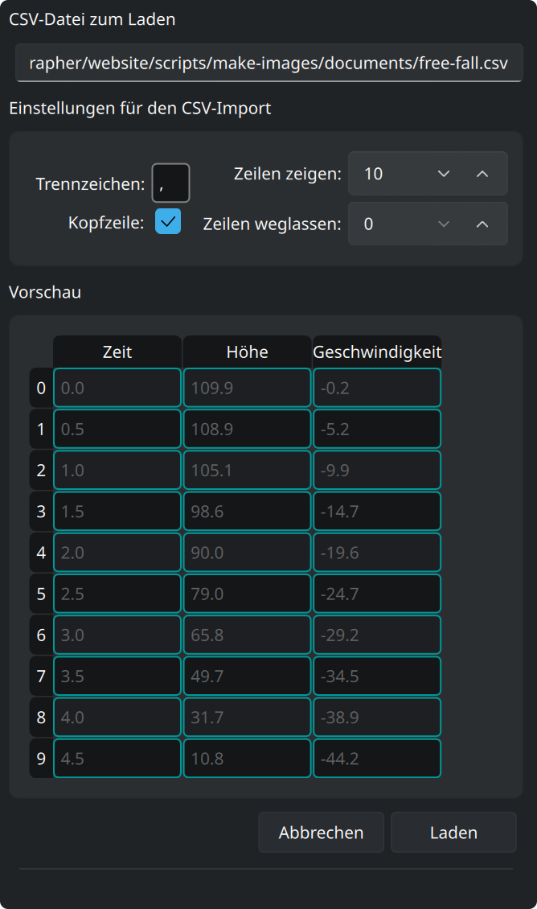

Er öffnet einen Dateidialog. Danach zeigt eine Leiste an der Seite eine Vorschau
der Datei und die Optionen, mit denen sie gelesen wird. Die Vorschau folgt jeder
Änderung:

- Gib das Trennzeichen an (für Tabulator `\t` schreiben).
- Gib an, wie viele Zeilen am Anfang der Datei wegfallen (Kommentare oder
  Parameter zum Beispiel).
- Markiere, ob die erste Zeile die Namen der Spalten trägt.
- **Zeilen zeigen** ist die Zahl der Zeilen in der Vorschau.
- **Laden** macht aus der Vorschau Spalten.
- **Abbrechen** lässt alles, wie es war.

Wir haben ZeGrapher an CSV-Dateien mit mehreren Millionen Zellen erprobt.

### 3.6. Zeichenstil

Der Pinselknopf öffnet die Einstellungen dafür, wie ein Objekt gezeichnet wird:

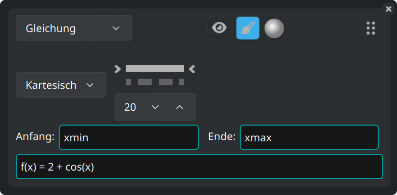

- Koordinaten **kartesisch** oder **polar**.
- Die Art der Linie — durchgezogen, gestrichelt, Strich-Punkt, gepunktet, oder
  keine Linie — und ihre Stärke.
- Bei Objekten aus Punkten (Folgen und Daten) die Form und die Größe der Punkte.
- **Anfang** und **Ende**: der Bereich, über den das Objekt gezeichnet wird.
  Voreingestellt sind `xmin` und `xmax`, die Grenzen der Ansicht. Beide Felder
  nehmen jeden Ausdruck an, zum Beispiel `-math::pi` und `4*math::pi`.

## 4. Der Reiter Gitter — Teilstriche und Gitter

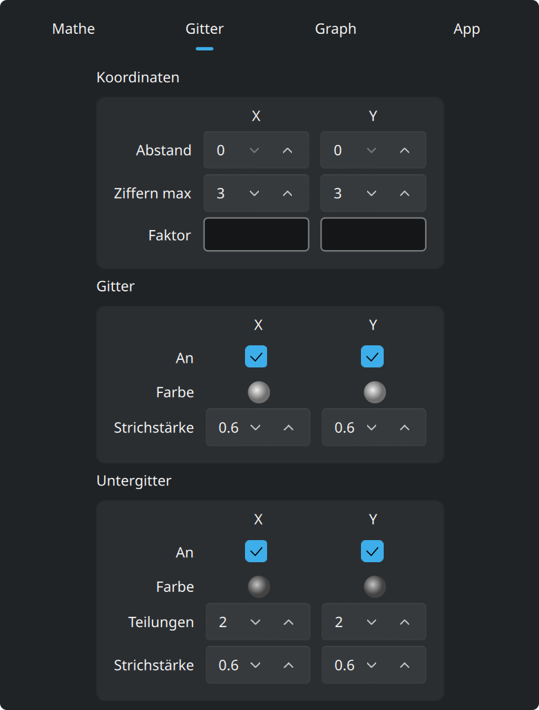

**Koordinaten** stellt die Zahlen entlang der Achsen ein: ihren Abstand, wie
viele Ziffern sie nutzen dürfen, und einen **Faktor**. Der Faktor ist ein
Ausdruck, die Teilstriche können also Vielfache von `math::pi` sein, und die
Beschriftungen stehen dann als Vielfache davon.

**Gitter** und **Untergitter** stellst du für x und y getrennt ein. Jedes hat
eine Farbe, eine Strichstärke, und einen Schalter, der es zeigt oder verbirgt.
Beim Untergitter gibst du außerdem an, in wie viele Teile es jede Zelle
schneidet.

## 5. Der Reiter Graph — Aussehen und Genauigkeit

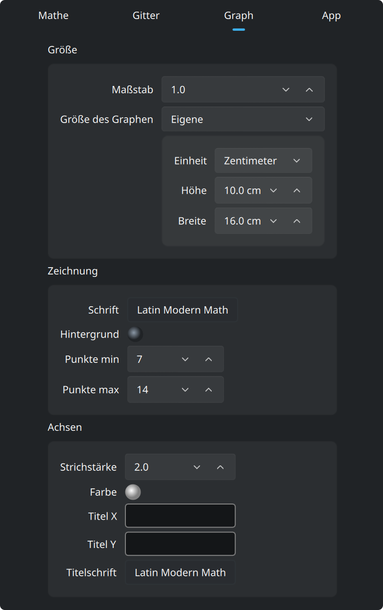

Voreingestellt füllt der Graph das Fenster. Stell **Größe des Graphen** auf
*Eigene*, im Kasten **Größe** oben, und der Graph wird ein Blatt in der Größe,
die du angibst. Diese Größe geht in Pixeln oder in **echten Zentimetern**. Ein
Zentimeter ist ein echter Zentimeter auf dem Bildschirm, und bleibt es in einem
ausgegebenen `pdf` oder `svg`. **Maßstab**, im selben Kasten, macht die ganze
Zeichnung mit einer Einstellung größer oder kleiner.

Dieses Blatt wird als Seite im Fenster gezeichnet, mit einer Zoomleiste darüber:

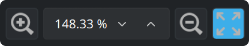

Die Leiste macht das Blatt auf dem Bildschirm größer oder kleiner und nimmt auch
einen Zoom in Prozent an. Der letzte Knopf passt das ganze Blatt ins Fenster.
Dieser Zoom ändert nur, wie groß das Blatt gezeichnet wird. Die Grenzen der
Ansicht bleiben, wie sie sind.

Die zwei Kästen unter **Größe**:

- **Zeichnung**: die **Schrift** des Graphen und die Farbe seines
  **Hintergrunds**. **Punkte min** und **Punkte max** sind, wie viele Punkte für
  jede stetige Kurve berechnet werden, in Zweierpotenzen. Mehr Punkte geben eine
  feinere Kurve, aber ein langsameres Zeichnen.
- **Achsen**: Strichstärke, Farbe, die Titel entlang x und y, und die Schrift
  dieser Titel.

## 6. Der Reiter App

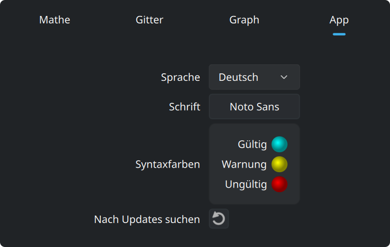

In diesem Reiter stehen die Sprache und die Schrift der Oberfläche. Dazu die drei
Farben der Eingabefelder: gültig, Warnung und ungültig. Der letzte Knopf fragt
zegrapher.com, ob eine neuere Version da ist.
