# Documentation


- [1. The graph](#1-the-graph)
  - [1.1. Moving and zooming](#11-moving-and-zooming)
- [2. The user input panel](#2-the-user-input-panel)
  - [2.1. View range](#21-view-range)
  - [2.2. Files](#22-files)
- [3. Math tab](#3-math-tab)
  - [3.1. Adding an object](#31-adding-an-object)
  - [3.2. Functions and sequences](#32-functions-and-sequences)
  - [3.3. Constants](#33-constants)
    - [3.3.1. Animation](#331-animation)
    - [3.3.2. Several values at once](#332-several-values-at-once)
  - [3.4. Parametric equations](#34-parametric-equations)
  - [3.5. Data](#35-data)
    - [3.5.1. The data table](#351-the-data-table)
    - [3.5.2. Filling a column from an object](#352-filling-a-column-from-an-object)
    - [3.5.3. Importing a CSV file](#353-importing-a-csv-file)
  - [3.6. Plot style](#36-plot-style)
- [4. The Grid tab — ticks and grid](#4-the-grid-tab--ticks-and-grid)
- [5. The Graph tab — look and precision](#5-the-graph-tab--look-and-precision)
- [6. The App tab](#6-the-app-tab)

## 1. The graph


The graph is what you see on the right, and what you export. The
[Grid](#4-the-grid-tab--ticks-and-grid) and
[Graph](#5-the-graph-tab--look-and-precision) tabs set its look, its precision and
its size.

### 1.1. Moving and zooming

You drive the graph with the mouse:

| Action | Mouse |
|--------|-------|
| Move the view | Drag with the left mouse button |
| Zoom both axes at once | Scroll wheel |
| Zoom the y axis only | `Ctrl` + vertical scroll |
| Zoom the x axis only | `Ctrl` + horizontal scroll or <br/> `Ctrl` + `Shift` + vertical scroll |

The zoom keeps the point under the cursor in place.

## 2. The user input panel

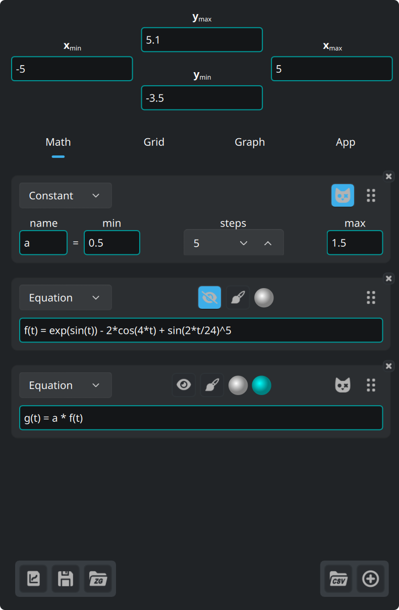

The four fields at the top of the panel are the bounds of the view. Under them
are four tabs:

| Tab | What it holds |
|-----|---------------|
| **Math** | the objects you plot: equations, constants, parametric equations, data |
| **Grid** | ticks, grid and sub-grid |
| **Graph** | size, font, background, axes |
| **App** | language, font, syntax colors, updates |

The three buttons at the bottom left are for [files](#22-files).

The arrow on the edge of the panel hides it, and shows it again. The line down
the right edge sets its width.

The bookmark button, under that arrow, opens this documentation and closes it.

### 2.1. View range

The four fields at the top of the panel accept expressions, not just numbers. A
minimum must stay below its maximum, and the fields refuse anything else.

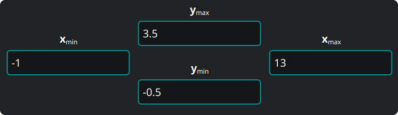

### 2.2. Files


The three buttons at the bottom left of the panel are, in order:

1. **Export the graph** you see, in a vector format (`svg`, `pdf`) or as an
   image (`png`, `jpeg`, `bmp`, `ppm`). The export looks exactly like the graph
   on the screen.
2. **Save** everything — objects, data, view, settings — as a ZeGrapher document
   (`.zg`).
3. **Open** such a document.

At the next start, ZeGrapher opens your last work again. If you give a `.zg`
file on the command line, the app opens that file instead.

## 3. Math tab

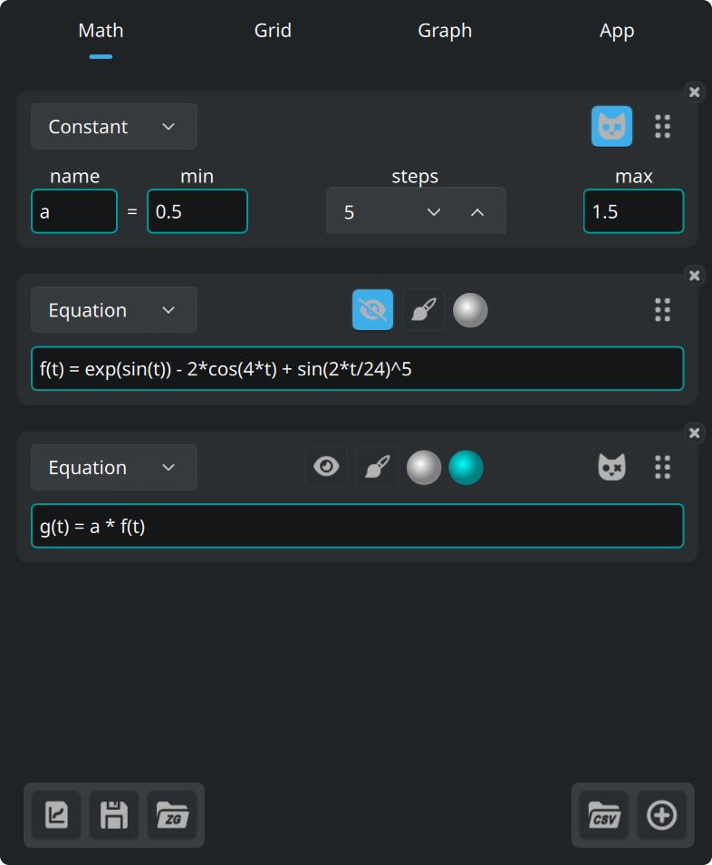

This tab defines the objects to plot, or to use inside other objects: functions,
sequences, constants (which are never plotted), parametric equations, and data
columns.

### 3.1. Adding an object

This button, at the bottom of the Math tab, adds an object.


The dropdown at the top of the new card sets the kind of object.

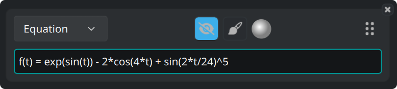

Every card carries the same buttons:

- The eye button shows or hides the curve.
- The brush button opens the [plot style](#36-plot-style).
- The disc is the color of the curve.
- The handle on the right reorders the objects when you drag it.
- The **×** in the corner deletes the object.

### 3.2. Functions and sequences

You define a function by its natural equation:

```
f(x) = 2 + cos(x)
```

These functions are built in, and work in any expression:

| Kind | Functions |
|------|-----------|
| Trigonometry | `cos`, `sin`, `tan`, `acos`, `asin`, `atan` |
| Hyperbolic | `cosh`, `sinh`, `tanh`, `acosh`, `asinh`, `atanh` |
| Hyperbolic, short names | `ch`, `sh`, `th`, `ach`, `ash`, `ath` |
| Powers and logarithms | `sqrt`, `exp`, `ln` (base e), `log` (base 10), `lg` (base 2) |
| Rounding | `floor`, `ceil` |
| Two arguments | `max`, `min` |
| Others | `abs`, `erf`, `erfc`, `gamma` (also written `Γ`) |

These constants are built in:

| Name | Value |
|------|-------|
| `math::pi`, `math::π` | 3.141592653589793 |
| `physics::kB` | the Boltzmann constant, 1.380649e-23 |
| `physics::h` | the Planck constant, 6.62607015e-34 |
| `physics::c` | the speed of light in vacuum, 299792458 |

The three physics constants hold their value in SI units.

A sequence is a list of expressions separated by `,` or `;`. The first
expressions are the first terms of the sequence. The **last** one is the
general term, and the app uses it for every index after those first terms.

```
u(n) = 0 ; 1 ; 0.5*(u(n-2) + u(n-1))
```

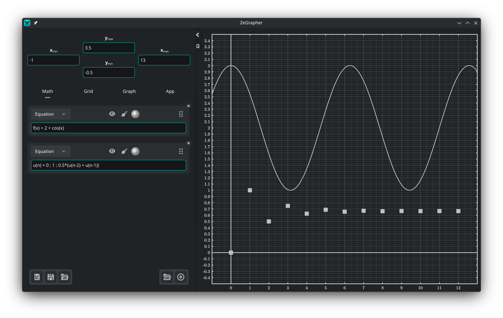

The border of an input line takes a color that tells you whether the expression
is valid. An invalid one also gets a message underneath, with the reason.

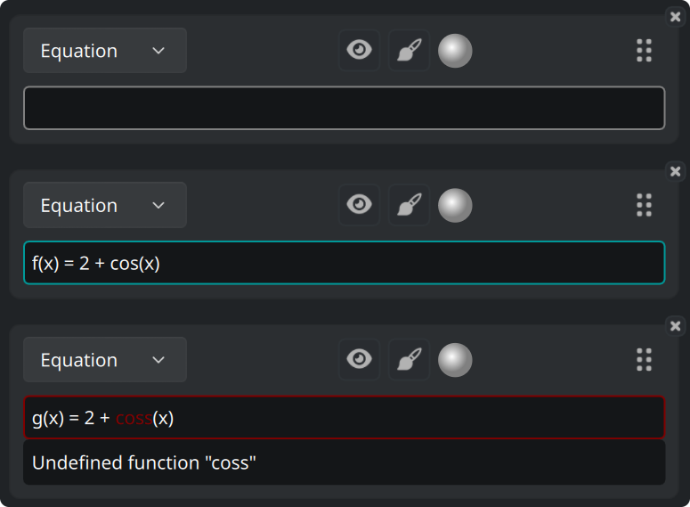

A field that expects a value, such as a bound of the view, can take the warning
color instead: the expression is valid, but it yields no number.

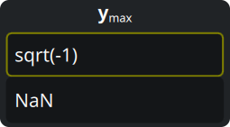

You choose these three colors in the [App tab](#6-the-app-tab).

### 3.3. Constants

A **constant** is a name with a numeric value. Every other object, except
another constant, can then use it in its expression.

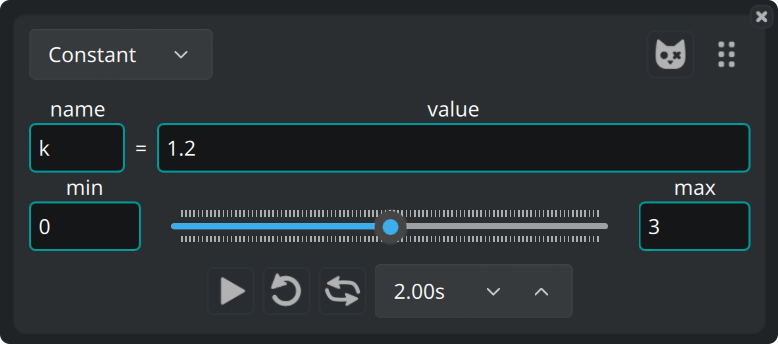

#### 3.3.1. Animation

The slider underneath moves the value between **min** and **max**, and every
curve that uses the constant follows. Drag the slider by hand, or animate it.
The row under the slider holds the animation controls: play, repeat, ping-pong,
and the period of one sweep.

#### 3.3.2. Several values at once

This button on a constant card turns it into a **Schrödinger constant**.


The constant then holds `steps + 1` values, at equal distances from min to max.
The app plots every object that uses the constant once per value.

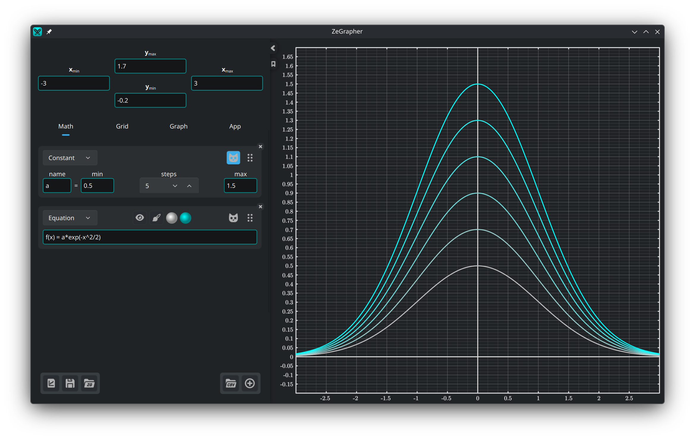

These objects get a second color disc. The app draws the family of curves as a
gradient from the first color to the second.

### 3.4. Parametric equations

A parametric equation is a pair of objects that give the coordinates of each
point of the curve. Name them in the two fields:

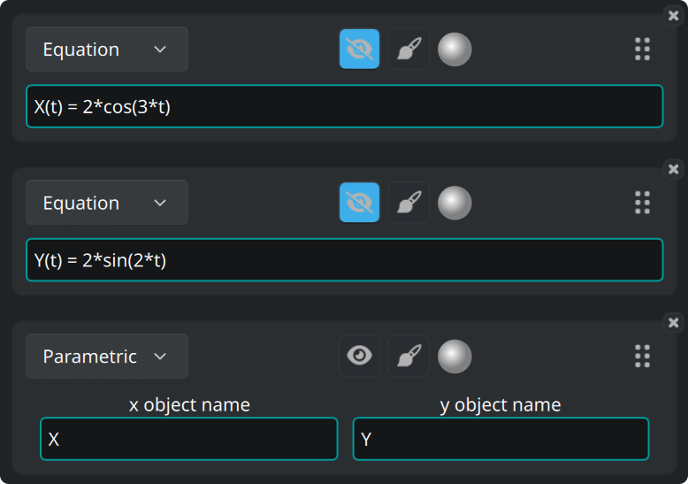

The app plots the pair between the **Start** and **End**, defined in the
[plot style](#36-plot-style) of the parametric equation.

### 3.5. Data

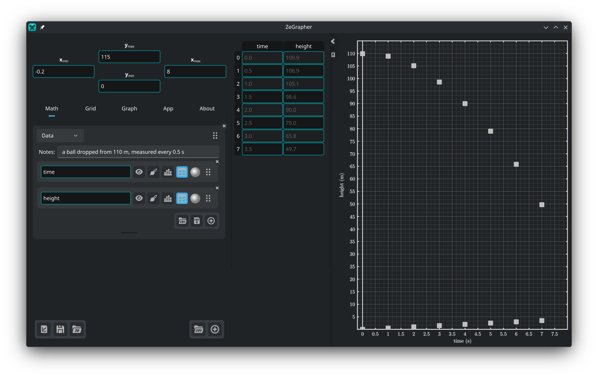

A data object is a sheet of named columns. Each column is a math object of its
own. It has a name, an eye button, a plot style, a color, a handle that reorders it,
and a **×** in the corner that deletes it.

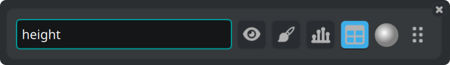

The app plots the values of a column against its indices: the first value at
x = 0, the second at x = 1, and so on. To plot one column against another, use a
[parametric equation](#34-parametric-equations).

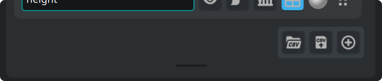

The buttons at the bottom right of the sheet import a CSV file, export the
columns to a CSV file, and add a column. The bar underneath resizes the sheet.
Double-click it to give the sheet its default height again.

#### 3.5.1. The data table

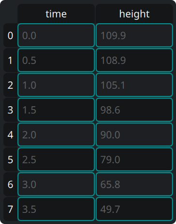

The **table** button on a column shows that column in the table next to the
panel. In the table:

- Click a cell, then type to edit it, or press `Enter` to open the editor,
- Click a header to select a whole row or a whole column,
- Click and drag for a rectangular selection of cells,
- Press `Backspace` to empty the selected cells, and `Delete` to remove them,
- Open the right-click menu for those same two actions, under *Clear* and
  *Delete*, and for *Insert row above* and *Insert row below*. Both Insert
  entries act on the active cell.

If you delete a whole column, the column object is also deleted.

#### 3.5.2. Filling a column from an object

The bar-chart button on a column opens a small form: name an object, give a
**Start**, an **End** and a **Step**. The check button samples the object and
loads the values into the column.

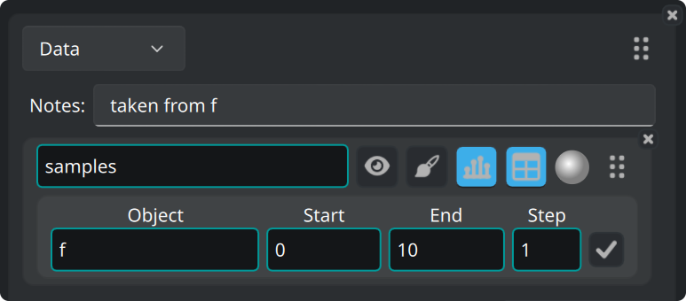

#### 3.5.3. Importing a CSV file

The CSV button is on a sheet, or at the bottom of the Math tab for a new sheet.

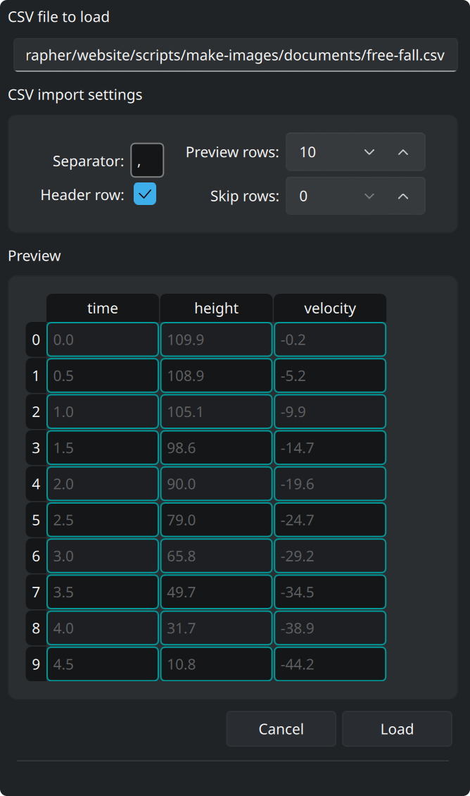

It opens a file dialog. Then a side pane shows a preview of the file, and the
options that read it. The preview follows each change:

- Set the separator (write `\t` for a `TAB` separator).
- Set the number of rows to skip at the top of the file (comments or extra
  parameters, for example).
- Mark whether the first row holds the column names.
- **Preview rows** is the number of rows that the preview shows.
- **Load** makes columns out of the preview.
- **Cancel** leaves everything as it was.

We tested ZeGrapher on CSV files of several million cells.

### 3.6. Plot style

The brush button opens the settings that decide how an object is drawn:

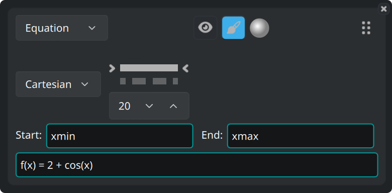

- **Cartesian** or **Polar** coordinates.
- The line pattern — solid, dashed, dash-dotted, dotted, or no line — and its
  width.
- For the objects drawn as points (sequences and data), the shape and the size
  of the point.
- **Start** and **End**: the interval the app plots the object over. The default
  values are `xmin` and `xmax`, the bounds of the view. Both fields accept any
  expression, for example `-math::pi` and `4*math::pi`.

## 4. The Grid tab — ticks and grid

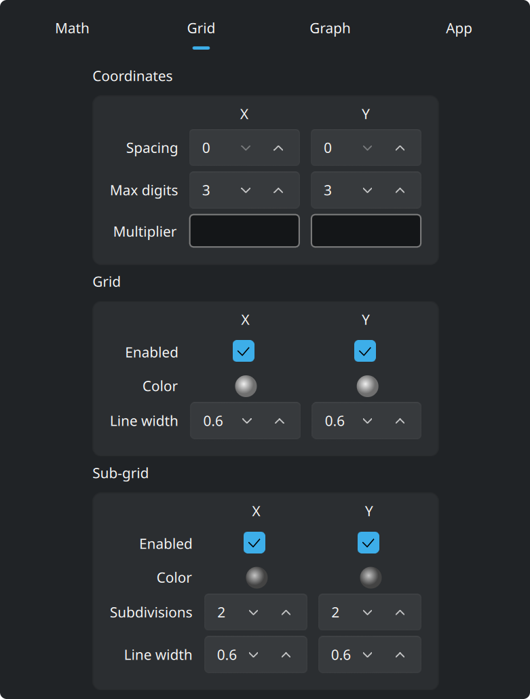

**Coordinates** sets the numbers along the axes: their spacing, the number of
digits they can use, and a **multiplier**. The multiplier is an expression, so
ticks can be multiples of `math::pi`, and the labels are written as multiples of
it.

You set **Grid** and **Sub-grid** separately for x and y. Each one takes a
color, a line width, and a switch that shows it or hides it. The sub-grid also
takes the number of parts it cuts each cell into.

## 5. The Graph tab — look and precision

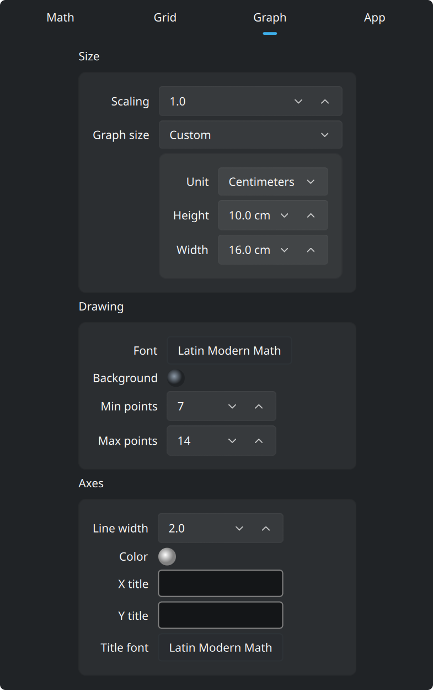

By default the graph fills the window. Set **Graph size** to *Custom*, in the
**Size** box at the top, and the graph becomes a sheet of the size you give.
That size is in pixels, or in **real centimeters**. A centimeter is a real
centimeter on the screen, and stays one in an exported `pdf` or `svg`.
**Scaling**, in the same box, grows or shrinks the whole drawing with one
setting.

The app draws that sheet as a page in the window, with a zoom bar above it:

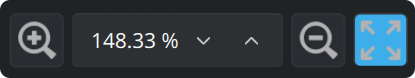

The bar grows or shrinks the sheet on the screen, and also accepts a zoom
percentage. The last button fits the whole sheet in the window. This zoom only
changes the size at which the app draws the sheet. The bounds of the view stay
as they are.

The two boxes under **Size**:

- **Drawing**: the **font** of the graph and its **background** color. **Min
  points** and **Max points** are the number of points the app computes for each
  continuous curve, as powers of two. More points give a finer curve and a slower
  redraw.
- **Axes**: line width, color, the titles written along x and y, and the font
  those titles use.

## 6. The App tab

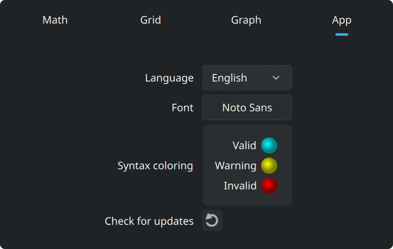

This tab holds the language and the font of the interface. It also holds the
three colors of the input lines: valid, warning and invalid. The last button
asks zegrapher.com for a newer version.
