# Documentación

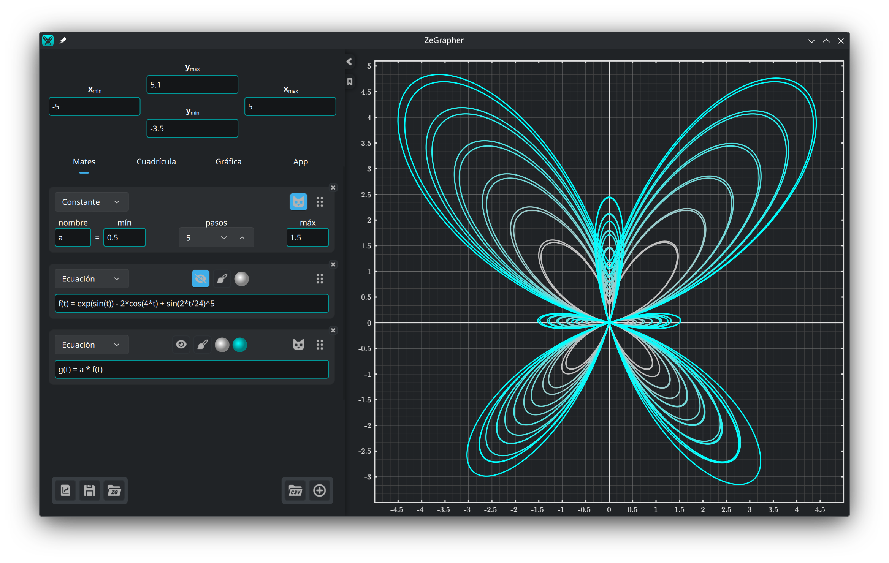

- [1. La gráfica](#1-la-gráfica)
  - [1.1. Mover y acercar](#11-mover-y-acercar)
- [2. El panel de entrada](#2-el-panel-de-entrada)
  - [2.1. Límites de la vista](#21-límites-de-la-vista)
  - [2.2. Archivos](#22-archivos)
- [3. La pestaña Mates](#3-la-pestaña-mates)
  - [3.1. Añadir un objeto](#31-añadir-un-objeto)
  - [3.2. Funciones y sucesiones](#32-funciones-y-sucesiones)
  - [3.3. Constantes](#33-constantes)
    - [3.3.1. Animación](#331-animación)
    - [3.3.2. Varios valores a la vez](#332-varios-valores-a-la-vez)
  - [3.4. Ecuaciones paramétricas](#34-ecuaciones-paramétricas)
  - [3.5. Datos](#35-datos)
    - [3.5.1. La tabla de datos](#351-la-tabla-de-datos)
    - [3.5.2. Rellenar una columna con un objeto](#352-rellenar-una-columna-con-un-objeto)
    - [3.5.3. Importar un archivo CSV](#353-importar-un-archivo-csv)
  - [3.6. Estilo de trazado](#36-estilo-de-trazado)
- [4. La pestaña Cuadrícula — marcas y cuadrícula](#4-la-pestaña-cuadrícula--marcas-y-cuadrícula)
- [5. La pestaña Gráfica — aspecto y precisión](#5-la-pestaña-gráfica--aspecto-y-precisión)
- [6. La pestaña App](#6-la-pestaña-app)

## 1. La gráfica


La gráfica es lo que ves a la derecha, y lo que exportas. Las pestañas
[Cuadrícula](#4-la-pestaña-cuadrícula--marcas-y-cuadrícula) y
[Gráfica](#5-la-pestaña-gráfica--aspecto-y-precisión) fijan su aspecto, su
precisión y su tamaño.

### 1.1. Mover y acercar

La gráfica se maneja con el ratón:

| Acción | Ratón |
|--------|-------|
| Mover la vista | Arrastrar con el botón izquierdo |
| Acercar los dos ejes a la vez | Rueda del ratón |
| Acercar solo el eje y | `Ctrl` + rueda vertical |
| Acercar solo el eje x | `Ctrl` + rueda horizontal, o <br/> `Ctrl` + `Mayús` + rueda vertical |

Al acercar, el punto que está bajo el cursor se queda donde estaba.

## 2. El panel de entrada

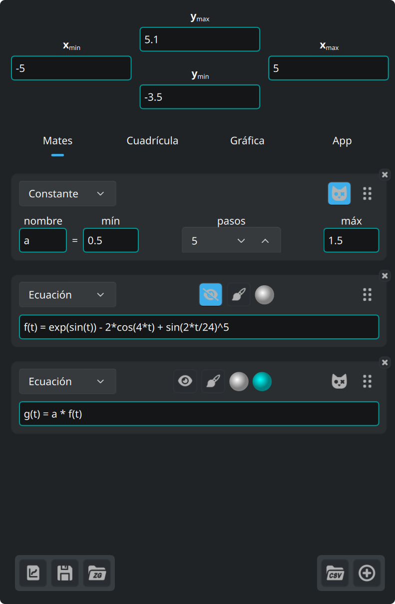

Los cuatro campos de arriba del panel son los límites de la vista. Debajo hay
cuatro pestañas:

| Pestaña | Qué contiene |
|---------|--------------|
| **Mates** | los objetos que trazas: ecuaciones, constantes, ecuaciones paramétricas, datos |
| **Cuadrícula** | marcas, cuadrícula y subcuadrícula |
| **Gráfica** | tamaño, fuente, fondo, ejes |
| **App** | idioma, fuente, colores de sintaxis, actualizaciones |

Los tres botones de abajo a la izquierda son para los [archivos](#22-archivos).

La flecha del borde del panel lo pliega y lo vuelve a desplegar. La línea que
recorre su borde derecho ajusta su ancho.

El botón del marcapáginas, bajo esa flecha, abre esta documentación y la
cierra.

### 2.1. Límites de la vista

Los cuatro campos de arriba del panel aceptan expresiones, no solo números. Cada
mínimo debe quedar por debajo de su máximo, y los campos rechazan cualquier otro
valor.

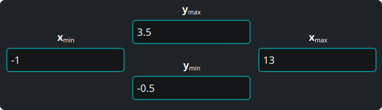

### 2.2. Archivos


Los tres botones de abajo a la izquierda del panel son, por orden:

1. **Exportar la gráfica** que ves, en formato vectorial (`svg`, `pdf`) o como
   imagen (`png`, `jpeg`, `bmp`, `ppm`). El archivo exportado es idéntico a la
   gráfica de la pantalla.
2. **Guardarlo** todo — objetos, datos, vista, ajustes — en un documento de
   ZeGrapher (`.zg`).
3. **Abrir** un documento de ese tipo.

Al arrancar de nuevo, ZeGrapher vuelve a abrir tu último trabajo. Si le pasas un
archivo `.zg` en la línea de órdenes, abre ese archivo en su lugar.

## 3. La pestaña Mates

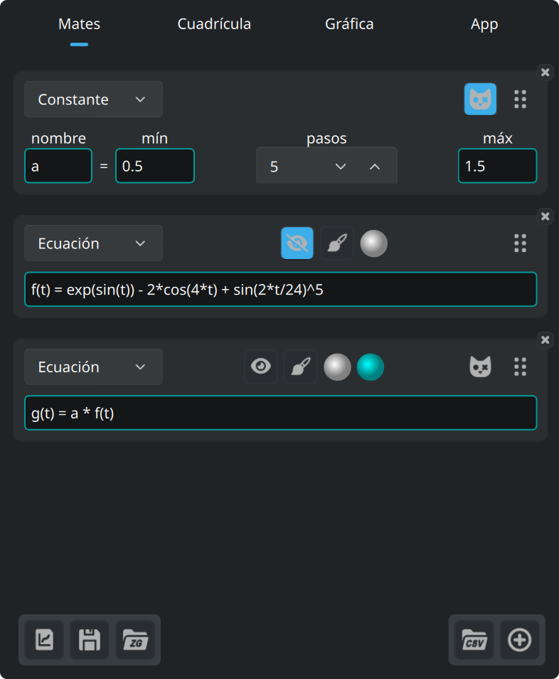

Esta pestaña define los objetos que se trazan, o que se usan dentro de otros
objetos: funciones, sucesiones, constantes (que nunca se trazan), ecuaciones
paramétricas y columnas de datos.

### 3.1. Añadir un objeto

Este botón, al final de la pestaña Mates, añade un objeto.


La lista desplegable de arriba de la nueva tarjeta elige el tipo de objeto.

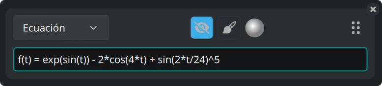

Todas las tarjetas llevan los mismos botones:

- El botón del ojo muestra u oculta la curva.
- El botón del pincel abre el [estilo de trazado](#36-estilo-de-trazado).
- El disco es el color de la curva.
- El asa de la derecha reordena los objetos cuando la arrastras.
- La **×** de la esquina borra el objeto.

### 3.2. Funciones y sucesiones

Una función se define con su ecuación natural:

```
f(x) = 2 + cos(x)
```

Estas funciones vienen de serie, y sirven en cualquier expresión:

| Tipo | Funciones |
|------|-----------|
| Trigonometría | `cos`, `sin`, `tan`, `acos`, `asin`, `atan` |
| Hiperbólicas | `cosh`, `sinh`, `tanh`, `acosh`, `asinh`, `atanh` |
| Hiperbólicas, nombres cortos | `ch`, `sh`, `th`, `ach`, `ash`, `ath` |
| Potencias y logaritmos | `sqrt`, `exp`, `ln` (base e), `log` (base 10), `lg` (base 2) |
| Redondeo | `floor`, `ceil` |
| De dos argumentos | `max`, `min` |
| Otras | `abs`, `erf`, `erfc`, `gamma` (también `Γ`) |

Estas constantes vienen de serie:

| Nombre | Valor |
|--------|-------|
| `math::pi`, `math::π` | 3.141592653589793 |
| `physics::kB` | la constante de Boltzmann, 1.380649e-23 |
| `physics::h` | la constante de Planck, 6.62607015e-34 |
| `physics::c` | la velocidad de la luz en el vacío, 299792458 |

Las tres constantes físicas están en unidades del SI.

Una sucesión es una lista de expresiones separadas por `,` o `;`. Las primeras
expresiones son los primeros términos. La **última** es el término general, y la
aplicación la usa para todos los índices siguientes.

```
u(n) = 0 ; 1 ; 0.5*(u(n-2) + u(n-1))
```

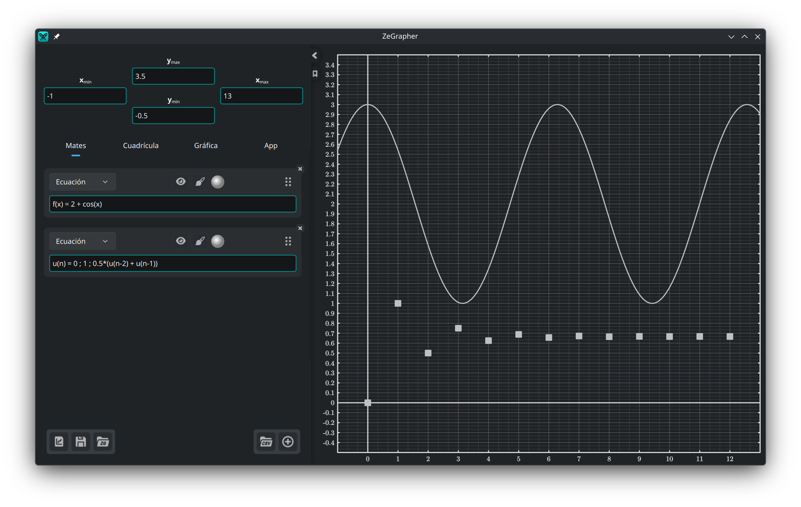

El borde de un campo de entrada toma un color que indica si la expresión es
válida. Cuando no lo es, un mensaje debajo da el motivo.

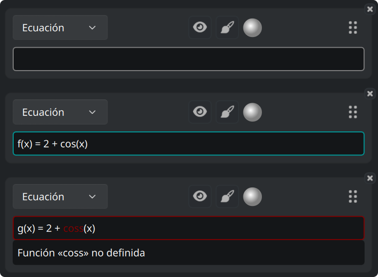

Un campo que espera un valor, como un límite de la vista, puede tomar en cambio
el color de aviso: la expresión es válida, pero no da ningún número.

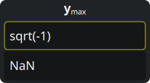

Estos tres colores los eliges en la [pestaña App](#6-la-pestaña-app).

### 3.3. Constantes

Una **constante** es un nombre con un valor numérico. Cualquier otro objeto,
salvo otra constante, puede usarla después en su expresión.

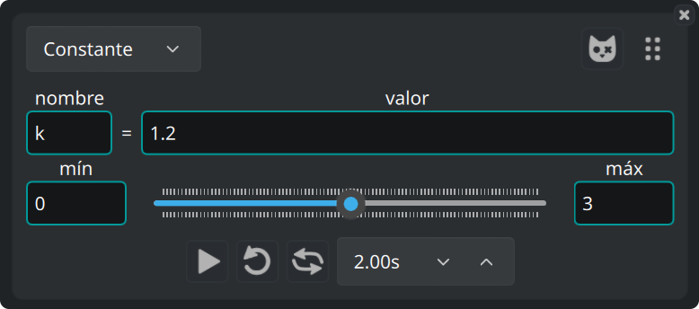

#### 3.3.1. Animación

El deslizador de debajo hace variar el valor entre **mín** y **máx**, y todas las
curvas que usan la constante lo siguen. Arrastra el deslizador a mano, o
anímalo. La fila de debajo tiene los mandos de la animación: reproducir, bucle,
ida y vuelta, y la duración de una pasada.

#### 3.3.2. Varios valores a la vez

Este botón, en una tarjeta de constante, la convierte en **constante de
Schrödinger**.


La constante toma entonces `pasos + 1` valores, repartidos a intervalos iguales
entre mín y máx. La aplicación traza cada objeto que usa la constante una vez
por valor.

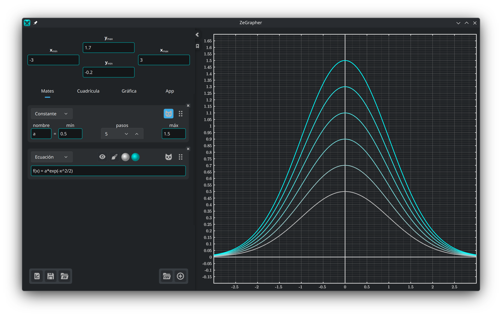

Esos objetos reciben un segundo disco de color. La aplicación dibuja la familia
de curvas en degradado, del primer color al segundo.

### 3.4. Ecuaciones paramétricas

Una ecuación paramétrica es un par de objetos que dan las coordenadas de cada
punto de la curva. Los nombras en los dos campos:

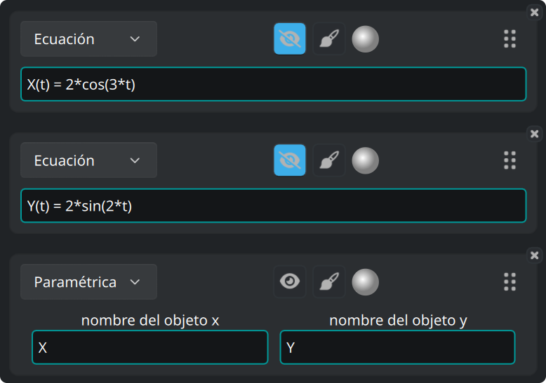

La aplicación traza el par entre el **Inicio** y el **Fin**, definidos en el
[estilo de trazado](#36-estilo-de-trazado) de la ecuación paramétrica.

### 3.5. Datos

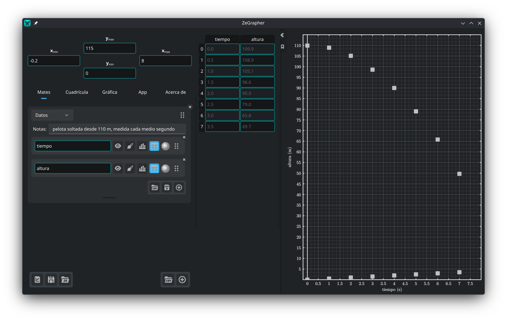

Un objeto de datos es una hoja de columnas con nombre. Cada columna es un objeto
matemático de pleno derecho. Tiene nombre, botón del ojo, estilo de trazado,
color, un asa para reordenarla, y una **×** en la esquina que la borra.

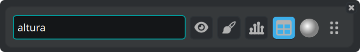

La aplicación traza los valores de una columna frente a su índice: el primer
valor en x = 0, el segundo en x = 1, y así sucesivamente. Para trazar una
columna frente a otra, usa una [ecuación
paramétrica](#34-ecuaciones-paramétricas).


Los botones de abajo a la derecha de la hoja importan un archivo CSV, exportan
las columnas a un archivo CSV, y añaden una columna. La barra de debajo cambia
la altura de la hoja. Haz doble clic en ella para devolverle su altura por
defecto.

#### 3.5.1. La tabla de datos

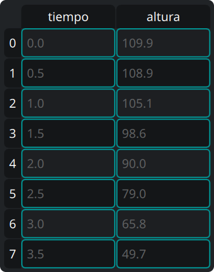

El botón de **tabla** de una columna la muestra en la tabla, junto al panel. En
la tabla:

- haz clic en una celda y escribe para cambiarla, o pulsa `Intro` para abrir el
  editor,
- haz clic en una cabecera para seleccionar toda una fila o toda una columna,
- arrastra para seleccionar un rectángulo de celdas,
- pulsa `Retroceso` para vaciar las celdas seleccionadas, y `Supr` para
  borrarlas,
- abre el menú contextual, con el botón derecho, para esas dos mismas acciones,
  bajo *Borrar* y *Eliminar*, y también para *Insertar fila encima* e *Insertar
  fila debajo*. Las dos entradas de inserción actúan sobre la celda activa.

Si borras una columna entera, la aplicación borra también el objeto columna.

#### 3.5.2. Rellenar una columna con un objeto

El botón de histograma de una columna abre un formulario pequeño: nombra un
objeto, y da un **Inicio**, un **Fin** y un **Paso**. El botón de
confirmación muestrea el objeto y escribe los valores en la columna.

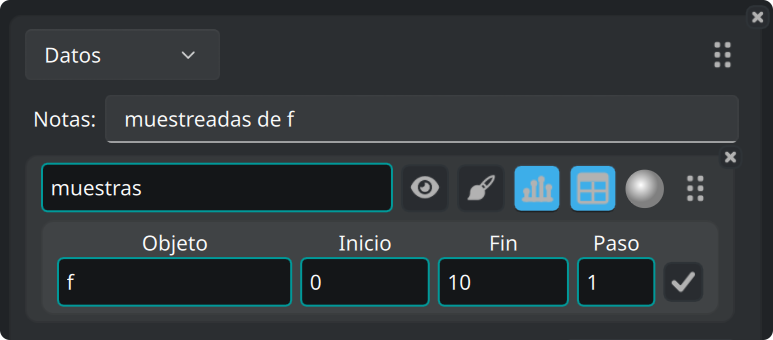

#### 3.5.3. Importar un archivo CSV

El botón CSV está en una hoja, o al final de la pestaña Mates para crear una
hoja nueva.

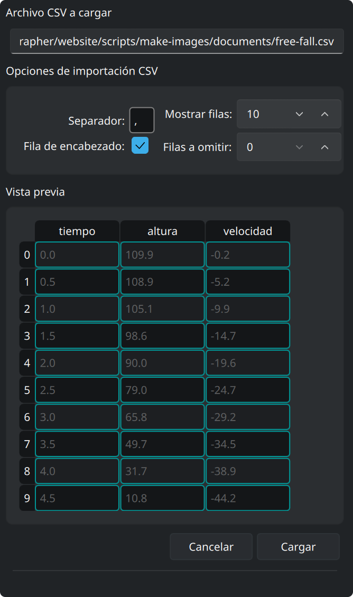

Abre un selector de archivos. Después, un panel lateral muestra una vista previa
del archivo y las opciones con que se lee. La vista previa sigue cada cambio:

- Indica el separador (escribe `\t` para el tabulador).
- Indica cuántas filas hay que omitir al principio del archivo (comentarios o
  parámetros, por ejemplo).
- Marca si la primera fila lleva los nombres de las columnas.
- **Mostrar filas** es el número de filas que enseña la vista previa.
- **Cargar** crea las columnas a partir de la vista previa.
- **Cancelar** lo deja todo como estaba.

Hemos probado ZeGrapher con archivos CSV de varios millones de celdas.

### 3.6. Estilo de trazado

El botón del pincel abre los ajustes que deciden cómo se dibuja un objeto:

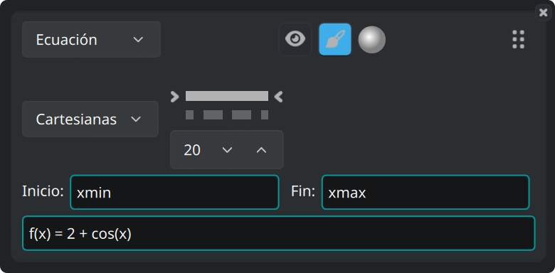

- Coordenadas **cartesianas** o **polares**.
- El patrón de la línea — continua, discontinua, de trazo y punto, de puntos, o
  sin línea — y su grosor.
- Para los objetos dibujados con puntos (sucesiones y datos), la forma y el
  tamaño de los puntos.
- **Inicio** y **Fin**: el intervalo sobre el que la aplicación traza el objeto.
  Los valores por defecto son `xmin` y `xmax`, los límites de la vista. Ambos
  campos aceptan cualquier expresión, por ejemplo `-math::pi` y `4*math::pi`.

## 4. La pestaña Cuadrícula — marcas y cuadrícula

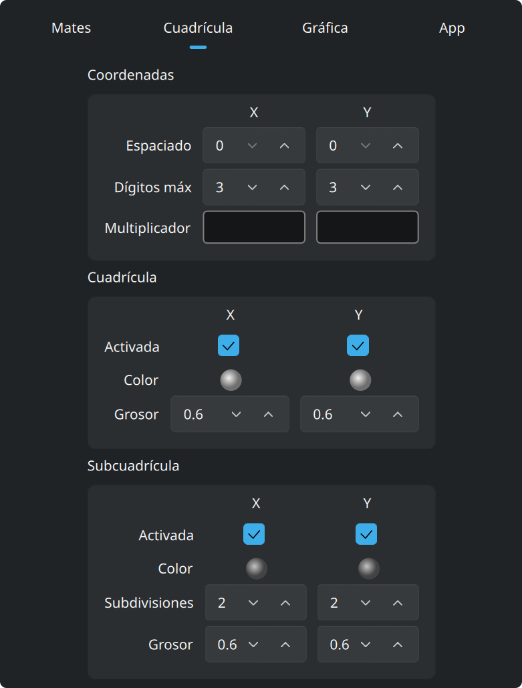

**Coordenadas** ajusta los números que van a lo largo de los ejes: su
espaciado, cuántos dígitos pueden usar, y un **multiplicador**. El multiplicador
es una expresión, así que las marcas pueden ser múltiplos de `math::pi`, y las
etiquetas se escriben entonces como múltiplos de ese valor.

**Cuadrícula** y **Subcuadrícula** se ajustan por separado para x y para y. Cada
una tiene color, grosor de línea, y un interruptor que la muestra o la oculta. A
la subcuadrícula le das además en cuántas partes corta cada celda.

## 5. La pestaña Gráfica — aspecto y precisión

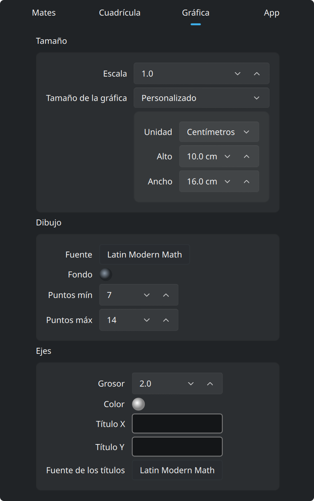

Por defecto la gráfica llena la ventana. Pon **Tamaño de gráfica** en
*Personalizado*, en el recuadro **Tamaño** de arriba, y la gráfica pasa a ser
una hoja del tamaño que indiques. Ese tamaño va en píxeles, o en **centímetros
reales**. Un centímetro es un centímetro real en la pantalla, y lo
sigue siendo en un `pdf` o un `svg` exportado. **Escala**, en el mismo recuadro,
agranda o encoge todo el dibujo con un solo ajuste.

La aplicación dibuja esa hoja como una página dentro de la ventana, con una
barra de zoom encima:

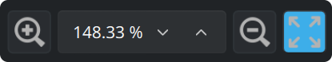

La barra agranda o encoge la hoja en la pantalla, y también acepta un porcentaje
de zoom. El último botón ajusta la hoja entera a la ventana. Este zoom solo
cambia el tamaño al que la aplicación dibuja la hoja. Los límites de la vista no
se tocan.

Los dos recuadros bajo **Tamaño**:

- **Dibujo**: la **fuente** de la gráfica y el color de su **fondo**. **Puntos
  mín** y **Puntos máx** son la cantidad de puntos que la aplicación calcula
  para cada curva continua, en potencias de dos. Cuantos más puntos, más fino el
  trazado y más lento el dibujo.
- **Ejes**: grosor de línea, color, los títulos escritos a lo largo de x y de y,
  y la fuente de esos títulos.

## 6. La pestaña App

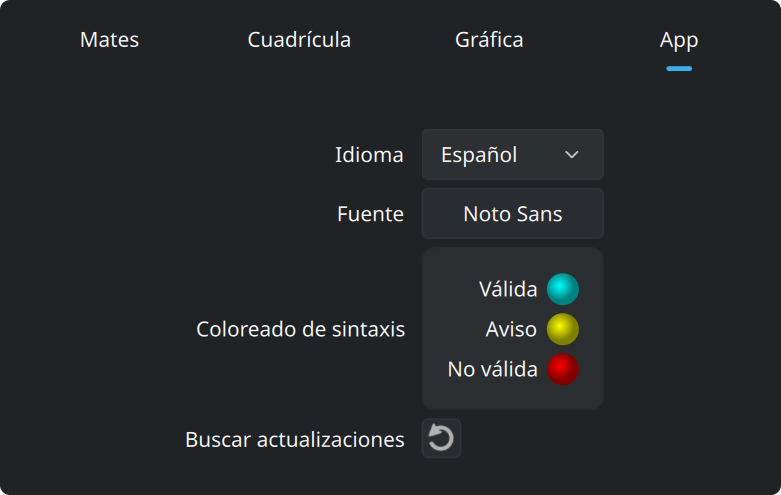

Esta pestaña tiene el idioma y la fuente de la interfaz. También tiene los tres
colores de los campos de entrada: válida, aviso y no válida. El último botón le
pregunta a zegrapher.com si hay una versión más nueva.
