# Documentation

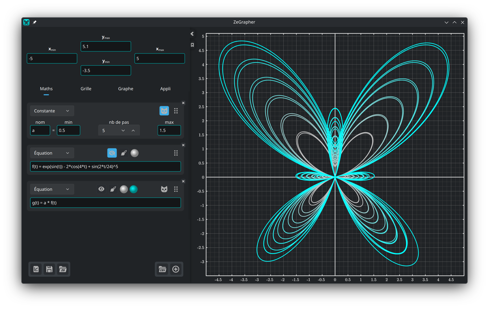

- [1. Le graphe](#1-le-graphe)
  - [1.1. Se déplacer et zoomer](#11-se-déplacer-et-zoomer)
- [2. Le panneau de saisie](#2-le-panneau-de-saisie)
  - [2.1. Bornes de la vue](#21-bornes-de-la-vue)
  - [2.2. Fichiers](#22-fichiers)
- [3. L'onglet Maths](#3-longlet-maths)
  - [3.1. Ajouter un objet](#31-ajouter-un-objet)
  - [3.2. Fonctions et suites](#32-fonctions-et-suites)
  - [3.3. Constantes](#33-constantes)
    - [3.3.1. Animation](#331-animation)
    - [3.3.2. Plusieurs valeurs à la fois](#332-plusieurs-valeurs-à-la-fois)
  - [3.4. Équations paramétriques](#34-équations-paramétriques)
  - [3.5. Données](#35-données)
    - [3.5.1. Le tableau de données](#351-le-tableau-de-données)
    - [3.5.2. Remplir une colonne à partir d'un objet](#352-remplir-une-colonne-à-partir-dun-objet)
    - [3.5.3. Importer un fichier CSV](#353-importer-un-fichier-csv)
  - [3.6. Style de tracé](#36-style-de-tracé)
- [4. L'onglet Grille — graduations et grille](#4-longlet-grille--graduations-et-grille)
- [5. L'onglet Graphe — allure et précision](#5-longlet-graphe--allure-et-précision)
- [6. L'onglet Appli](#6-longlet-appli)

## 1. Le graphe


Le graphe est ce que vous voyez à droite, et ce que vous exportez. Les onglets
[Grille](#4-longlet-grille--graduations-et-grille) et
[Graphe](#5-longlet-graphe--allure-et-précision) règlent son allure, sa précision
et sa taille.

### 1.1. Se déplacer et zoomer

Le graphe se pilote à la souris :

| Action | Souris |
|--------|--------|
| Déplacer la vue | Faire glisser avec le bouton gauche de la souris |
| Zoomer les deux axes à la fois | Molette |
| Zoomer l'axe y seul | `Ctrl` + molette verticale |
| Zoomer l'axe x seul | `Ctrl` + molette horizontale ou <br/> `Ctrl` + `Maj` + molette verticale |

Le zoom conserve en place le point situé sous le curseur.

## 2. Le panneau de saisie

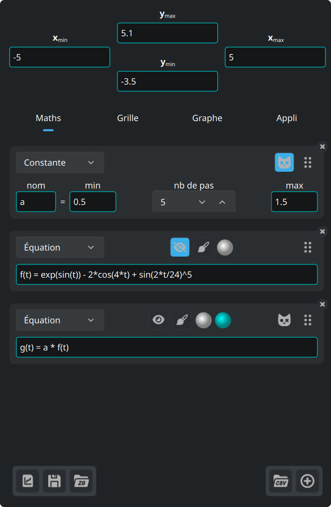

Les quatre champs en haut du panneau sont les bornes de la vue. En dessous se
trouvent quatre onglets :

| Onglet | Ce qu'il contient |
|--------|-------------------|
| **Maths** | les objets que vous tracez : équations, constantes, équations paramétriques, données |
| **Grille** | graduations, grille et sous-grille |
| **Graphe** | taille, police, arrière-plan, axes |
| **Appli** | langue, police, coloration syntaxique, mises à jour |

Les trois boutons en bas à gauche concernent les [fichiers](#22-fichiers).

La flèche sur le bord du panneau le masque, et le rouvre. La ligne qui longe son
bord droit règle sa largeur.

Le bouton marque-page, sous cette flèche, ouvre cette documentation et la
referme.

### 2.1. Bornes de la vue

Les quatre champs en haut du panneau acceptent des expressions, et pas seulement
des nombres. Chaque minimum doit rester inférieur à son maximum, et les champs
refusent toute autre valeur.

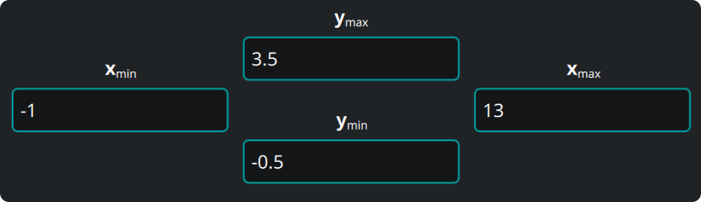

### 2.2. Fichiers


Les trois boutons en bas à gauche du panneau sont, dans l'ordre :

1. **Exporter le graphe** que vous voyez, dans un format vectoriel (`svg`,
   `pdf`) ou comme image (`png`, `jpeg`, `bmp`, `ppm`). Le fichier exporté est
   identique au graphe affiché à l'écran.
2. **Enregistrer** tout — objets, données, vue, réglages — dans un document
   ZeGrapher (`.zg`).
3. **Ouvrir** un tel document.

Au démarrage suivant, ZeGrapher rouvre votre dernier travail. Si vous donnez un
fichier `.zg` en ligne de commande, l'application ouvre ce fichier à la place.

## 3. L'onglet Maths

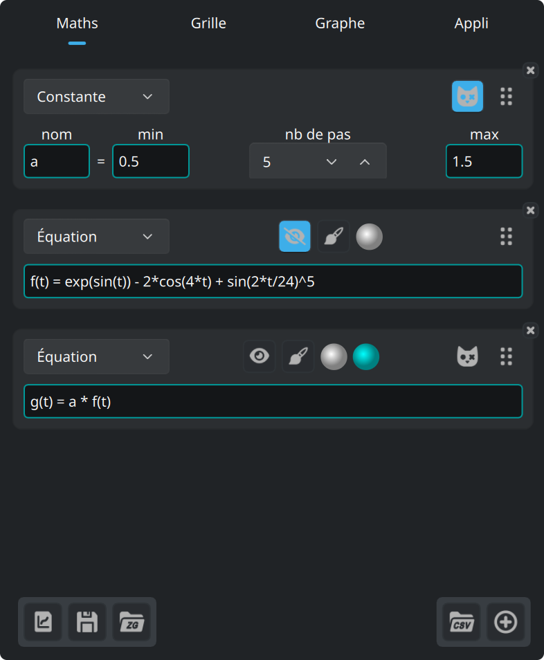

Cet onglet définit les objets à tracer, ou à utiliser dans d'autres objets :
fonctions, suites, constantes (jamais tracées), équations paramétriques et
colonnes de données.

### 3.1. Ajouter un objet

Ce bouton, en bas de l'onglet Maths, ajoute un objet.


La liste déroulante en haut de la nouvelle carte choisit le type d'objet.

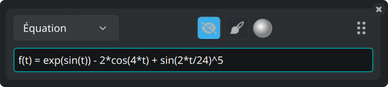

Toutes les cartes portent les mêmes boutons :

- Le bouton œil affiche ou masque la courbe.
- Le bouton pinceau ouvre le [style de tracé](#36-style-de-tracé).
- Le disque est la couleur de la courbe.
- La poignée à droite réordonne les objets quand vous la faites glisser.
- Le **×** dans le coin supprime l'objet.

### 3.2. Fonctions et suites

Une fonction se définit par son équation naturelle :

```
f(x) = 2 + cos(x)
```

Ces fonctions sont prédéfinies, et s'utilisent dans toute expression :

| Catégorie | Fonctions |
|-----------|-----------|
| Trigonométrie | `cos`, `sin`, `tan`, `acos`, `asin`, `atan` |
| Hyperboliques | `cosh`, `sinh`, `tanh`, `acosh`, `asinh`, `atanh` |
| Hyperboliques, noms courts | `ch`, `sh`, `th`, `ach`, `ash`, `ath` |
| Puissances et logarithmes | `sqrt`, `exp`, `ln` (base e), `log` (base 10), `lg` (base 2) |
| Arrondis | `floor`, `ceil` |
| À deux arguments | `max`, `min` |
| Autres | `abs`, `erf`, `erfc`, `gamma` (qui s'écrit aussi `Γ`) |

Ces constantes sont prédéfinies :

| Nom | Valeur |
|-----|--------|
| `math::pi`, `math::π` | 3.141592653589793 |
| `physics::kB` | la constante de Boltzmann, 1.380649e-23 |
| `physics::h` | la constante de Planck, 6.62607015e-34 |
| `physics::c` | la vitesse de la lumière dans le vide, 299792458 |

Les trois constantes physiques sont exprimées en unités SI.

Une suite est une liste d'expressions séparées par `,` ou `;`. Les premières
expressions sont les premiers termes de la suite. La **dernière** est le terme
général, et l'application l'utilise pour tous les indices suivants.

```
u(n) = 0 ; 1 ; 0.5*(u(n-2) + u(n-1))
```

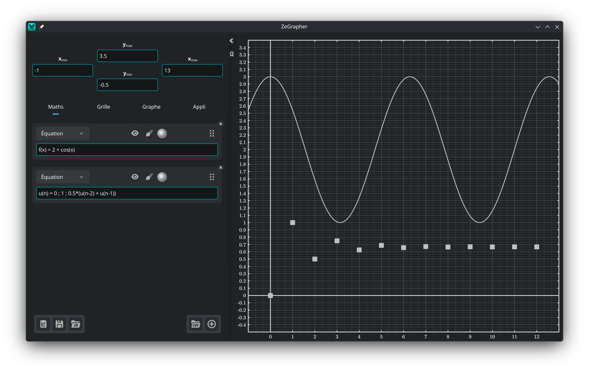

Le contour d'un champ de saisie prend une couleur qui dit si l'expression est
valide. Une expression invalide reçoit en plus un message, en dessous, qui en
donne la raison.

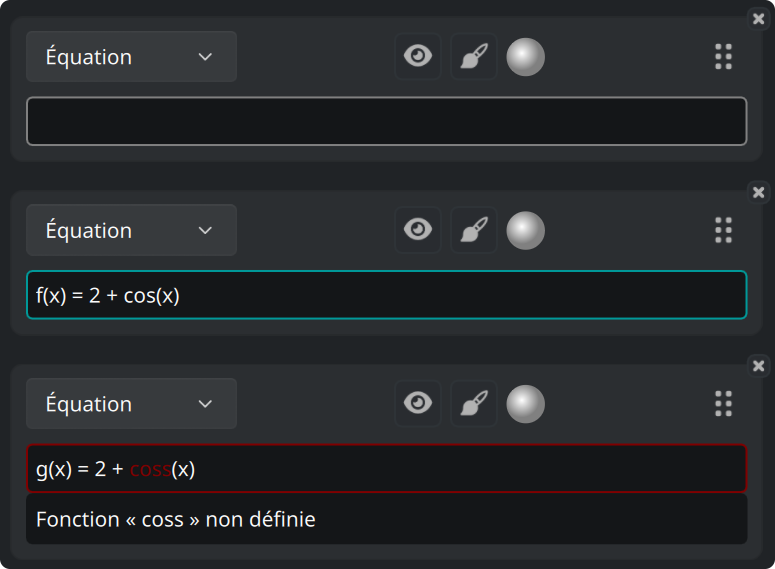

Un champ qui attend une valeur, comme une borne de la vue, peut prendre la
couleur d'avertissement : l'expression est valide, mais elle ne donne aucun
nombre.


Vous choisissez ces trois couleurs dans l'[onglet Appli](#6-longlet-appli).

### 3.3. Constantes

Une **constante** est un nom porteur d'une valeur numérique. Tout autre objet,
sauf une autre constante, peut ensuite l'utiliser dans son expression.

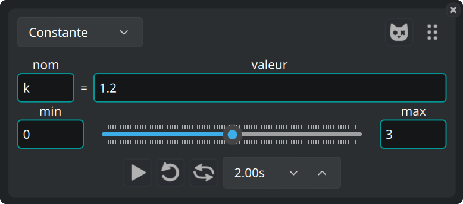

#### 3.3.1. Animation

Le curseur en dessous fait varier la valeur entre **min** et **max**, et toutes
les courbes qui utilisent la constante suivent. Faites glisser le curseur à la
main, ou animez-le. La rangée sous le curseur donne les commandes d'animation :
lecture, boucle, aller-retour, et la durée d'un passage.

#### 3.3.2. Plusieurs valeurs à la fois

Ce bouton, sur une carte de constante, la transforme en **constante de
Schrödinger**.


La constante prend alors `nombre de pas + 1` valeurs, réparties à intervalles
réguliers entre min et max. L'application trace chaque objet qui utilise la
constante une fois par valeur.

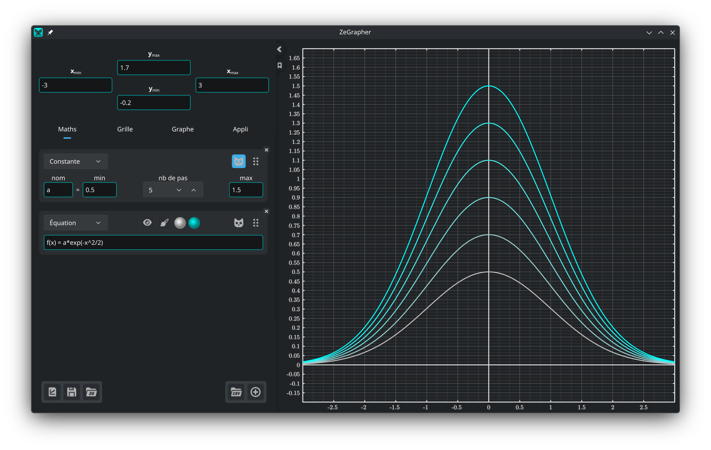

Ces objets reçoivent un second disque de couleur. L'application dessine la
famille de courbes en dégradé, de la première couleur vers la seconde.

### 3.4. Équations paramétriques

Une équation paramétrique est un couple d'objets qui donnent les coordonnées de
chaque point de la courbe. Nommez-les dans les deux champs :

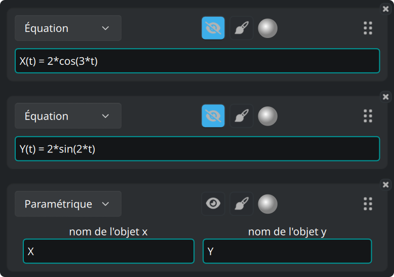

L'application trace le couple entre le **Début** et la **Fin**, définis dans le
[style de tracé](#36-style-de-tracé) de l'équation paramétrique.

### 3.5. Données

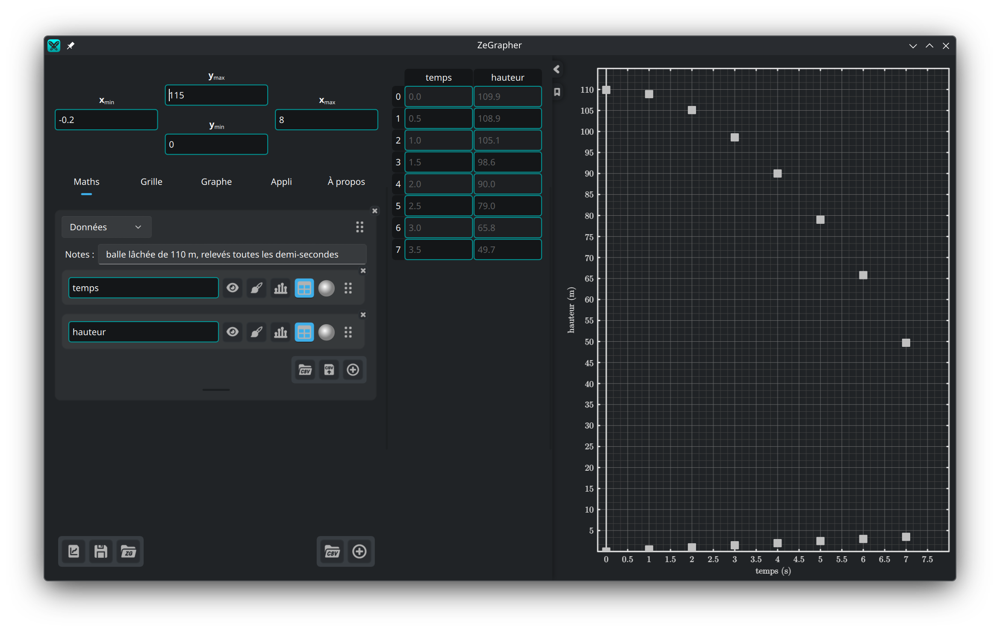

Un objet de données est une feuille de colonnes nommées. Chaque colonne est un
objet mathématique à part entière. Elle a un nom, un bouton œil, un style de
tracé, une couleur, une poignée qui la réordonne, et un **×** dans le coin qui
la supprime.

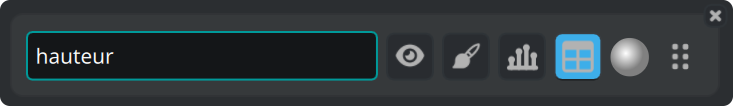

L'application trace les valeurs d'une colonne en fonction de leur indice : la
première valeur en x = 0, la deuxième en x = 1, et ainsi de suite. Pour tracer
une colonne en fonction d'une autre, utilisez une [équation
paramétrique](#34-équations-paramétriques).

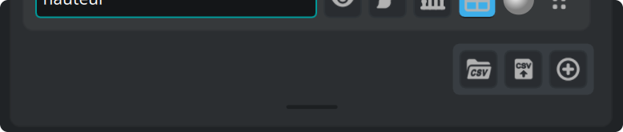

Les boutons en bas à droite de la feuille importent un fichier CSV, exportent
les colonnes vers un fichier CSV, et ajoutent une colonne. La barre en dessous
redimensionne la feuille. Double-cliquez dessus pour lui rendre sa hauteur par
défaut.

#### 3.5.1. Le tableau de données

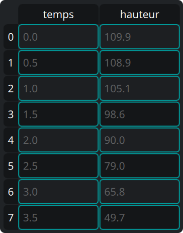

Le bouton **tableau** d'une colonne affiche cette colonne dans le tableau, à
côté du panneau. Dans le tableau :

- cliquez sur une cellule, puis saisissez une valeur pour la modifier, ou
  appuyez sur `Entrée` pour ouvrir l'éditeur,
- cliquez sur un en-tête pour sélectionner toute une ligne ou toute une colonne,
- faites glisser pour sélectionner un rectangle de cellules,
- appuyez sur `Retour arrière` pour vider les cellules sélectionnées, et sur
  `Suppr` pour les supprimer,
- ouvrez le menu contextuel, d'un clic droit, pour ces deux mêmes actions, sous
  *Effacer* et *Supprimer*, ainsi que pour *Insérer une ligne au-dessus* et
  *Insérer une ligne en dessous*. Les deux entrées d'insertion agissent sur la
  cellule active.

Si vous supprimez toute une colonne, l'application supprime aussi l'objet
colonne.

#### 3.5.2. Remplir une colonne à partir d'un objet

Le bouton histogramme d'une colonne ouvre un petit formulaire : indiquez un
objet, puis donnez un **Début**, une **Fin** et un **Pas**. Le bouton de
validation échantillonne l'objet et écrit les valeurs dans la colonne.

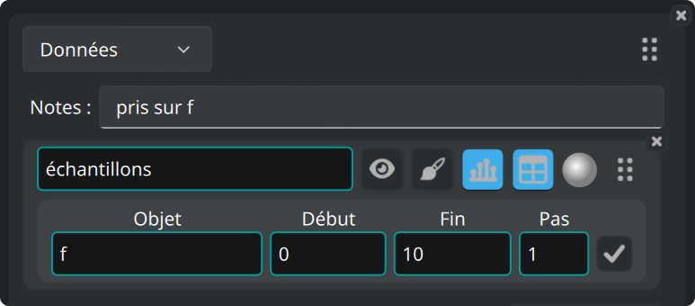

#### 3.5.3. Importer un fichier CSV

Le bouton CSV se trouve sur une feuille, ou en bas de l'onglet Maths pour créer
une nouvelle feuille.

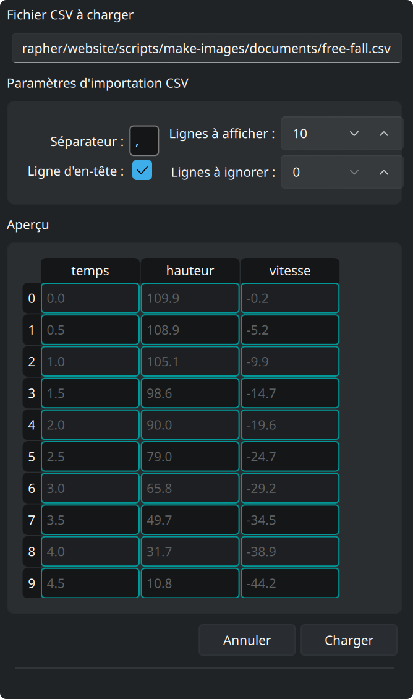

Il ouvre un sélecteur de fichier. Un volet latéral montre ensuite un aperçu du
fichier, et les options qui le lisent. L'aperçu suit chaque modification :

- Indiquez le séparateur (écrivez `\t` pour une tabulation).
- Indiquez le nombre de lignes à ignorer en haut du fichier (des commentaires ou
  des paramètres, par exemple).
- Précisez si la première ligne contient les noms des colonnes.
- **Lignes à afficher** est le nombre de lignes que l'aperçu montre.
- **Charger** crée les colonnes à partir de l'aperçu.
- **Annuler** laisse tout en l'état.

Nous avons testé ZeGrapher sur des fichiers CSV de plusieurs millions de
cellules.

### 3.6. Style de tracé

Le bouton pinceau ouvre les réglages qui décident du dessin d'un objet :

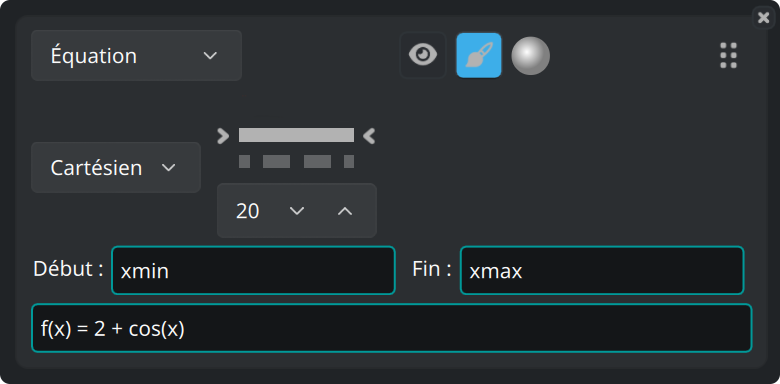

- Coordonnées **Cartésiennes** ou **Polaires**.
- Le motif du trait — plein, tirets, tirets-points, pointillés, ou aucun trait —
  et son épaisseur.
- Pour les objets dessinés en points (suites et données), la forme et la taille
  des points.
- **Début** et **Fin** : l'intervalle sur lequel l'application trace l'objet.
  Les valeurs par défaut sont `xmin` et `xmax`, les bornes de la vue. Les deux
  champs acceptent toute expression, par exemple `-math::pi` et `4*math::pi`.

## 4. L'onglet Grille — graduations et grille

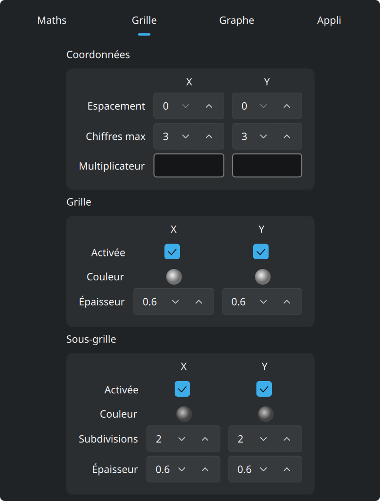

**Coordonnées** règle les nombres le long des axes : leur espacement, le nombre
de chiffres qu'ils peuvent afficher, et un **multiplicateur**. Le multiplicateur
est une expression : les graduations peuvent donc être des multiples de
`math::pi`, et les étiquettes s'écrivent alors en multiples de cette valeur.

Vous réglez **Grille** et **Sous-grille** séparément pour x et pour y. Chacune a
une couleur, une épaisseur de trait, et un interrupteur qui l'affiche ou la
masque. Vous donnez aussi à la sous-grille le nombre de subdivisions de chaque
cellule.

## 5. L'onglet Graphe — allure et précision

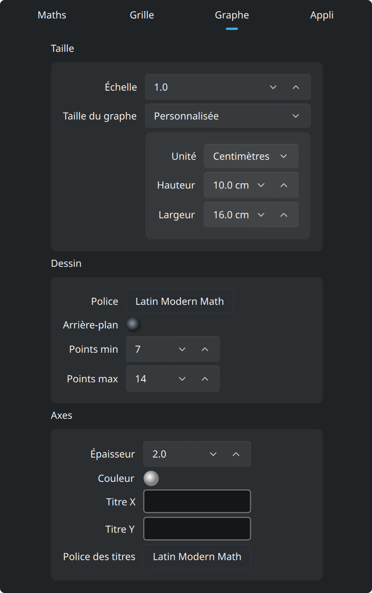

Par défaut, le graphe remplit la fenêtre. Réglez **Taille du graphe** sur
*Personnalisée*, dans le cadre **Taille** en haut, et le graphe devient une
feuille de la taille que vous indiquez. Cette taille est en pixels, ou en
**centimètres réels**. Un centimètre est un vrai centimètre à l'écran,
et le reste dans un `pdf` ou un `svg` exporté. **Échelle**, dans le
même cadre, agrandit ou réduit tout le dessin d'un seul réglage.

L'application dessine cette feuille comme une page dans la fenêtre, avec une
barre de zoom au-dessus :

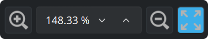

La barre agrandit ou réduit l'affichage de la feuille, et accepte aussi un
pourcentage de zoom. Le dernier bouton ajuste toute la feuille à la fenêtre. Ce
zoom ne change que la taille à laquelle l'application dessine la feuille. Les
bornes de la vue restent inchangées.

Les deux cadres sous **Taille** :

- **Dessin** : la **police** du graphe et la couleur de son **arrière-plan**.
  **Points min** et **Points max** sont le nombre de points que l'application
  calcule pour chaque courbe continue, en puissances de deux. Plus il y a de
  points, plus le tracé est fin et plus le dessin est lent.
- **Axes** : épaisseur de trait, couleur, les titres écrits le long de x et de
  y, et la police de ces titres.

## 6. L'onglet Appli

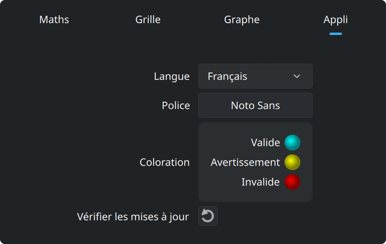

Cet onglet contient la langue et la police de l'interface. Il donne aussi les
trois couleurs des champs de saisie : valide, avertissement et invalide. Le
dernier bouton demande à zegrapher.com s'il existe une version plus récente.
