# Documentazione

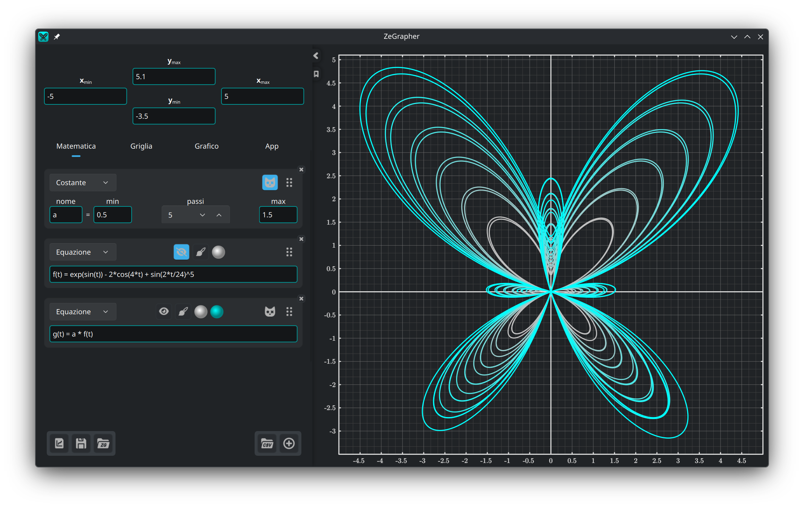

- [1. Il grafico](#1-il-grafico)
  - [1.1. Spostare e zoomare](#11-spostare-e-zoomare)
- [2. Il pannello di inserimento](#2-il-pannello-di-inserimento)
  - [2.1. Estremi della vista](#21-estremi-della-vista)
  - [2.2. File](#22-file)
- [3. La scheda Matematica](#3-la-scheda-matematica)
  - [3.1. Aggiungere un oggetto](#31-aggiungere-un-oggetto)
  - [3.2. Funzioni e successioni](#32-funzioni-e-successioni)
  - [3.3. Costanti](#33-costanti)
    - [3.3.1. Animazione](#331-animazione)
    - [3.3.2. Più valori insieme](#332-più-valori-insieme)
  - [3.4. Equazioni parametriche](#34-equazioni-parametriche)
  - [3.5. Dati](#35-dati)
    - [3.5.1. La tabella dei dati](#351-la-tabella-dei-dati)
    - [3.5.2. Riempire una colonna da un oggetto](#352-riempire-una-colonna-da-un-oggetto)
    - [3.5.3. Importare un file CSV](#353-importare-un-file-csv)
  - [3.6. Stile del tratto](#36-stile-del-tratto)
- [4. La scheda Griglia — tacche e griglia](#4-la-scheda-griglia--tacche-e-griglia)
- [5. La scheda Grafico — aspetto e precisione](#5-la-scheda-grafico--aspetto-e-precisione)
- [6. La scheda App](#6-la-scheda-app)
- [7. La scheda Informazioni](#7-la-scheda-informazioni)

## 1. Il grafico

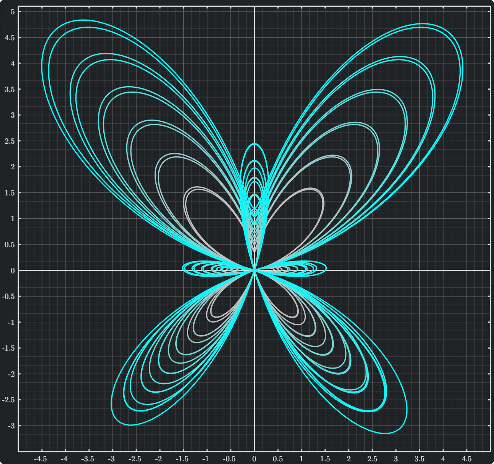

Il grafico è quello che vedi a destra, e quello che esporti. Le schede
[Griglia](#4-la-scheda-griglia--tacche-e-griglia) e
[Grafico](#5-la-scheda-grafico--aspetto-e-precisione) ne fissano l'aspetto, la
precisione e la dimensione.

### 1.1. Spostare e zoomare

Il grafico si comanda col mouse:

| Azione | Mouse |
|--------|-------|
| Spostare la vista | Trascinare col tasto sinistro |
| Zoomare i due assi insieme | Rotellina |
| Zoomare solo l'asse y | `Ctrl` + scorrimento verticale |
| Zoomare solo l'asse x | `Ctrl` + scorrimento orizzontale, oppure <br/> `Ctrl` + `Maiusc` + scorrimento verticale |

Con lo zoom, il punto sotto il cursore resta dov'è.

## 2. Il pannello di inserimento

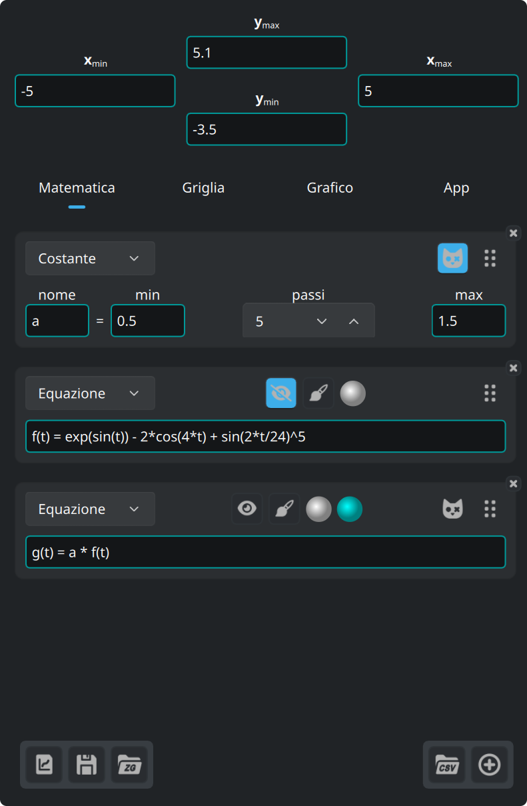

I quattro campi in cima al pannello sono gli estremi della vista. Sotto ci sono
cinque schede:

| Scheda | Cosa contiene |
|--------|---------------|
| **Matematica** | gli oggetti che tracci: equazioni, costanti, equazioni parametriche, dati |
| **Griglia** | tacche, griglia e sottogriglia |
| **Grafico** | dimensioni, carattere, sfondo, assi |
| **App** | lingua, carattere, colori della sintassi |
| **Informazioni** | versione, aggiornamenti, licenze, note di rilascio |

I tre pulsanti in basso a sinistra riguardano i [file](#22-file).

Sul bordo del pannello:

- il pulsante a freccia chiude il pannello, e lo riapre
- il pulsante a segnalibro, subito sotto, apre e chiude questa documentazione
- trascina la linea lungo il bordo destro per cambiare la larghezza del
  pannello

### 2.1. Estremi della vista

I quattro campi in cima al pannello accettano espressioni, non solo numeri. Ogni
minimo deve restare sotto il suo massimo, altrimenti il campo diventa non
valido.

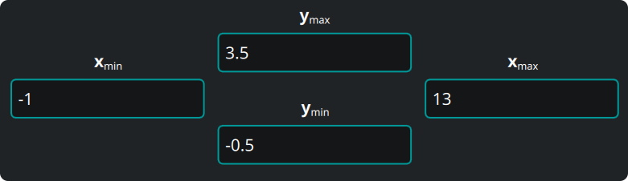

### 2.2. File


I tre pulsanti in basso a sinistra nel pannello sono, in ordine:

1. **Esporta il grafico** che vedi, in formato vettoriale (`svg`, `pdf`) o come
   immagine (`png`, `jpeg`, `bmp`, `ppm`). Il file esce identico al grafico
   sullo schermo.
2. **Salva** tutto — oggetti, dati, vista, impostazioni — in un documento
   ZeGrapher (`.zg`).
3. **Apri** un documento di questo tipo.

Al prossimo avvio, ZeGrapher riapre il tuo ultimo lavoro. Se passi un file `.zg`
sulla riga di comando, apre quel file al suo posto.

## 3. La scheda Matematica

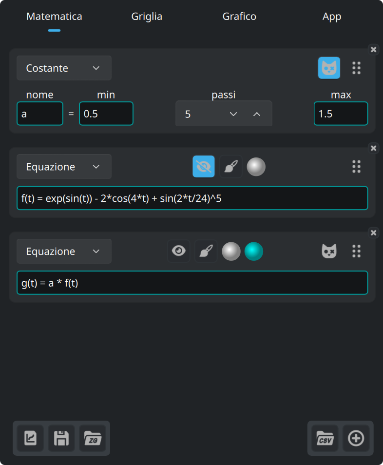

Questa scheda definisce gli oggetti da tracciare, o da usare dentro altri
oggetti: funzioni, successioni, costanti (che non si tracciano mai), equazioni
parametriche e colonne di dati.

### 3.1. Aggiungere un oggetto

Questo pulsante, in fondo alla scheda Matematica, aggiunge un oggetto.


L'elenco in cima alla nuova scheda sceglie il tipo di oggetto.

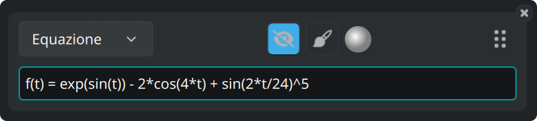

Ogni scheda di oggetto porta gli stessi pulsanti:

- L'occhio mostra o nasconde la curva.
- Il pennello apre lo [stile del tratto](#36-stile-del-tratto).
- Il disco è il colore della curva.
- Trascina la maniglia a destra per riordinare gli oggetti.
- La **×** nell'angolo elimina l'oggetto.

### 3.2. Funzioni e successioni

Una funzione si definisce con la sua equazione naturale:

```
f(x) = 2 + cos(x)
```

Queste funzioni sono già pronte, e valgono in ogni espressione:

| Tipo | Funzioni |
|------|----------|
| Trigonometria | `cos`, `sin`, `tan`, `acos`, `asin`, `atan` |
| Iperboliche | `cosh`, `sinh`, `tanh`, `acosh`, `asinh`, `atanh` |
| Iperboliche, nomi brevi | `ch`, `sh`, `th`, `ach`, `ash`, `ath` |
| Potenze e logaritmi | `sqrt`, `exp`, `ln` (base e), `log` (base 10), `lg` (base 2) |
| Arrotondamento | `floor`, `ceil` |
| A due argomenti | `max`, `min` |
| Altre | `abs`, `erf`, `erfc`, `gamma` (si scrive anche `Γ`) |

Queste costanti ci sono già:

| Nome | Valore |
|------|--------|
| `math::pi`, `math::π` | 3.141592653589793 |
| `physics::kB` | la costante di Boltzmann, 1.380649e-23 |
| `physics::h` | la costante di Planck, 6.62607015e-34 |
| `physics::c` | la velocità della luce nel vuoto, 299792458 |

Le tre costanti fisiche sono in unità del SI.

Una successione è un elenco di espressioni separate da `,` o `;`. Le prime
espressioni sono i primi termini. L'**ultima** è il termine generale, e vale per
tutti gli indici che seguono.

```
u(n) = 0 ; 1 ; 0.5*(u(n-2) + u(n-1))
```

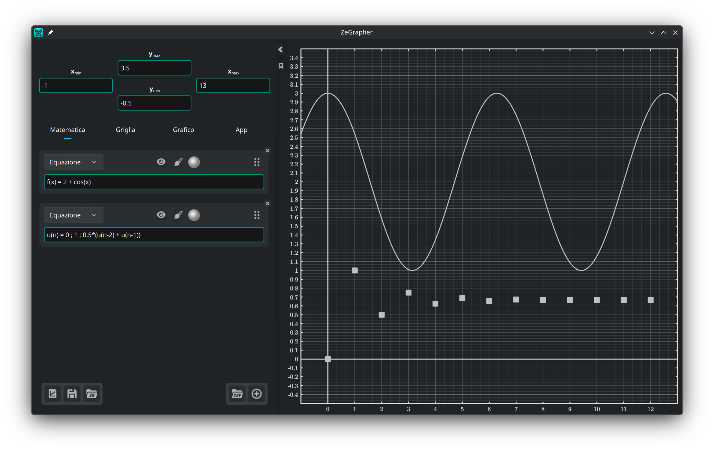

Il bordo di un campo prende un colore che dice se l'espressione è valida. Quando
non lo è, sotto compare il motivo.

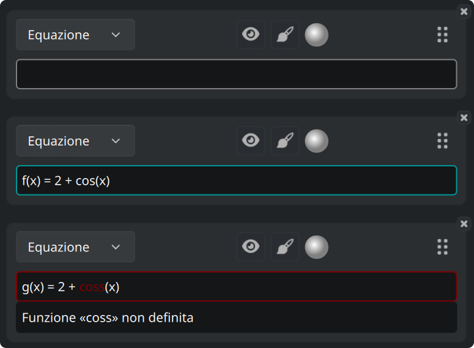

Un campo che aspetta un valore, come un estremo della vista, può prendere invece
il colore di avviso: l'espressione è valida, ma non dà nessun numero.

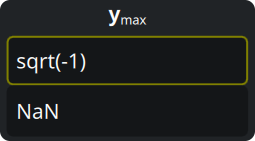

Questi tre colori li scegli nella [scheda App](#6-la-scheda-app).

### 3.3. Costanti

Una **costante** è un nome con un valore numerico. Ogni altro oggetto, tranne
un'altra costante, può poi usarla nella propria espressione.

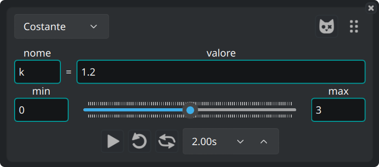

#### 3.3.1. Animazione

Il cursore sotto porta il valore da **min** a **max**, e tutte le curve che usano
la costante lo seguono. Trascina il cursore a mano, oppure lascialo andare. La
riga sotto il cursore ha i comandi dell'animazione: avvio, ciclo, avanti e
indietro, e la durata di un passaggio.

#### 3.3.2. Più valori insieme

Questo pulsante, su una scheda di costante, la rende una **costante di
Schrödinger**.


La costante prende allora `passi + 1` valori, a distanze uguali da min a max.
Ogni oggetto che la usa viene tracciato una volta per valore.

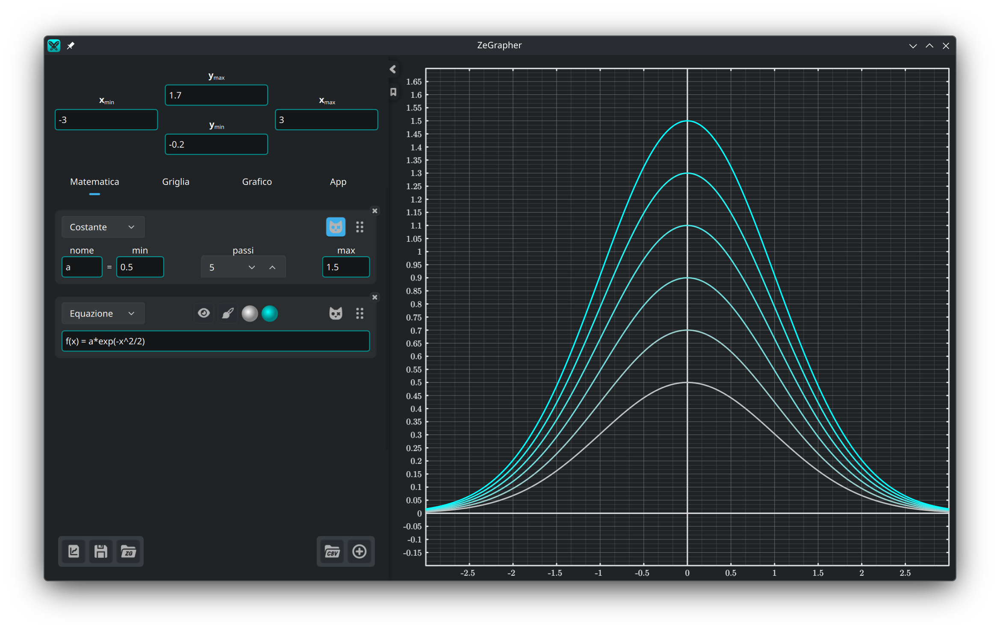

Questi oggetti ricevono un secondo disco di colore. La famiglia di curve viene
disegnata in sfumatura, dal primo colore al secondo.

### 3.4. Equazioni parametriche

Un'equazione parametrica è una coppia di oggetti che dà le coordinate di ogni
punto della curva. I loro nomi si scrivono nei due campi:

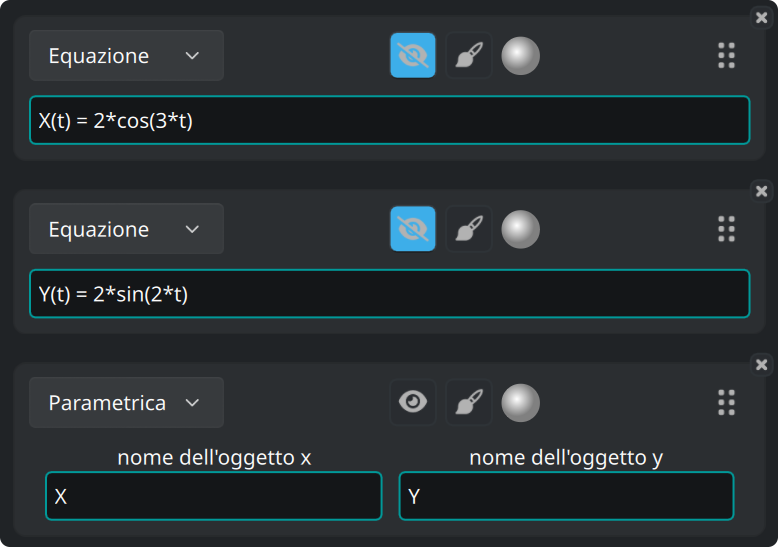

La coppia viene tracciata fra l'**Inizio** e la **Fine**, definiti nello
[stile del tratto](#36-stile-del-tratto) dell'equazione parametrica.

### 3.5. Dati

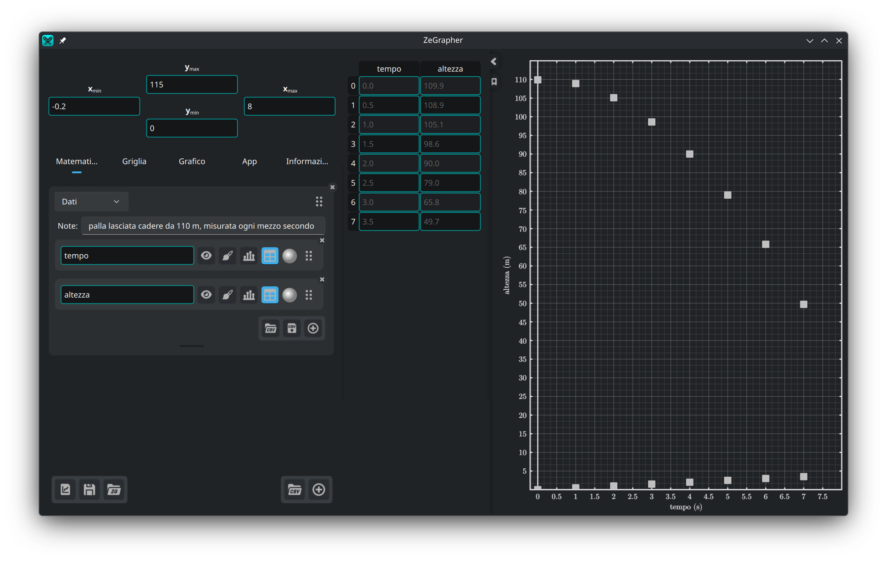

Un oggetto di dati è un foglio di colonne con un nome. Ogni colonna è un oggetto
matematico a sé, con un nome e gli stessi pulsanti di ogni altro oggetto.

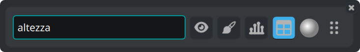

I valori di una colonna vengono tracciati contro il loro indice: il primo valore
in x = 0, il secondo in x = 1, e così via. Per tracciare una colonna contro
un'altra, usa un'[equazione parametrica](#34-equazioni-parametriche).

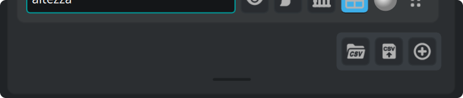

I pulsanti in basso a destra del foglio importano un file CSV, scrivono le
colonne in un file CSV, e aggiungono una colonna. Trascina la barra sotto per
cambiare l'altezza del foglio, e fai doppio clic sulla barra per ridargli
l'altezza predefinita.

#### 3.5.1. La tabella dei dati

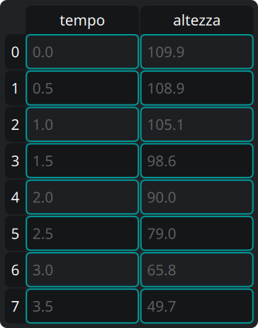

Il pulsante **tabella** di una colonna la mostra nella tabella accanto al
pannello. Nella tabella:

- Fai clic su una cella e scrivi per cambiarla, oppure premi `Invio` per aprire
  l'editor.
- Fai clic su un'intestazione per selezionare tutta una riga o tutta una colonna.
- Trascina per selezionare un rettangolo di celle.
- Premi `Backspace` per svuotare il contenuto delle celle scelte.
- Premi `Canc` per eliminare le celle scelte. I valori sotto salgono.
- Il menu del tasto destro ha le stesse due azioni, sotto *Svuota* ed *Elimina*,
  e in più *Inserisci riga sopra* e *Inserisci riga sotto*. Le due inserzioni
  agiscono sulla cella attiva.

Se selezioni una colonna intera e premi `Canc`, sparisce anche l'oggetto colonna
nella scheda Matematica.

#### 3.5.2. Riempire una colonna da un oggetto

Il pulsante a istogramma di una colonna apre un piccolo modulo: dai il nome di
un oggetto, e un **Inizio**, una **Fine** e un **Passo**. Il pulsante di conferma
preleva i valori dell'oggetto e li scrive nella colonna.

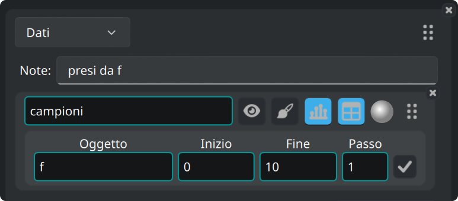

#### 3.5.3. Importare un file CSV

Il pulsante CSV sta su un foglio, oppure in fondo alla scheda Matematica per
creare un foglio nuovo.

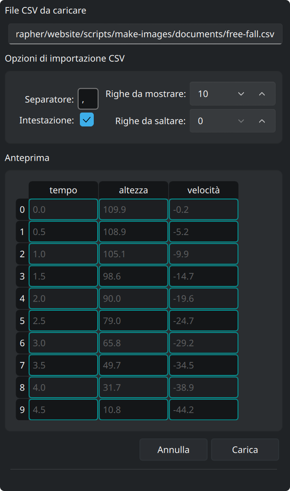

Apre una finestra di scelta file. Poi un pannello laterale mostra le
impostazioni di importazione, con sotto un'anteprima del file. L'anteprima si
aggiorna a ogni impostazione che cambi:

- **Separatore** — il carattere fra due valori. Scrivi `\t` per la tabulazione.
- **Riga di intestazione** — segnala quando la prima riga porta i nomi delle
  colonne.
- **Righe da mostrare** — quante righe si vedono nell'anteprima.
- **Righe da saltare** — quante righe saltare all'inizio del file, per esempio
  commenti o parametri.

**Carica** crea le colonne dal file, e **Annulla** lascia tutto com'era.

Abbiamo provato ZeGrapher su file CSV da diversi milioni di celle.

### 3.6. Stile del tratto

Il pulsante col pennello apre le impostazioni che decidono come viene disegnato
un oggetto:

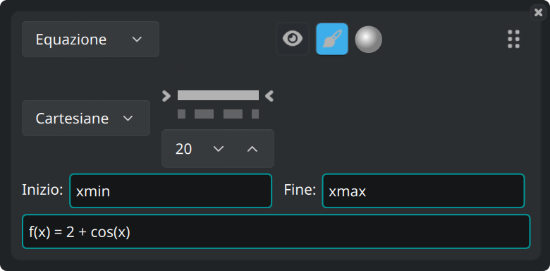

- Coordinate **cartesiane** o **polari**.
- Il tipo di linea — continua, tratteggiata, tratto e punto, punteggiata, o
  nessuna linea — e il suo spessore.
- Per gli oggetti disegnati a punti (successioni e dati), la forma e la
  dimensione dei punti.
- **Inizio** e **Fine**: l'intervallo su cui l'oggetto viene tracciato. Di
  partenza sono `xmin` e `xmax`, gli estremi della vista. Tutti e due i campi
  accettano qualsiasi espressione, per esempio `-math::pi` e `4*math::pi`.

## 4. La scheda Griglia — tacche e griglia

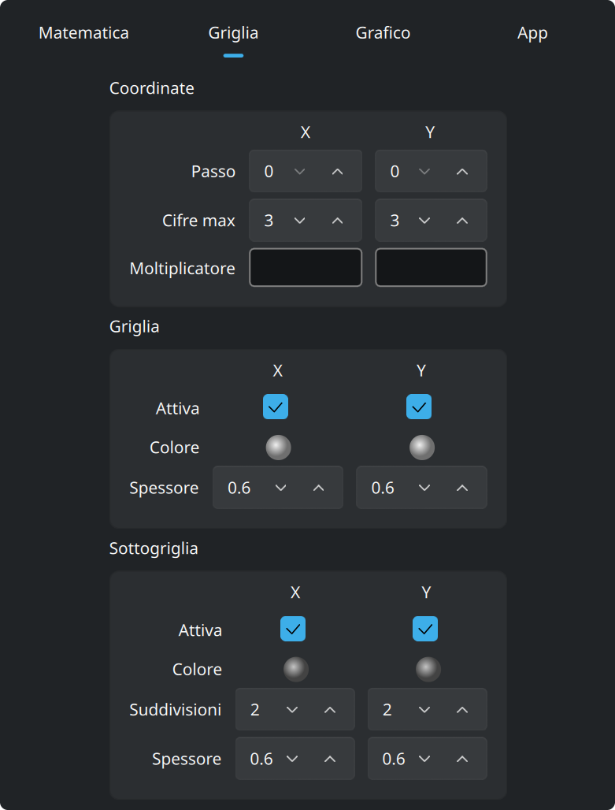

**Coordinate** regola i numeri lungo gli assi: il loro passo, quante cifre
possono usare, e un **moltiplicatore**. Il moltiplicatore è un'espressione,
quindi le tacche possono essere multipli di `math::pi`, e le etichette si
scrivono come multipli di quel valore.

**Griglia** e **Sottogriglia** si regolano separatamente per x e per y. Ognuna ha
un colore, uno spessore di linea, e un interruttore che la mostra o la nasconde.
Alla sottogriglia dici anche in quante parti taglia ogni cella.

## 5. La scheda Grafico — aspetto e precisione

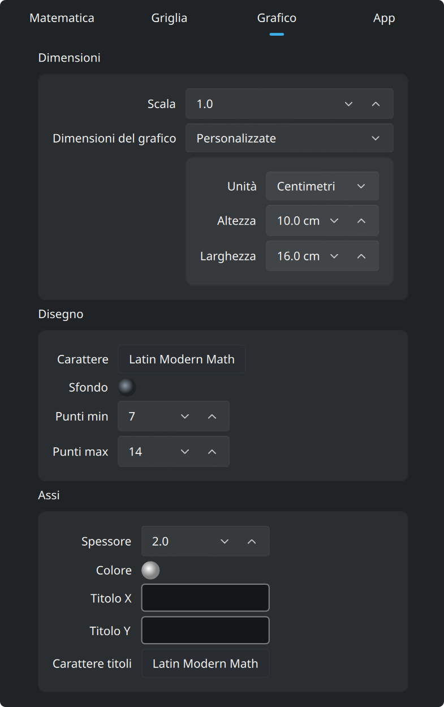

Di partenza il grafico riempie la finestra. Metti **Dimensioni del grafico** su
*Personalizzate*, nel riquadro **Dimensioni** in cima, e il grafico diventa un
foglio della dimensione che indichi. Quella dimensione va in pixel, o in
**centimetri reali**. Un centimetro è un centimetro vero sullo schermo, e resta
tale in un `pdf` o in un `svg` esportato.

**Scala**, nello stesso riquadro, ridimensiona in una volta tutto ciò che viene
disegnato: le linee, il testo e le tacche.

Questo foglio viene disegnato come una pagina dentro la finestra, con una barra
di zoom sopra:

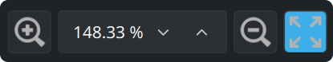

La barra fa lo zoom del foglio sullo schermo, e l'ultimo pulsante fa entrare
tutto il foglio nella finestra. Questo zoom non tocca il grafico: gli estremi
della vista restano come sono. Le dimensioni in centimetri sono giuste allo zoom
del 100%.

I due riquadri sotto **Dimensioni**:

- **Disegno**: il carattere e il colore di sfondo del grafico. **Punti min** e
  **Punti max** fissano quanti punti vengono calcolati per ogni curva continua,
  in potenze di due. Più punti danno un tratto più fine e un disegno più lento.
- **Assi**: spessore della linea, colore, i titoli scritti lungo x e y, e il
  carattere di quei titoli.

## 6. La scheda App

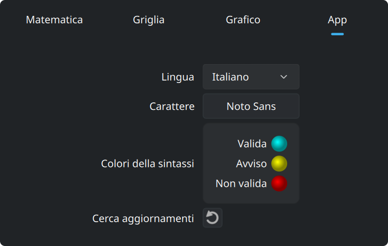

Questa scheda imposta la lingua e il carattere dell'interfaccia, e i tre colori
dei campi di inserimento: valida, avviso e non valida.

## 7. La scheda Informazioni

Questa scheda dice che cos'è ZeGrapher. Contiene:

- la versione che stai usando, e un pulsante che chiede a zegrapher.com se ne è
  uscita una più nuova,
- i collegamenti al sito, al codice sorgente e all'autore,
- le licenze di ZeGrapher, di Qt e del carattere matematico incluso,
- le note di rilascio: che cosa porta ogni versione, con un collegamento alla sua
  pagina su GitHub.
