# ドキュメント

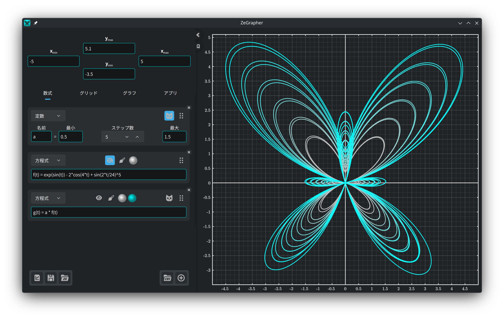

- [1. グラフ](#1-グラフ)
  - [1.1. 移動とズーム](#11-移動とズーム)
- [2. 入力パネル](#2-入力パネル)
  - [2.1. 表示範囲](#21-表示範囲)
  - [2.2. ファイル](#22-ファイル)
- [3. 数式タブ](#3-数式タブ)
  - [3.1. 対象を追加する](#31-対象を追加する)
  - [3.2. 関数と数列](#32-関数と数列)
  - [3.3. 定数](#33-定数)
    - [3.3.1. アニメーション](#331-アニメーション)
    - [3.3.2. 一度に複数の値](#332-一度に複数の値)
  - [3.4. 媒介変数表示](#34-媒介変数表示)
  - [3.5. データ](#35-データ)
    - [3.5.1. データの表](#351-データの表)
    - [3.5.2. 対象の値で列を埋める](#352-対象の値で列を埋める)
    - [3.5.3. CSV ファイルを読み込む](#353-csv-ファイルを読み込む)
  - [3.6. 描画スタイル](#36-描画スタイル)
- [4. グリッドタブ：目盛りとグリッド](#4-グリッドタブ目盛りとグリッド)
- [5. グラフタブ：見た目と精度](#5-グラフタブ見た目と精度)
- [6. アプリタブ](#6-アプリタブ)

## 1. グラフ


グラフは右側に見えているもので、書き出されるものでもあります。
[グリッド](#4-グリッドタブ目盛りとグリッド)タブと
[グラフ](#5-グラフタブ見た目と精度)タブが、その見た目、精度、大きさを決めます。

### 1.1. 移動とズーム

グラフはマウスで操作します：

| 操作 | マウス |
|------|--------|
| 表示を動かす | 左ボタンでドラッグ |
| 両方の軸を同時にズーム | ホイール |
| y 軸だけズーム | `Ctrl` + 縦スクロール |
| x 軸だけズーム | `Ctrl` + 横スクロール、または <br/> `Ctrl` + `Shift` + 縦スクロール |

ズームしても、カーソルの下の点はその場に留まります。

## 2. 入力パネル

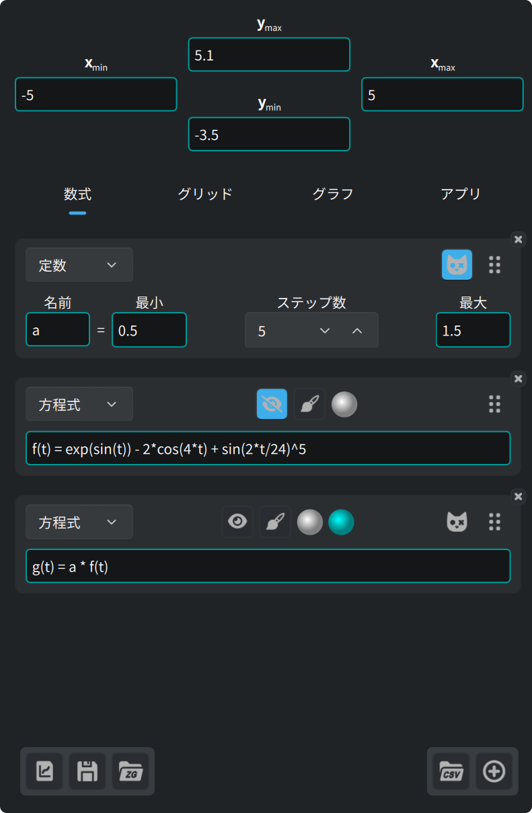

パネル上部の四つの入力欄が表示範囲です。その下に四つのタブがあります：

| タブ | 中身 |
|------|------|
| **数式** | 描く対象：方程式、定数、媒介変数表示、データ |
| **グリッド** | 目盛り、グリッド、サブグリッド |
| **グラフ** | 大きさ、フォント、背景、軸 |
| **アプリ** | 言語、フォント、構文の色分け、更新 |

左下の三つのボタンは[ファイル](#22-ファイル)用です。

パネルの端にある矢印はパネルをたたみ、もう一度押すと開きます。右端の線を動かすと
幅が変わります。

矢印の下のしおりボタンは、このドキュメントを開いたり閉じたりします。

### 2.1. 表示範囲

パネル上部の四つの入力欄は、数だけでなく式も受け付けます。最小値は必ず最大値より
小さくなければならず、それ以外の値は受け付けません。

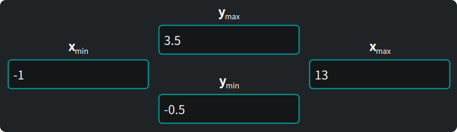

### 2.2. ファイル


パネル左下の三つのボタンは、左から順に：

1. 見えているグラフを**書き出す**。ベクター形式（`svg`、`pdf`）でも画像
   （`png`、`jpeg`、`bmp`、`ppm`）でも。書き出したものは画面のグラフと
   まったく同じです。
2. すべて（対象、データ、表示、設定）を ZeGrapher ドキュメント（`.zg`）に
   **保存する**。
3. そのドキュメントを**開く**。

次に起動したとき、ZeGrapher は前回の作業をそのまま開きます。コマンドラインで
`.zg` ファイルを渡すと、そちらを開きます。

## 3. 数式タブ

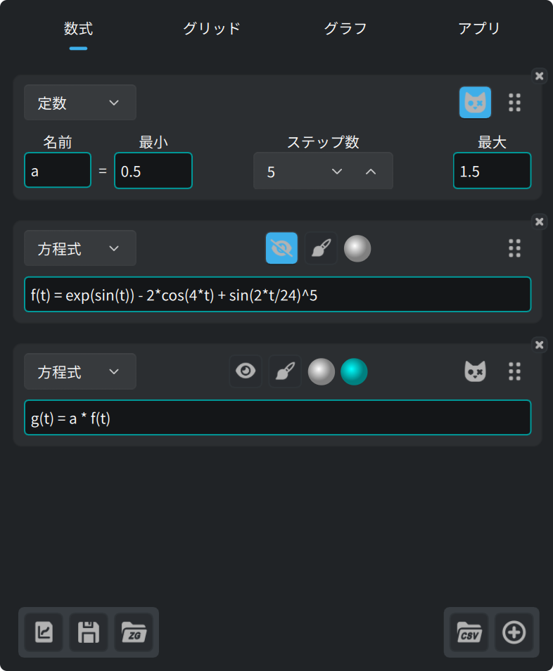

このタブで、描く対象や、ほかの対象の中で使う対象を定義します。関数、数列、
定数（描かれません）、媒介変数表示、そしてデータの列です。

### 3.1. 対象を追加する

数式タブの下にあるこのボタンで対象を追加します。


新しいカードの上にあるリストで、対象の種類を選びます。

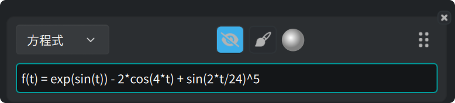

どのカードにも同じボタンが並びます：

- 目のボタンは曲線を出したり隠したりします。
- 筆のボタンは[描画スタイル](#36-描画スタイル)を開きます。
- 丸は曲線の色です。
- 右の取っ手をドラッグすると対象の並び順が変わります。
- 角の **×** は対象を消します。

### 3.2. 関数と数列

関数は自然な等式で定義します：

```
f(x) = 2 + cos(x)
```

次の関数は最初から入っていて、どの式でも使えます：

| 種類 | 関数 |
|------|------|
| 三角関数 | `cos`、`sin`、`tan`、`acos`、`asin`、`atan` |
| 双曲線関数 | `cosh`、`sinh`、`tanh`、`acosh`、`asinh`、`atanh` |
| 双曲線関数の短い名前 | `ch`、`sh`、`th`、`ach`、`ash`、`ath` |
| べき乗と対数 | `sqrt`、`exp`、`ln`（底 e）、`log`（底 10）、`lg`（底 2） |
| 丸め | `floor`、`ceil` |
| 引数二つ | `max`、`min` |
| その他 | `abs`、`erf`、`erfc`、`gamma`（`Γ` とも書けます） |

次の定数も最初から入っています：

| 名前 | 値 |
|------|-----|
| `math::pi`、`math::π` | 3.141592653589793 |
| `physics::kB` | ボルツマン定数、1.380649e-23 |
| `physics::h` | プランク定数、6.62607015e-34 |
| `physics::c` | 真空中の光速、299792458 |

物理定数三つの値は SI 単位です。

数列は `,` か `;` で区切った式の並びです。前のほうの式が最初の数項で、
**最後**の式が一般項です。それ以降の添字にはこの一般項を使います。

```
u(n) = 0 ; 1 ; 0.5*(u(n-2) + u(n-1))
```

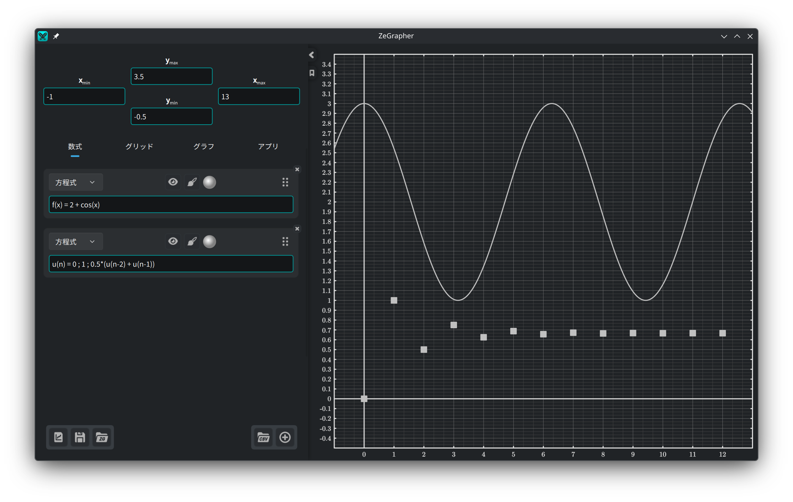

入力欄の枠は、式が正しいかどうかを色で示します。正しくないときは、下に理由が
出ます。

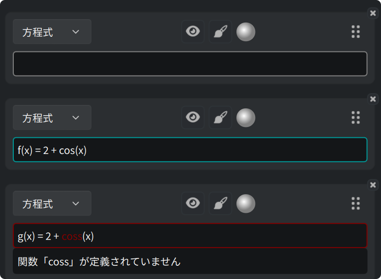

値を求める欄、たとえば表示範囲の欄では、枠が警告の色になることがあります。式は
正しいけれど、数にならないという意味です。

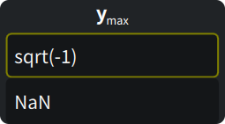

この三つの色は[アプリタブ](#6-アプリタブ)で選べます。

### 3.3. 定数

**定数**は数値を持つ名前です。定数以外のどの対象も、式の中でその定数を
使えます。

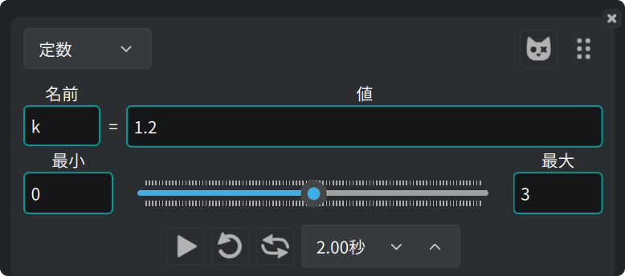

#### 3.3.1. アニメーション

下のスライダーが値を**最小**から**最大**まで動かし、その定数を使う曲線が
すべて追いかけます。スライダーは手で動かしても、自動で動かしてもかまいません。
スライダーの下の列がアニメーションの操作です。再生、繰り返し、往復、そして
一往復にかける時間。

#### 3.3.2. 一度に複数の値

定数のカードにあるこのボタンで、定数を**シュレーディンガー定数**にします。


定数は `ステップ数 + 1` 個の値をとり、最小から最大まで等間隔に並びます。
その定数を使う対象を、値の数だけ描きます。

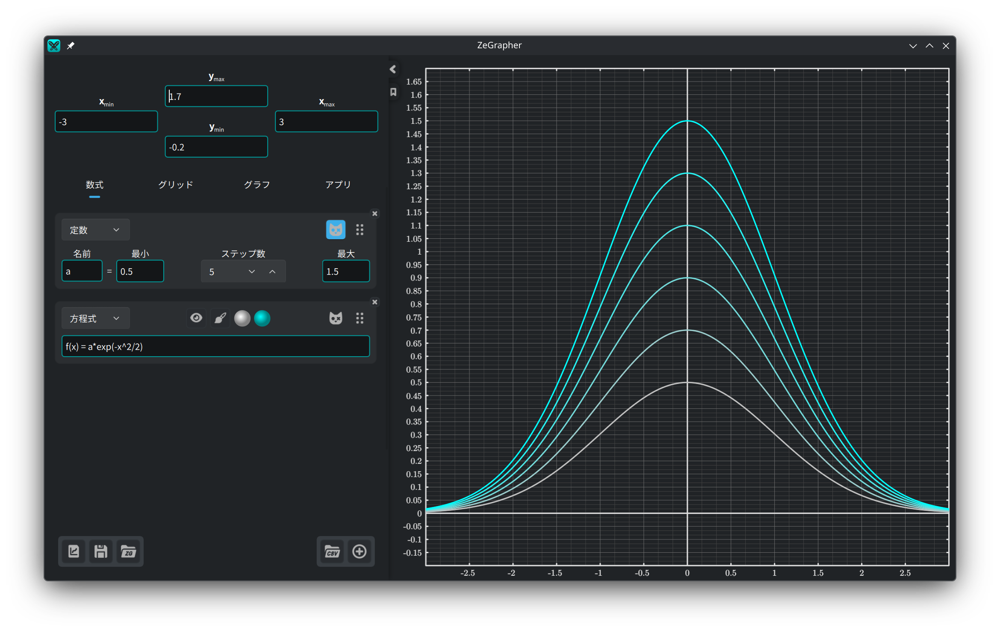

その対象には色の丸がもう一つ増えます。曲線の一族は、一つ目の色から二つ目の色への
グラデーションで描かれます。

### 3.4. 媒介変数表示

媒介変数表示は、曲線の各点の座標を与える二つの対象の組です。二つの欄に名前を
書きます：

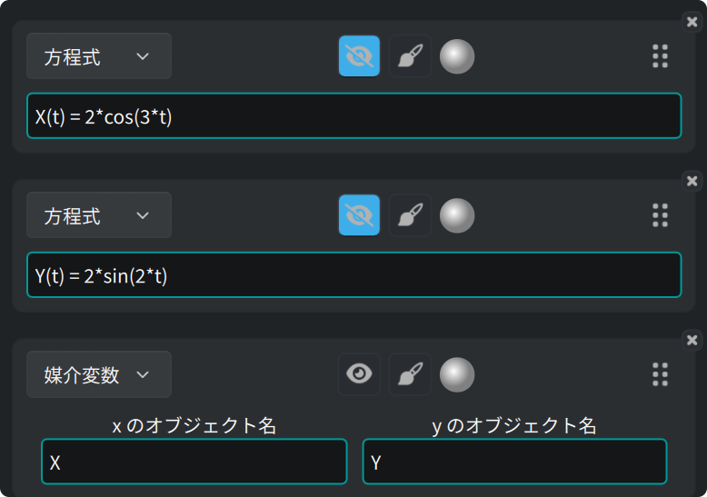

この組は、媒介変数表示の[描画スタイル](#36-描画スタイル)で決めた**開始**から
**終了**までの間に描かれます。

### 3.5. データ

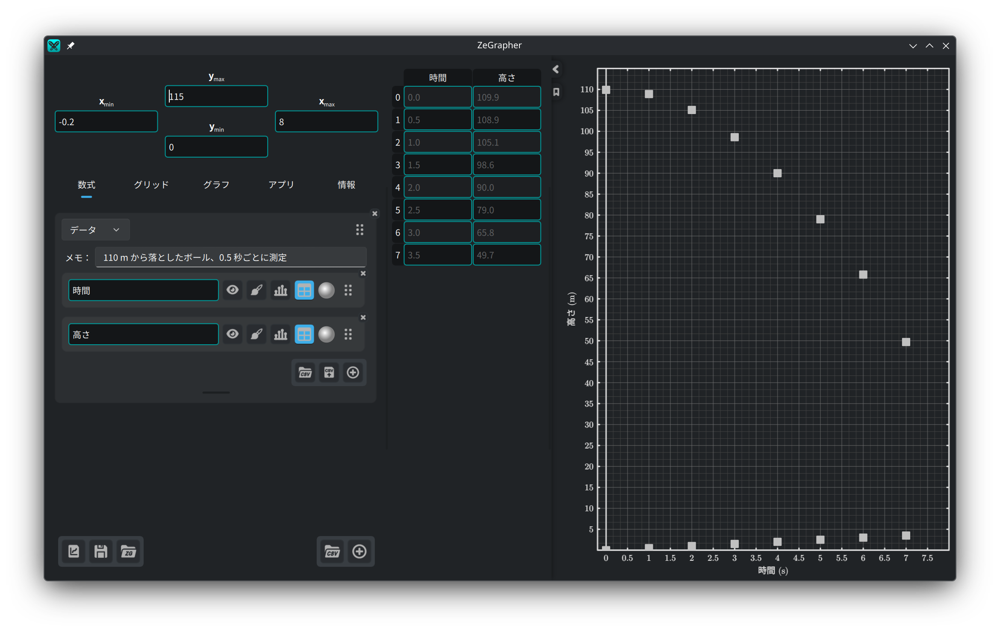

データの対象は、名前のついた列を集めたシートです。列は一つひとつが数学の対象です。
名前、目のボタン、描画スタイル、色、並べ替えの取っ手、そして角に消すための **×**
があります。

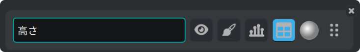

列の値は添字に対して描かれます。最初の値が x = 0、次が x = 1、というように。
列を別の列に対して描くには、[媒介変数表示](#34-媒介変数表示)を使います。

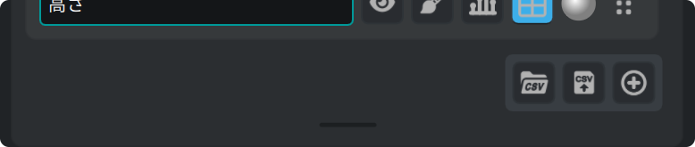

シート右下のボタンは、CSV ファイルの読み込み、列の CSV ファイルへの書き出し、
列の追加です。その下の棒でシートの高さが変わります。棒をダブルクリックすると、
既定の高さに戻ります。

#### 3.5.1. データの表

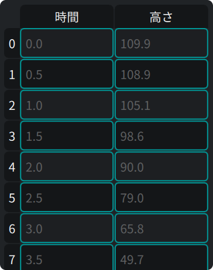

列の**表**ボタンを押すと、その列がパネルの横の表に出ます。表では：

- セルをクリックしてそのまま打てば書き換えられます。`Enter` を押すと編集画面が
  開きます。
- 見出しをクリックすると行全体、列全体を選べます。
- ドラッグすると四角い範囲を選べます。
- `Backspace` で選んだセルを空にし、`Delete` で消します。
- 右クリックのメニューにも同じ二つが*消去*と*削除*として並び、さらに
  *上に行を挿入*と*下に行を挿入*があります。挿入はどちらも、いま選んでいる
  セルを基準にします。

列をまるごと消すと、その列の対象も消えます。

#### 3.5.2. 対象の値で列を埋める

列にある棒グラフのボタンを押すと、小さな入力欄が開きます。対象の名前と、
**開始**、**終了**、**刻み**を書きます。チェックのボタンを押すと、対象の値を
とって列に書き込みます。

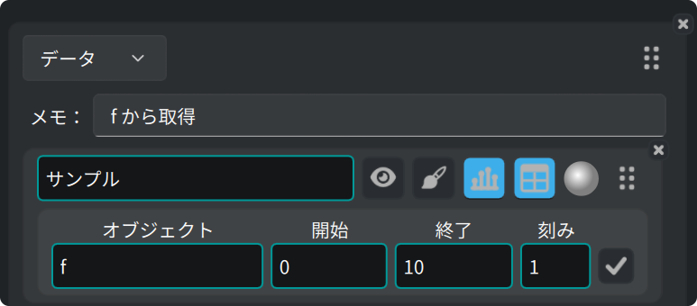

#### 3.5.3. CSV ファイルを読み込む

CSV ボタンはシートの上にあります。新しいシートを作るときは数式タブの下にあります。

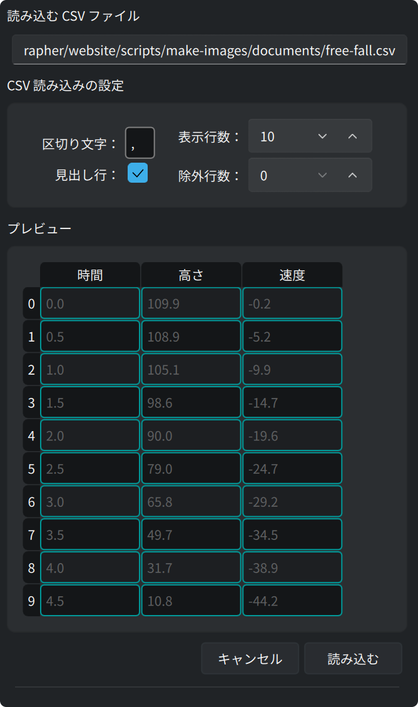

ファイル選択の画面が開きます。そのあと横のパネルに、ファイルのプレビューと
読み込みの設定が出ます。設定を変えるたびにプレビューが変わります：

- 区切り文字を指定します（タブは `\t` と書きます）。
- ファイルの先頭で読み飛ばす行数を指定します（コメントやパラメーターなど）。
- 一行目が列の名前かどうかを指定します。
- **表示行数**はプレビューに出る行の数です。
- **読み込む**で、プレビューのとおりに列を作ります。
- **キャンセル**なら何も変わりません。

数百万セルの CSV ファイルでも動作を確かめました。

### 3.6. 描画スタイル

筆のボタンで、対象の描き方の設定が開きます：

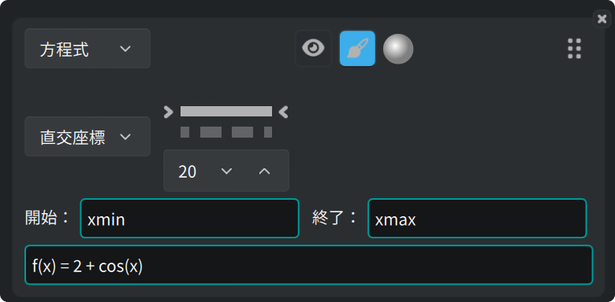

- **直交座標**か**極座標**か。
- 線の種類（実線、破線、一点鎖線、点線、線なし）と、その太さ。
- 点で描く対象（数列とデータ）では、点の形と大きさ。
- **開始**と**終了**：対象を描く区間です。既定では表示範囲の `xmin` と `xmax`
  です。どちらの欄にも式を書けます。たとえば `-math::pi` と `4*math::pi`。

## 4. グリッドタブ：目盛りとグリッド

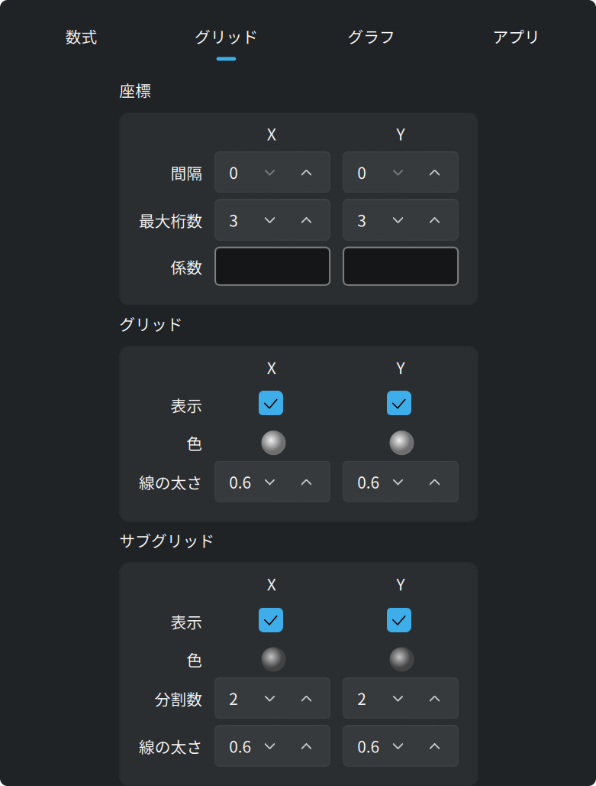

**座標**は軸に沿って並ぶ数字を決めます。間隔、使える桁数、そして**係数**です。
係数は式なので、目盛りを `math::pi` の倍数にでき、数字もその倍数として書かれます。

**グリッド**と**サブグリッド**は x と y で別々に決めます。それぞれに色、線の
太さ、出すか隠すかのスイッチがあります。サブグリッドには、一マスをいくつに
分けるかも指定します。

## 5. グラフタブ：見た目と精度

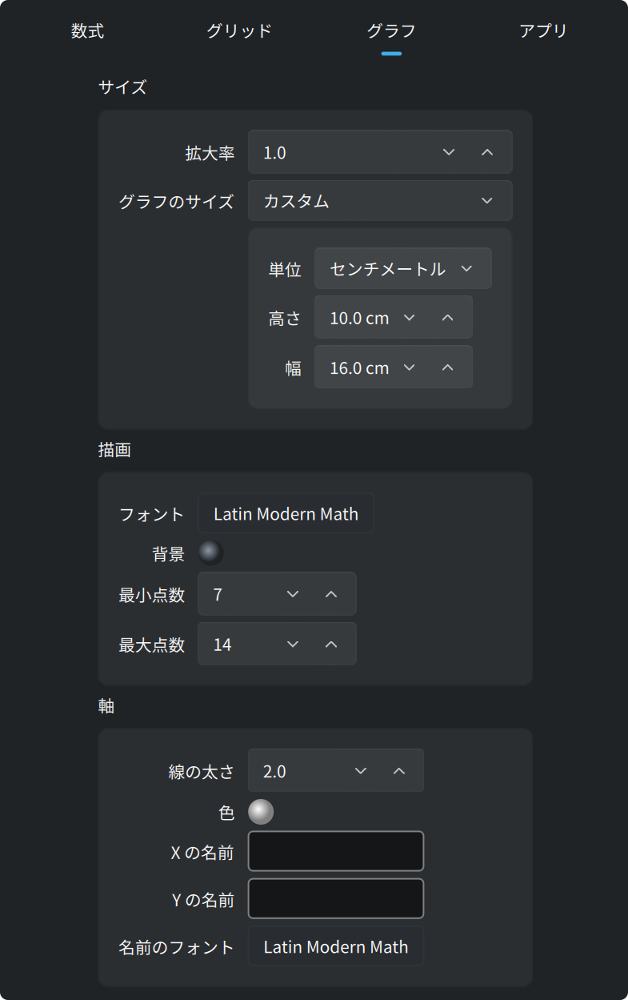

既定ではグラフがウィンドウ全体を埋めます。上の**サイズ**の枠で
**グラフのサイズ**を*カスタム*にすると、グラフは指定した大きさの一枚の紙に
なります。大きさはピクセルでも**実寸のセンチメートル**でも指定できます。
1 センチメートルは画面上でも本物の 1 センチメートルで、書き出した `pdf` や
`svg` でもそのままです。同じ枠の**拡大率**は、描かれるもの全体を一つの設定で
大きくしたり小さくしたりします。

この紙はウィンドウの中にページとして描かれ、上にズームバーが付きます：

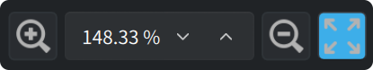

バーは紙を画面上で大きく、あるいは小さくします。ズーム率を数字で入れることも
できます。いちばん右のボタンは紙全体をウィンドウに収めます。このズームは紙を描く
大きさを変えるだけで、表示範囲はそのままです。

**サイズ**の下の二つの枠：

- **描画**：グラフの**フォント**と**背景**の色。**最小点数**と**最大点数**は、
  連続な曲線一本あたりに計算する点の数で、2 のべき乗で指定します。点が多いほど
  曲線は滑らかになり、描くのは遅くなります。
- **軸**：線の太さ、色、x と y に沿って書く名前、そしてその名前のフォント。

## 6. アプリタブ

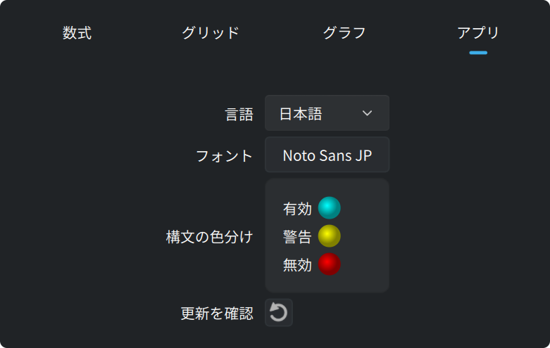

このタブには画面の言語とフォントがあります。入力欄の三つの色（有効、警告、無効）
もここです。いちばん下のボタンは、新しい版が出ていないか zegrapher.com に
問い合わせます。
