# Documentação

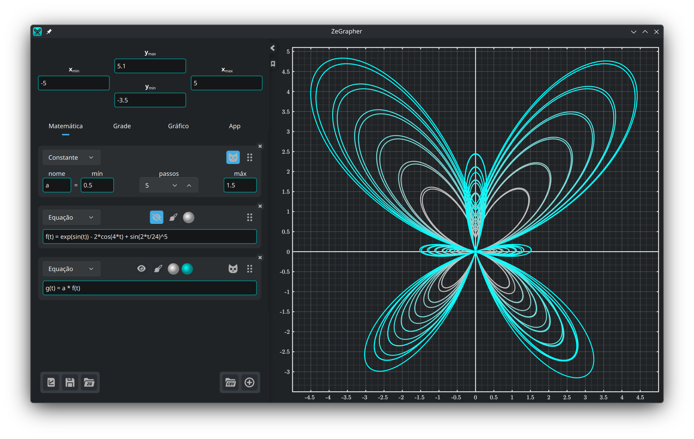

- [1. O gráfico](#1-o-gráfico)
  - [1.1. Mover e dar zoom](#11-mover-e-dar-zoom)
- [2. O painel de entrada](#2-o-painel-de-entrada)
  - [2.1. Limites da vista](#21-limites-da-vista)
  - [2.2. Arquivos](#22-arquivos)
- [3. A aba Matemática](#3-a-aba-matemática)
  - [3.1. Adicionar um objeto](#31-adicionar-um-objeto)
  - [3.2. Funções e sequências](#32-funções-e-sequências)
  - [3.3. Constantes](#33-constantes)
    - [3.3.1. Animação](#331-animação)
    - [3.3.2. Vários valores de uma vez](#332-vários-valores-de-uma-vez)
  - [3.4. Equações paramétricas](#34-equações-paramétricas)
  - [3.5. Dados](#35-dados)
    - [3.5.1. A tabela de dados](#351-a-tabela-de-dados)
    - [3.5.2. Preencher uma coluna com um objeto](#352-preencher-uma-coluna-com-um-objeto)
    - [3.5.3. Importar um arquivo CSV](#353-importar-um-arquivo-csv)
  - [3.6. Estilo do traço](#36-estilo-do-traço)
- [4. A aba Grade — marcas e grade](#4-a-aba-grade--marcas-e-grade)
- [5. A aba Gráfico — aparência e precisão](#5-a-aba-gráfico--aparência-e-precisão)
- [6. A aba App](#6-a-aba-app)
- [7. A aba Sobre](#7-a-aba-sobre)

## 1. O gráfico


O gráfico é o que você vê à direita, e o que você exporta. As abas
[Grade](#4-a-aba-grade--marcas-e-grade) e
[Gráfico](#5-a-aba-gráfico--aparência-e-precisão) definem a aparência, a
precisão e o tamanho dele.

### 1.1. Mover e dar zoom

O gráfico se comanda pelo mouse:

| Ação | Mouse |
|------|-------|
| Mover a vista | Arrastar com o botão esquerdo |
| Dar zoom nos dois eixos de uma vez | Roda do mouse |
| Dar zoom só no eixo y | `Ctrl` + rolagem vertical |
| Dar zoom só no eixo x | `Ctrl` + rolagem horizontal ou <br/> `Ctrl` + `Shift` + rolagem vertical |

Ao dar zoom, o ponto sob o cursor fica onde está.

## 2. O painel de entrada

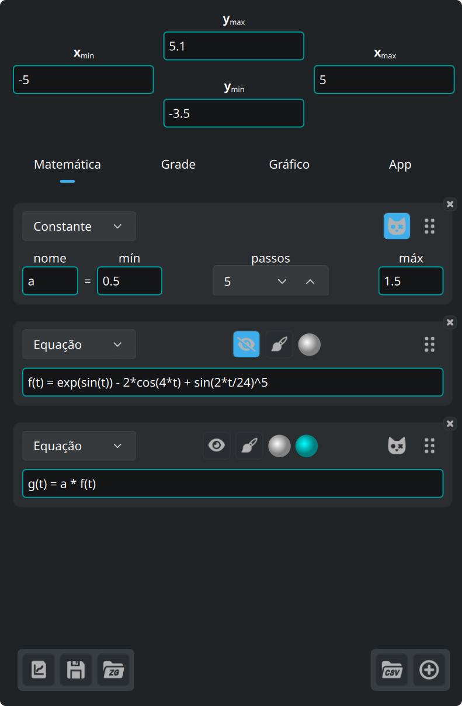

Os quatro campos no alto do painel são os limites da vista. Abaixo deles ficam
cinco abas:

| Aba | O que traz |
|-----|------------|
| **Matemática** | o que você traça: equações, constantes, equações paramétricas, dados |
| **Grade** | marcas, grade e subgrade |
| **Gráfico** | tamanho, fonte, fundo, eixos |
| **App** | idioma, fonte, cores da sintaxe |
| **Sobre** | versão, atualizações, licenças, notas de versão |

Os três botões no canto inferior esquerdo são para os [arquivos](#22-arquivos).

Na borda do painel:

- o botão de seta recolhe o painel, e o traz de volta
- o botão de marcador, logo abaixo, abre e fecha esta documentação
- arraste a linha que corre pela borda direita para mudar a largura do painel

### 2.1. Limites da vista

Os quatro campos no alto do painel aceitam expressões, não só números. Cada
mínimo precisa ficar abaixo do seu máximo, senão o campo fica inválido.

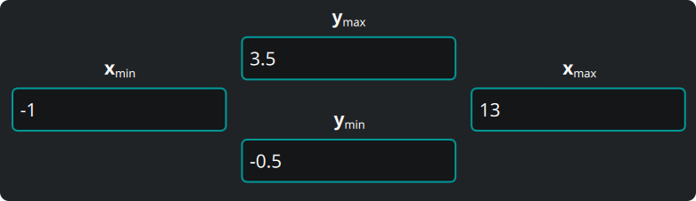

### 2.2. Arquivos


Os três botões no canto inferior esquerdo do painel são, em ordem:

1. **Exportar o gráfico** que você vê, em formato vetorial (`svg`, `pdf`) ou
   como imagem (`png`, `jpeg`, `bmp`, `ppm`). O arquivo sai idêntico ao gráfico
   da tela.
2. **Salvar** tudo — objetos, dados, vista, ajustes — em um documento do
   ZeGrapher (`.zg`).
3. **Abrir** um documento desses.

Na próxima vez que abrir, o ZeGrapher volta ao seu último trabalho. Se você
passar um arquivo `.zg` na linha de comando, o programa abre esse arquivo no
lugar.

## 3. A aba Matemática

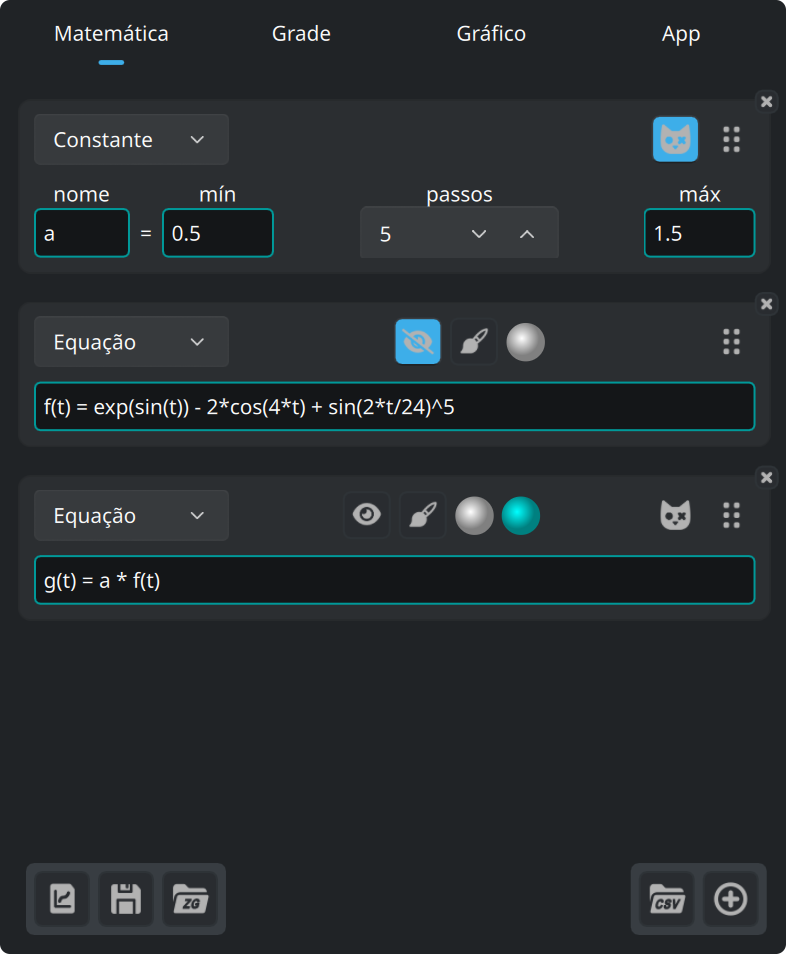

Esta aba define os objetos a traçar, ou a usar dentro de outros objetos:
funções, sequências, constantes (que nunca são traçadas), equações paramétricas
e colunas de dados.

### 3.1. Adicionar um objeto

Este botão, no rodapé da aba Matemática, adiciona um objeto.


A lista no alto do novo cartão escolhe o tipo de objeto.

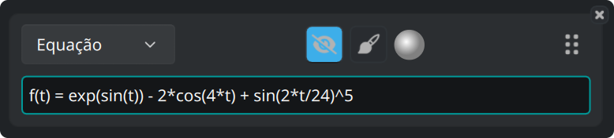

Todo cartão traz os mesmos botões:

- O botão do olho mostra ou oculta a curva.
- O botão do pincel abre o [estilo do traço](#36-estilo-do-traço).
- O disco é a cor da curva.
- Arraste a alça à direita para reordenar os objetos.
- O **×** no canto exclui o objeto.

### 3.2. Funções e sequências

Uma função se define pela equação natural dela:

```
f(x) = 2 + cos(x)
```

Estas funções já vêm prontas, e valem em qualquer expressão:

| Tipo | Funções |
|------|---------|
| Trigonometria | `cos`, `sin`, `tan`, `acos`, `asin`, `atan` |
| Hiperbólicas | `cosh`, `sinh`, `tanh`, `acosh`, `asinh`, `atanh` |
| Hiperbólicas, nomes curtos | `ch`, `sh`, `th`, `ach`, `ash`, `ath` |
| Potências e logaritmos | `sqrt`, `exp`, `ln` (base e), `log` (base 10), `lg` (base 2) |
| Arredondamento | `floor`, `ceil` |
| De dois argumentos | `max`, `min` |
| Outras | `abs`, `erf`, `erfc`, `gamma` (também escrita `Γ`) |

Estas constantes já vêm prontas:

| Nome | Valor |
|------|-------|
| `math::pi`, `math::π` | 3.141592653589793 |
| `physics::kB` | a constante de Boltzmann, 1.380649e-23 |
| `physics::h` | a constante de Planck, 6.62607015e-34 |
| `physics::c` | a velocidade da luz no vácuo, 299792458 |

As três constantes da física estão em unidades do SI.

Uma sequência é uma lista de expressões separadas por `,` ou `;`. As primeiras
expressões são os primeiros termos. A **última** é o termo geral, e o programa a
usa para todos os índices seguintes.

```
u(n) = 0 ; 1 ; 0.5*(u(n-2) + u(n-1))
```

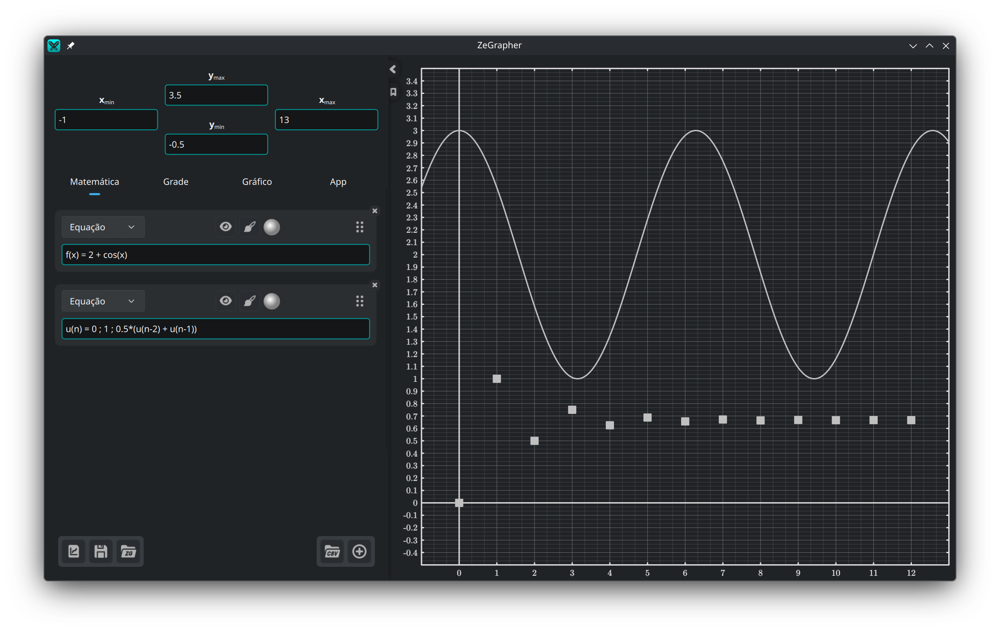

A borda de um campo ganha uma cor que diz se a expressão é válida. Quando não é,
uma mensagem abaixo dá o motivo.

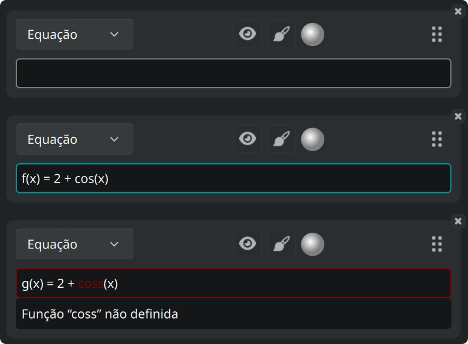

Um campo que espera um valor, como um limite da vista, pode ficar com a cor de
aviso: a expressão é válida, mas não dá número nenhum.

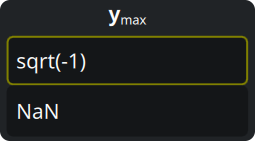

Estas três cores você escolhe na [aba App](#6-a-aba-app).

### 3.3. Constantes

Uma **constante** é um nome com um valor numérico. Qualquer outro objeto, fora
outra constante, pode então usá-la na expressão dele.

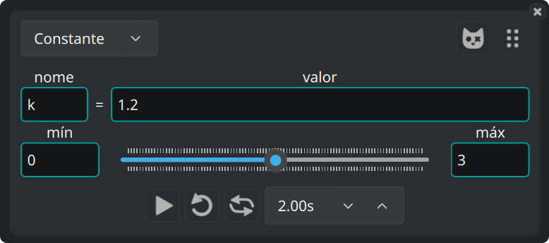

#### 3.3.1. Animação

O controle deslizante abaixo leva o valor de **mín** a **máx**, e todas as
curvas que usam a constante acompanham. Arraste o controle à mão, ou deixe a
animação correr. A fileira abaixo dele traz os comandos da animação: tocar,
repetir, vaivém, e o tempo de uma passagem.

#### 3.3.2. Vários valores de uma vez

Este botão, num cartão de constante, a torna uma **constante de
Schrödinger**.


A constante passa a ter `passos + 1` valores, igualmente espaçados de mín a máx.
O programa traça cada objeto que usa a constante uma vez por valor.

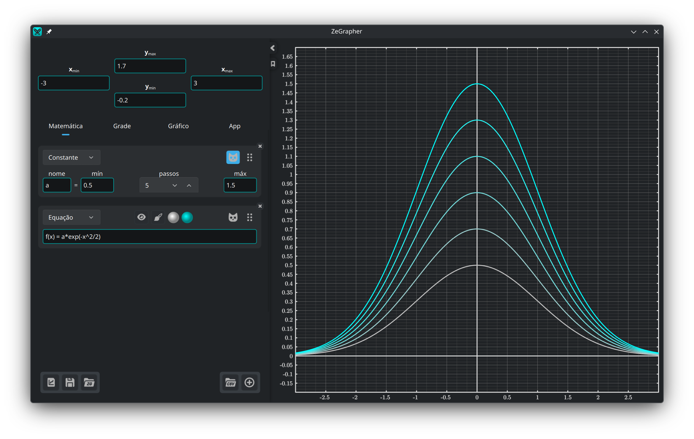

Esses objetos ganham um segundo disco de cor. A família de curvas é desenhada em
degradê, da primeira cor para a segunda.

### 3.4. Equações paramétricas

Uma equação paramétrica é um par de objetos que dão as coordenadas de cada ponto
da curva. Você os nomeia nos dois campos:

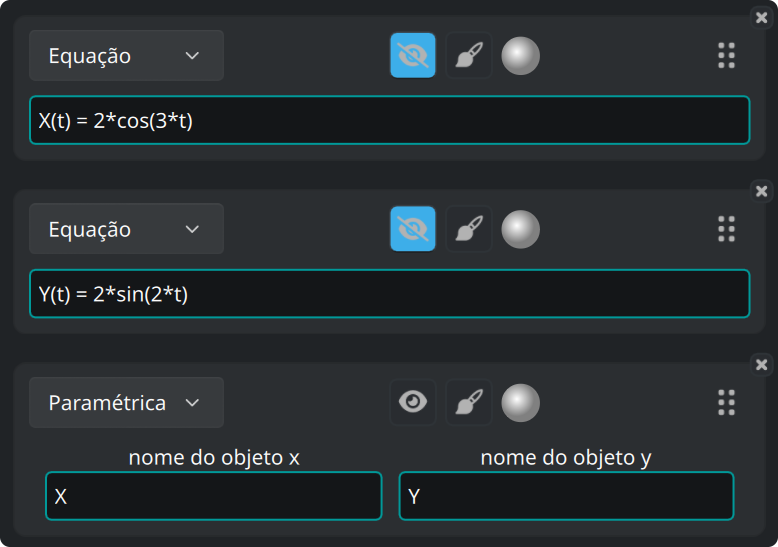

O programa traça o par entre o **Início** e o **Fim**, definidos no
[estilo do traço](#36-estilo-do-traço) da equação paramétrica.

### 3.5. Dados

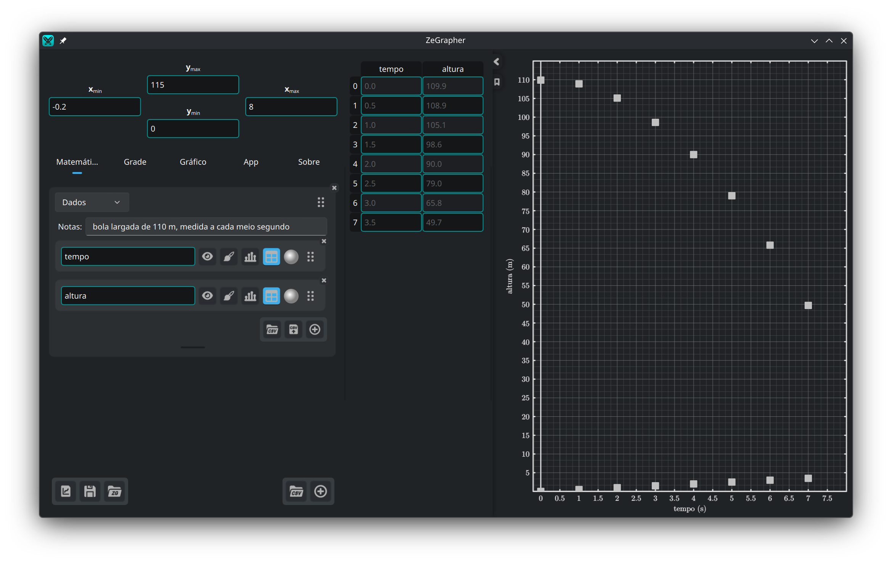

Um objeto de dados é uma planilha de colunas com nome. Cada coluna é um objeto
matemático por si só, com nome e os mesmos botões de qualquer outro objeto.


Os valores de uma coluna são traçados contra o índice deles: o primeiro valor em
x = 0, o segundo em x = 1, e assim por diante. Para traçar uma coluna contra
outra, use uma [equação paramétrica](#34-equações-paramétricas).

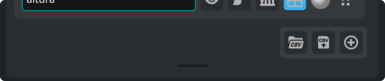

Os botões no canto inferior direito da planilha importam um arquivo CSV,
exportam as colunas para um arquivo CSV, e adicionam uma coluna. Arraste a barra
abaixo para mudar a altura da planilha, e clique duas vezes nela para devolver a
altura padrão.

#### 3.5.1. A tabela de dados

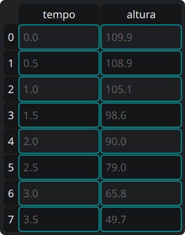

O botão de **tabela** de uma coluna mostra essa coluna na tabela, ao lado do
painel. Na tabela:

- Clique numa célula e digite para mudá-la, ou aperte `Enter` para abrir o
  editor.
- Clique num cabeçalho para selecionar uma linha inteira ou uma coluna inteira.
- Arraste para selecionar um retângulo de células.
- Aperte `Backspace` para limpar o conteúdo das células selecionadas.
- Aperte `Delete` para remover as células selecionadas. Os valores abaixo delas
  sobem.
- O menu do botão direito traz essas mesmas duas ações, em *Limpar* e *Excluir*,
  e ainda *Inserir linha acima* e *Inserir linha abaixo*. As duas inserções agem
  sobre a célula ativa.

Selecionar uma coluna inteira e apertar `Delete` exclui também o objeto coluna
na aba Matemática.

#### 3.5.2. Preencher uma coluna com um objeto

O botão de barras de uma coluna abre um pequeno formulário: dê o nome de um
objeto, e um **Início**, um **Fim** e um **Passo**. O botão de confirmação tira
os valores do objeto e os escreve na coluna.

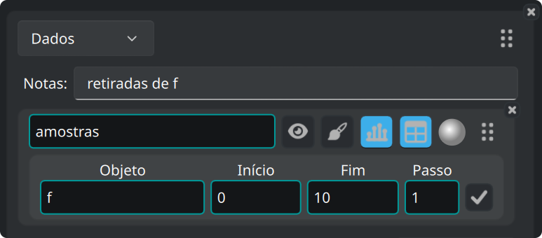

#### 3.5.3. Importar um arquivo CSV

O botão CSV fica numa planilha, ou no rodapé da aba Matemática para criar uma
planilha nova.

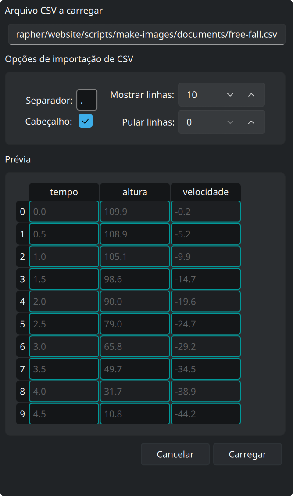

Ele abre um seletor de arquivos. Depois, um painel lateral mostra as opções de
importação, com uma prévia do arquivo abaixo. A prévia se atualiza a cada opção
que você muda:

- **Separador** — o caractere entre dois valores. Escreva `\t` para tabulação.
- **Linha de cabeçalho** — marque quando a primeira linha traz os nomes das
  colunas.
- **Mostrar linhas** — quantas linhas a prévia mostra.
- **Pular linhas** — quantas linhas ignorar no começo do arquivo, comentários ou
  parâmetros por exemplo.

**Carregar** cria as colunas a partir do arquivo, e **Cancelar** deixa tudo como
estava.

Testamos o ZeGrapher com arquivos CSV de vários milhões de células.

### 3.6. Estilo do traço

O botão do pincel abre os ajustes que decidem como um objeto é desenhado:

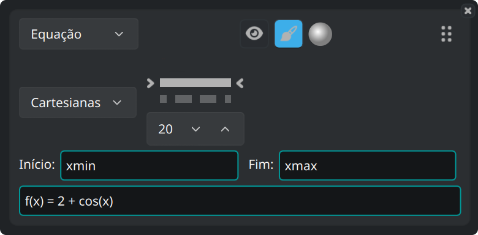

- Coordenadas **cartesianas** ou **polares**.
- O padrão da linha — cheia, tracejada, traço e ponto, pontilhada, ou sem linha
  — e a espessura dela.
- Para os objetos desenhados em pontos (sequências e dados), a forma e o tamanho
  dos pontos.
- **Início** e **Fim**: o intervalo em que o objeto é traçado. Os valores padrão
  são `xmin` e `xmax`, os limites da vista. Os dois campos aceitam qualquer
  expressão, por exemplo `-math::pi` e `4*math::pi`.

## 4. A aba Grade — marcas e grade

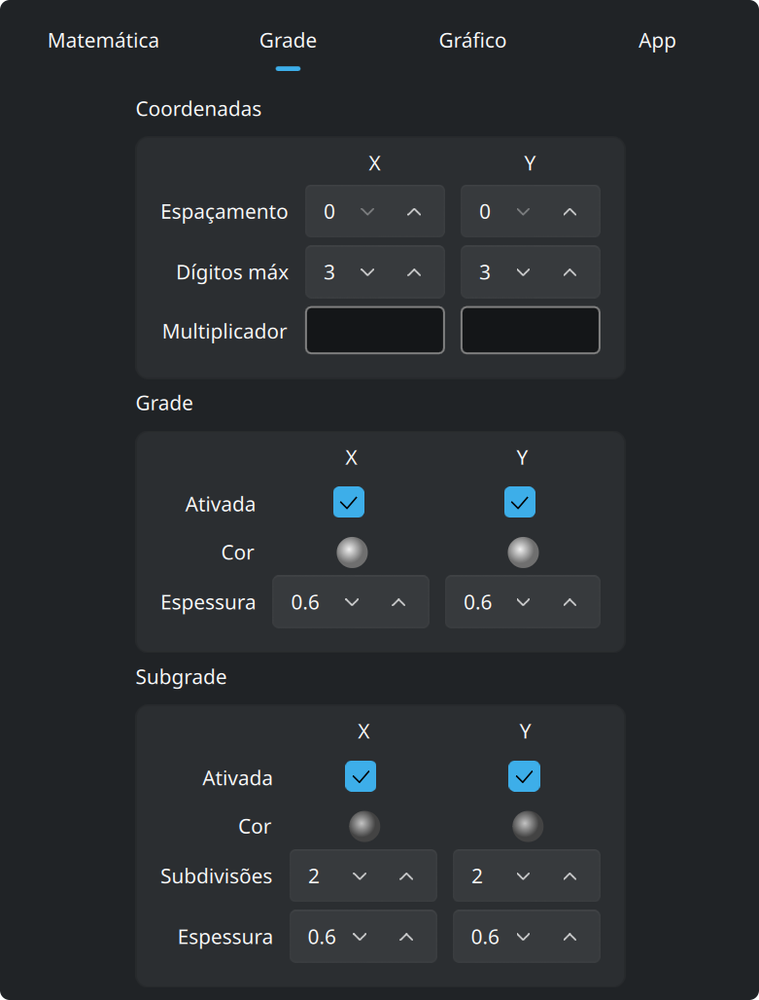

**Coordenadas** ajusta os números ao longo dos eixos: o espaçamento deles,
quantos dígitos podem usar, e um **multiplicador**. O multiplicador é uma
expressão, então as marcas podem ser múltiplos de `math::pi`, e os rótulos saem
escritos em múltiplos desse valor.

**Grade** e **Subgrade** se ajustam em separado para x e para y. Cada uma tem
cor, espessura de linha, e uma chave que a mostra ou a oculta. À subgrade você
diz ainda em quantas partes ela corta cada célula.

## 5. A aba Gráfico — aparência e precisão

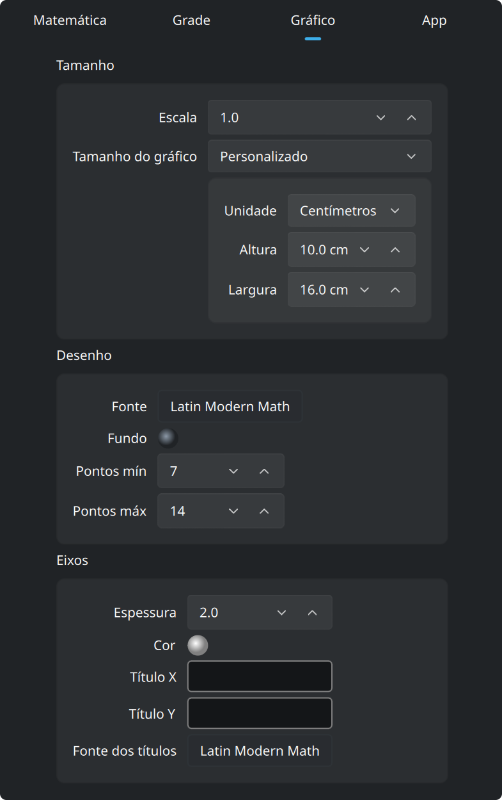

Por padrão o gráfico preenche a janela. Ponha **Tamanho do gráfico** em
*Personalizado*, na caixa **Tamanho** lá em cima, e o gráfico vira uma folha do
tamanho que você disser. Esse tamanho vai em pixels, ou em **centímetros
reais**. Um centímetro é um centímetro de verdade na tela, e continua sendo num
`pdf` ou num `svg` exportado.

**Escala**, na mesma caixa, muda de uma vez o tamanho de tudo o que é desenhado:
as linhas, o texto e as marcas.

O programa desenha essa folha como uma página na janela, com uma barra de zoom
acima:

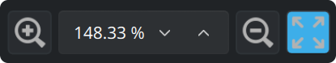

A barra dá zoom na folha na tela, e o último botão encaixa a folha inteira na
janela. Este zoom não mexe no gráfico: os limites da vista ficam como estão. Os
tamanhos em centímetros ficam certos em 100% de zoom.

As duas caixas abaixo de **Tamanho**:

- **Desenho**: a fonte e a cor de fundo do gráfico. **Pontos mín** e **Pontos
  máx** definem quantos pontos são calculados para cada curva contínua, em
  potências de dois. Quanto mais pontos, mais fino o traço e mais lento o
  desenho.
- **Eixos**: espessura de linha, cor, os títulos escritos ao longo de x e de y, e
  a fonte desses títulos.

## 6. A aba App

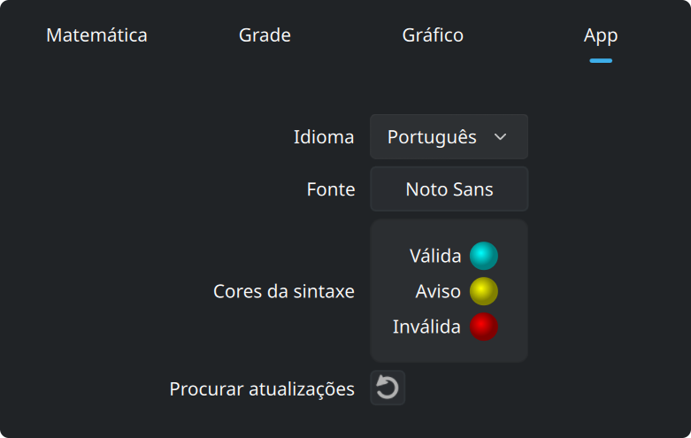

Esta aba define o idioma e a fonte da interface, e as três cores dos campos de
entrada: válida, aviso e inválida.

## 7. A aba Sobre

Esta aba conta o que é o ZeGrapher. Ela traz:

- a versão que você usa, e um botão que pergunta ao zegrapher.com se saiu uma
  mais nova,
- links para o site, para o código-fonte e para o autor,
- as licenças do ZeGrapher, do Qt e da fonte matemática embutida,
- as notas de versão: o que cada versão trouxe, com um link para a página dela no
  GitHub.
