# Документация

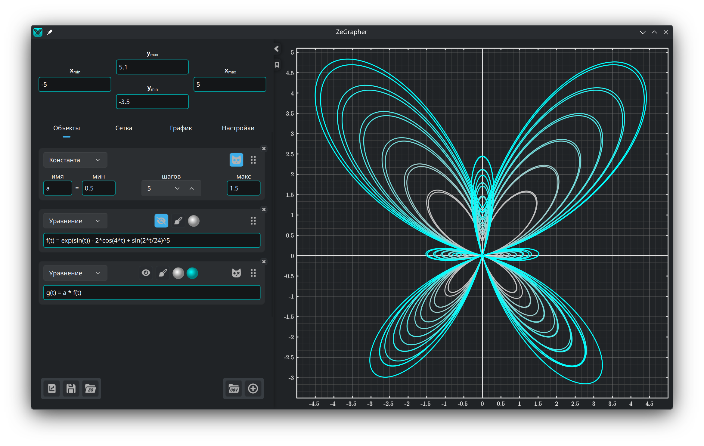

- [1. График](#1-график)
  - [1.1. Как двигать и менять масштаб](#11-как-двигать-и-менять-масштаб)
- [2. Панель ввода](#2-панель-ввода)
  - [2.1. Границы вида](#21-границы-вида)
  - [2.2. Файлы](#22-файлы)
- [3. Вкладка «Объекты»](#3-вкладка-объекты)
  - [3.1. Как добавить объект](#31-как-добавить-объект)
  - [3.2. Функции и последовательности](#32-функции-и-последовательности)
  - [3.3. Константы](#33-константы)
    - [3.3.1. Анимация](#331-анимация)
    - [3.3.2. Несколько значений сразу](#332-несколько-значений-сразу)
  - [3.4. Параметрические уравнения](#34-параметрические-уравнения)
  - [3.5. Данные](#35-данные)
    - [3.5.1. Таблица данных](#351-таблица-данных)
    - [3.5.2. Как заполнить столбец значениями объекта](#352-как-заполнить-столбец-значениями-объекта)
    - [3.5.3. Как загрузить файл CSV](#353-как-загрузить-файл-csv)
  - [3.6. Стиль кривой](#36-стиль-кривой)
- [4. Вкладка «Сетка» — деления и сетка](#4-вкладка-сетка--деления-и-сетка)
- [5. Вкладка «График» — вид и точность](#5-вкладка-график--вид-и-точность)
- [6. Вкладка «Общие»](#6-вкладка-общие)

## 1. График


График — это то, что вы видите справа, и то, что уходит в файл. Вкладки
[«Сетка»](#4-вкладка-сетка--деления-и-сетка) и
[«График»](#5-вкладка-график--вид-и-точность) задают его вид, его точность и
его размер.

### 1.1. Как двигать и менять масштаб

Графиком управляют мышью:

| Действие | Мышь |
|----------|------|
| Подвинуть вид | Перетащить левой кнопкой |
| Масштаб по обеим осям сразу | Колесо мыши |
| Масштаб только по оси y | `Ctrl` + колесо по вертикали |
| Масштаб только по оси x | `Ctrl` + колесо по горизонтали или <br/> `Ctrl` + `Shift` + колесо по вертикали |

При смене масштаба точка под курсором остаётся на месте.

## 2. Панель ввода

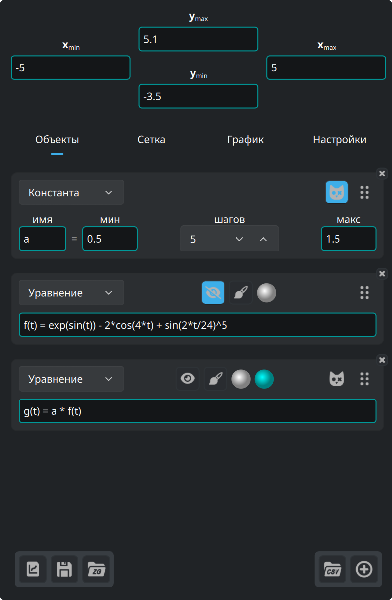

Четыре поля наверху панели — это границы вида. Под ними четыре вкладки:

| Вкладка | Что в ней |
|---------|-----------|
| **Объекты** | то, что вы строите: уравнения, константы, параметрические уравнения, данные |
| **Сетка** | деления, сетка и подсетка |
| **График** | размер, шрифт, фон, оси |
| **Общие** | язык, шрифт, цвета подсветки, обновления |

Три кнопки внизу слева — для [файлов](#22-файлы).

Стрелка на краю панели сворачивает её и разворачивает обратно. Полоса вдоль
правого края задаёт её ширину.

Кнопка-закладка под этой стрелкой открывает эту документацию и закрывает её.

### 2.1. Границы вида

Четыре поля наверху панели принимают выражения, а не только числа. Каждый
минимум должен оставаться меньше своего максимума, и другого значения поля не
примут.

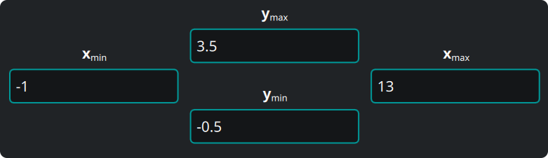

### 2.2. Файлы


Три кнопки внизу слева на панели, по порядку:

1. **Вывести график**, который вы видите, в векторном виде (`svg`, `pdf`) или
   картинкой (`png`, `jpeg`, `bmp`, `ppm`). Файл получается в точности таким,
   каким график виден на экране.
2. **Сохранить** всё — объекты, данные, вид, настройки — в документ ZeGrapher
   (`.zg`).
3. **Открыть** такой документ.

При следующем запуске ZeGrapher снова откроет вашу последнюю работу. Если
передать файл `.zg` в командной строке, программа откроет его вместо неё.

## 3. Вкладка «Объекты»

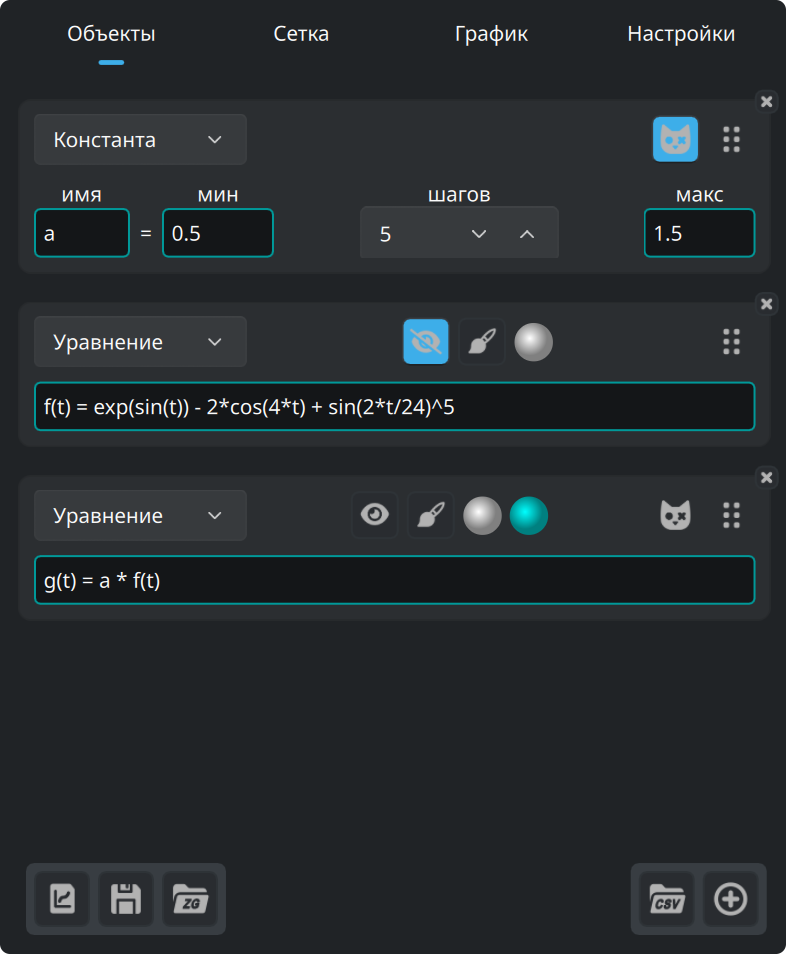

Эта вкладка задаёт объекты, которые нужно построить или использовать внутри
других объектов: функции, последовательности, константы (их никогда не строят),
параметрические уравнения и столбцы данных.

### 3.1. Как добавить объект

Эта кнопка внизу вкладки «Объекты» добавляет объект.


Список наверху новой карточки задаёт тип объекта.

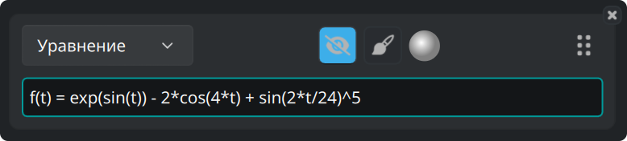

У каждой карточки один и тот же набор кнопок:

- Глаз показывает или прячет кривую.
- Кисть открывает [стиль кривой](#36-стиль-кривой).
- Кружок — это цвет кривой.
- Ручка справа меняет порядок объектов, когда вы её тянете.
- **×** в углу удаляет объект.

### 3.2. Функции и последовательности

Функция задаётся своим естественным уравнением:

```
f(x) = 2 + cos(x)
```

Эти функции встроены и доступны в любом выражении:

| Тип | Функции |
|-----|---------|
| Тригонометрия | `cos`, `sin`, `tan`, `acos`, `asin`, `atan` |
| Гиперболические | `cosh`, `sinh`, `tanh`, `acosh`, `asinh`, `atanh` |
| Гиперболические, коротко | `ch`, `sh`, `th`, `ach`, `ash`, `ath` |
| Степени и логарифмы | `sqrt`, `exp`, `ln` (по основанию e), `log` (по основанию 10), `lg` (по основанию 2) |
| Округление | `floor`, `ceil` |
| С двумя аргументами | `max`, `min` |
| Прочее | `abs`, `erf`, `erfc`, `gamma` (пишется и как `Γ`) |

Эти константы встроены:

| Имя | Значение |
|-----|----------|
| `math::pi`, `math::π` | 3.141592653589793 |
| `physics::kB` | постоянная Больцмана, 1.380649e-23 |
| `physics::h` | постоянная Планка, 6.62607015e-34 |
| `physics::c` | скорость света в вакууме, 299792458 |

Все три физические постоянные даны в единицах СИ.

Последовательность — это список выражений через `,` или `;`. Первые выражения —
это первые члены. **Последнее** выражение — общий член, и по нему программа
считает все следующие индексы.

```
u(n) = 0 ; 1 ; 0.5*(u(n-2) + u(n-1))
```

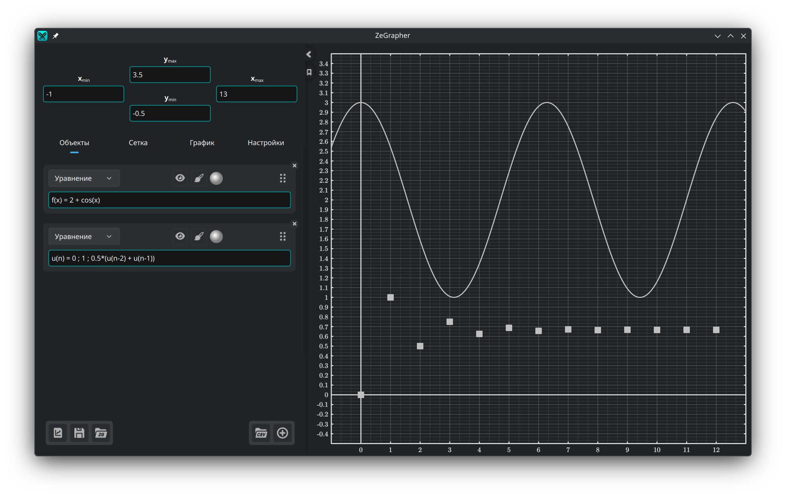

Рамка поля ввода окрашивается по тому, верно ли выражение. Когда оно неверно,
под полем появляется причина.

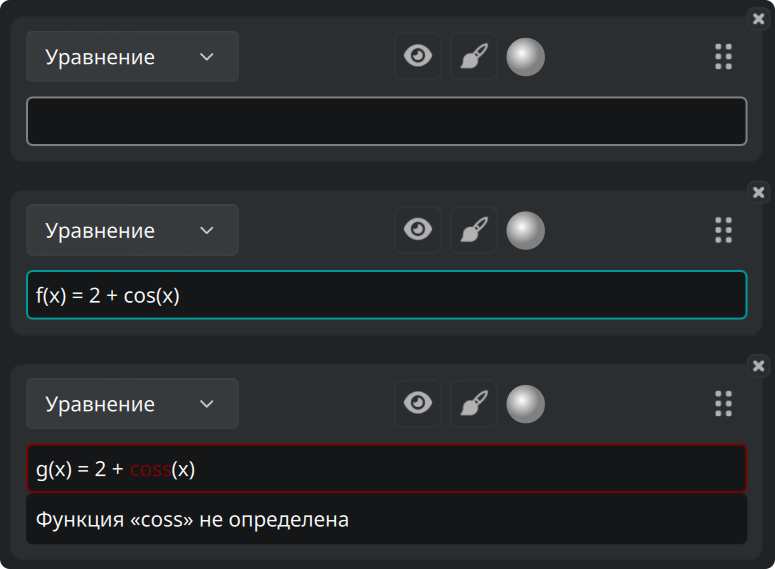

Поле, которое ждёт значения, — например граница вида, — может получить вместо
этого цвет предупреждения: выражение верно, но числа не даёт.

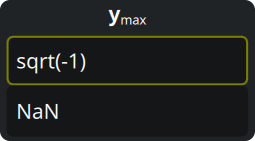

Эти три цвета вы выбираете на вкладке [«Общие»](#6-вкладка-общие).

### 3.3. Константы

**Константа** — это имя с числовым значением. Любой другой объект, кроме другой
константы, может дальше использовать её в своём выражении.

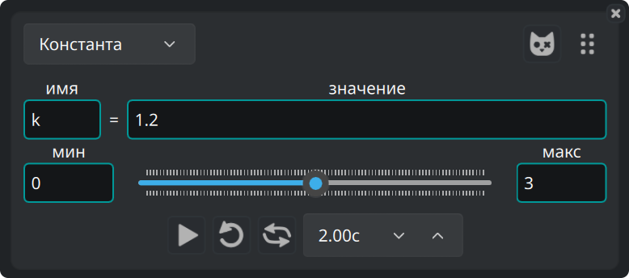

#### 3.3.1. Анимация

Ползунок под ней ведёт значение от **мин** к **макс**, и все кривые, где
константа участвует, идут следом. Ползунок можно тянуть рукой, а можно
запустить. В ряду под ползунком — управление анимацией: пуск, цикл,
туда-обратно и время одного прохода.

#### 3.3.2. Несколько значений сразу

Эта кнопка на карточке константы делает её **константой Шрёдингера**.


Тогда константа принимает `шагов + 1` значений, равномерно от мин до макс.
Каждый объект, где она участвует, программа строит по разу на значение.

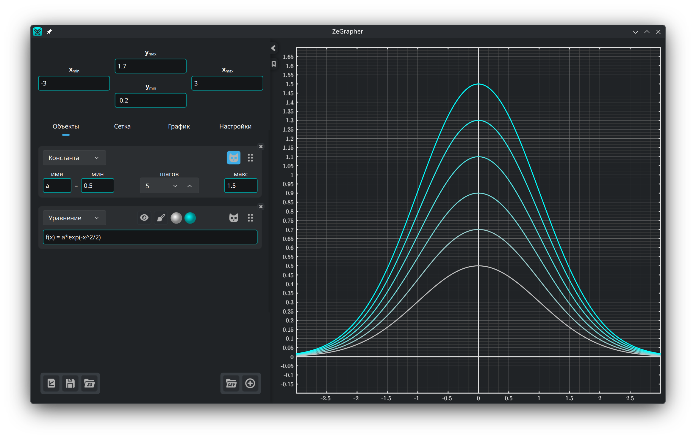

Такие объекты получают второй кружок цвета. Семейство кривых рисуется
градиентом от первого цвета ко второму.

### 3.4. Параметрические уравнения

Параметрическое уравнение — это пара объектов, задающих координаты каждой точки
кривой. Их имена пишут в двух полях:

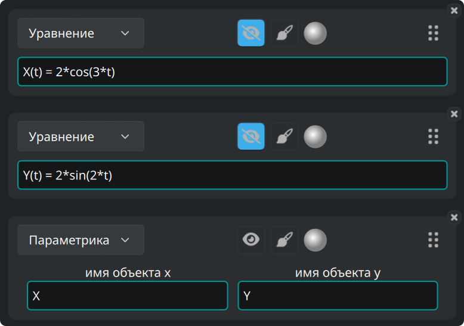

Программа строит пару между **Началом** и **Концом**, заданными в
[стиле кривой](#36-стиль-кривой) этого параметрического уравнения.

### 3.5. Данные

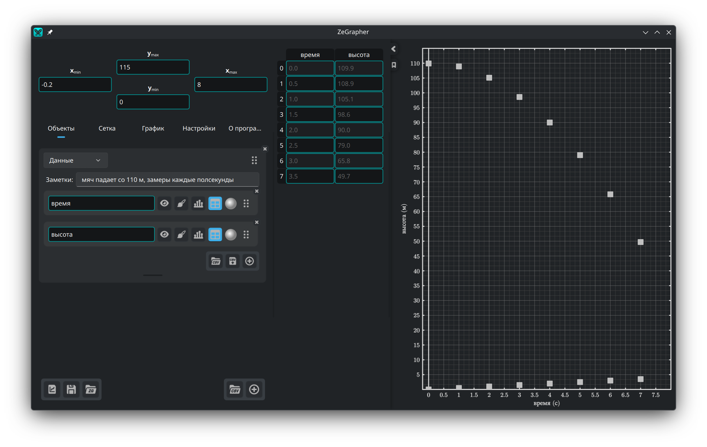

Объект данных — это лист из именованных столбцов. Каждый столбец сам по себе
математический объект. У него есть имя, кнопка-глаз, стиль кривой, цвет, ручка
для смены порядка и **×** в углу, которая его удаляет.

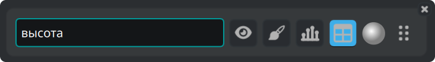

Значения столбца строятся по их номерам: первое значение при x = 0, второе при
x = 1, и так далее. Чтобы построить один столбец относительно другого,
возьмите [параметрическое уравнение](#34-параметрические-уравнения).

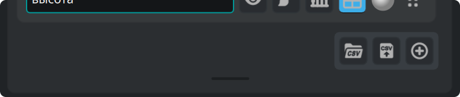

Кнопки внизу справа листа загружают файл CSV, записывают столбцы в файл CSV и
добавляют столбец. Полоса под ними меняет высоту листа. Двойной щелчок по ней
вернёт листу высоту по умолчанию.

#### 3.5.1. Таблица данных

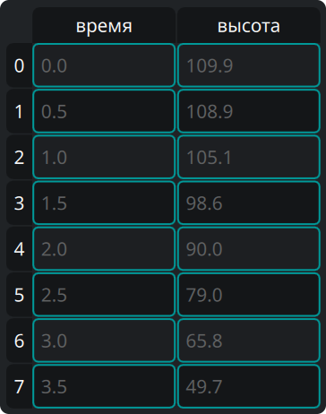

Кнопка **таблицы** на столбце показывает этот столбец в таблице рядом с
панелью. В таблице:

- щёлкните по ячейке и наберите значение, чтобы её изменить, или нажмите
  `Enter`, чтобы открыть редактор,
- щёлкните по заголовку, чтобы выделить всю строку или весь столбец,
- протяните мышью, чтобы выделить прямоугольник ячеек,
- нажмите `Backspace`, чтобы очистить выделенные ячейки, и `Delete`, чтобы их
  удалить,
- те же два действия есть в меню по правой кнопке, под *Очистить* и *Удалить*,
  а вместе с ними *Вставить строку выше* и *Вставить строку ниже*. Обе вставки
  работают от текущей ячейки.

Если удалить весь столбец, объект-столбец удалится вместе с ним.

#### 3.5.2. Как заполнить столбец значениями объекта

Кнопка со столбиками на столбце открывает небольшую форму: назовите объект и
задайте **Начало**, **Конец** и **Шаг**. Кнопка с галочкой берёт значения
объекта и записывает их в столбец.

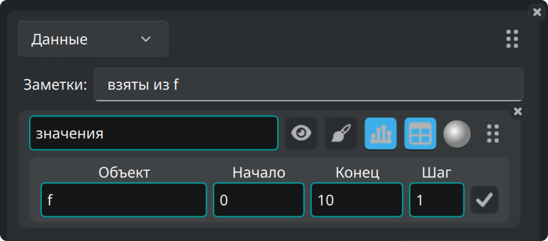

#### 3.5.3. Как загрузить файл CSV

Кнопка CSV есть на листе, а внизу вкладки «Объекты» — для нового листа.

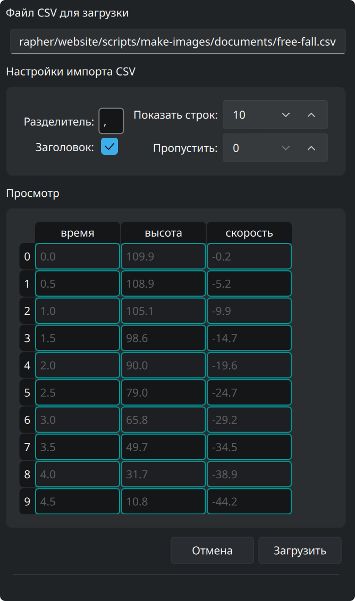

Она открывает выбор файла. Затем сбоку появляется просмотр файла и настройки,
по которым его читают. Просмотр меняется вслед за ними:

- Задайте разделитель (для табуляции напишите `\t`).
- Задайте, сколько строк пропустить в начале файла (например, комментарии или
  параметры).
- Отметьте, стоят ли в первой строке имена столбцов.
- **Показать строк** — сколько строк видно в просмотре.
- **Загрузить** создаёт столбцы по тому, что в просмотре.
- **Отмена** оставляет всё как было.

Мы проверили ZeGrapher на файлах CSV в несколько миллионов ячеек.

### 3.6. Стиль кривой

Кнопка с кистью открывает настройки того, как рисуется объект:

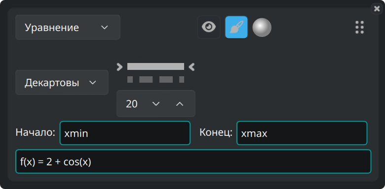

- Координаты **декартовы** или **полярные**.
- Вид линии — сплошная, штриховая, штрихпунктирная, пунктирная или без линии —
  и её толщина.
- Для объектов из точек (последовательности и данные) — форма и размер точек.
- **Начало** и **Конец**: промежуток, на котором объект строится. По умолчанию
  это `xmin` и `xmax`, границы вида. Оба поля принимают любое выражение,
  например `-math::pi` и `4*math::pi`.

## 4. Вкладка «Сетка» — деления и сетка

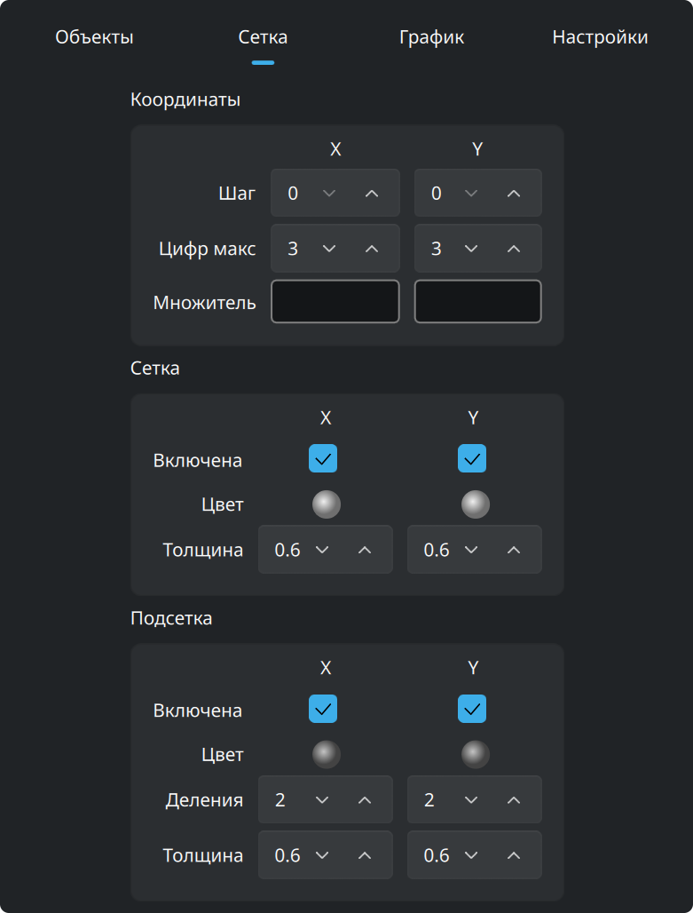

**Координаты** задают числа вдоль осей: их шаг, сколько цифр они могут занять,
и **множитель**. Множитель — это выражение, поэтому деления могут быть кратны
`math::pi`, и тогда подписи пишутся в его долях.

**Сетка** и **подсетка** настраиваются отдельно для x и для y. У каждой свой
цвет, своя толщина линии и переключатель, который её показывает или прячет.
Подсетке задают ещё и на сколько частей она делит каждую клетку.

## 5. Вкладка «График» — вид и точность

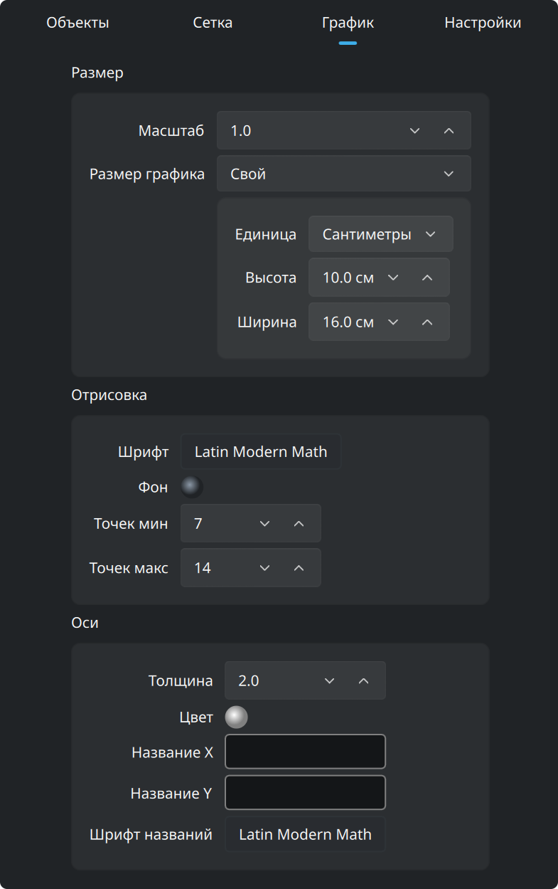

По умолчанию график занимает всё окно. Поставьте **Размер графика** в *Свой*, в
рамке **Размер** наверху, и график станет листом того размера, который вы
зададите. Размер идёт в пикселях или в **настоящих сантиметрах**. Сантиметр —
это настоящий сантиметр на экране, и он остаётся таким в выведенном `pdf` или
`svg`. **Масштаб**, в той же рамке, увеличивает или уменьшает весь
рисунок одной настройкой.

Этот лист рисуется в окне как страница, а над ним — полоса масштаба:

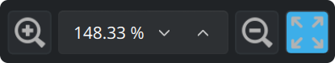

Полоса увеличивает или уменьшает лист на экране и принимает процент масштаба.
Последняя кнопка вписывает лист целиком в окно. Этот масштаб меняет только то,
насколько крупно рисуется лист. Границы вида остаются прежними.

Две рамки под **Размером**:

- **Отрисовка**: **шрифт** графика и цвет его **фона**. **Точек мин** и **Точек
  макс** — сколько точек считается для каждой непрерывной кривой, в степенях
  двойки. Чем больше точек, тем тоньше кривая и тем медленнее рисование.
- **Оси**: толщина линии, цвет, названия вдоль x и y и шрифт этих названий.

## 6. Вкладка «Общие»

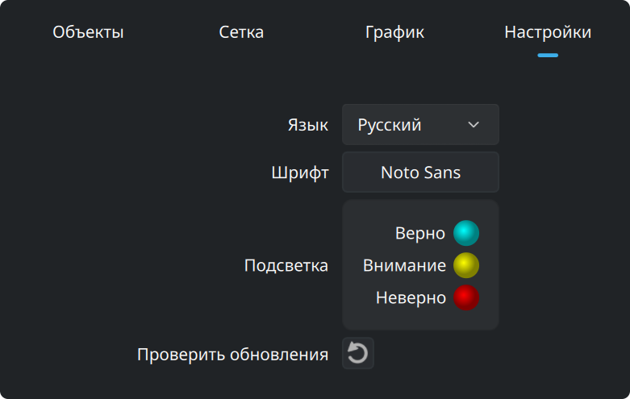

На этой вкладке — язык и шрифт интерфейса. Здесь же три цвета полей ввода:
верно, внимание и неверно. Последняя кнопка спрашивает у zegrapher.com, не
вышла ли версия новее.
