# 文档

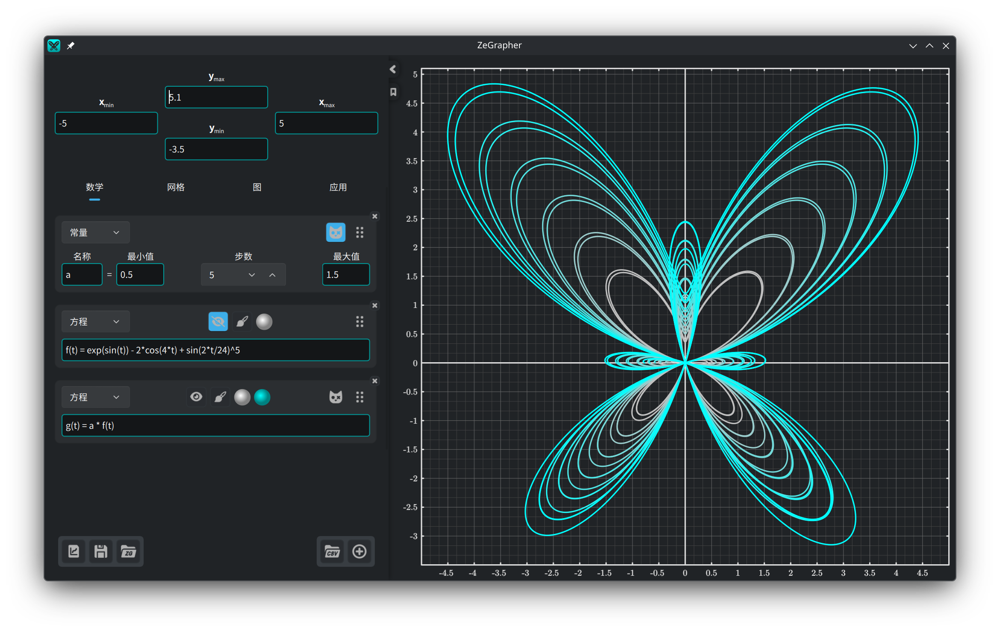

- [1. 图](#1-图)
  - [1.1. 平移与缩放](#11-平移与缩放)
- [2. 输入面板](#2-输入面板)
  - [2.1. 视图范围](#21-视图范围)
  - [2.2. 文件](#22-文件)
- [3. 数学标签页](#3-数学标签页)
  - [3.1. 添加对象](#31-添加对象)
  - [3.2. 函数与数列](#32-函数与数列)
  - [3.3. 常量](#33-常量)
    - [3.3.1. 动画](#331-动画)
    - [3.3.2. 同时取多个值](#332-同时取多个值)
  - [3.4. 参数方程](#34-参数方程)
  - [3.5. 数据](#35-数据)
    - [3.5.1. 数据表格](#351-数据表格)
    - [3.5.2. 用对象填充一列](#352-用对象填充一列)
    - [3.5.3. 导入 CSV 文件](#353-导入-csv-文件)
  - [3.6. 绘制样式](#36-绘制样式)
- [4. 网格标签页：刻度与网格](#4-网格标签页刻度与网格)
- [5. 图标签页：外观与精度](#5-图标签页外观与精度)
- [6. 应用标签页](#6-应用标签页)

## 1. 图


图就是你在右边看到的东西，也是你导出的东西。
[网格](#4-网格标签页刻度与网格)和[图](#5-图标签页外观与精度)两个标签页
决定它的外观、精度和尺寸。

### 1.1. 平移与缩放

图用鼠标操作：

| 操作 | 鼠标 |
|------|------|
| 平移视图 | 按住鼠标左键拖动 |
| 同时缩放两根轴 | 滚轮 |
| 只缩放 y 轴 | `Ctrl` + 垂直滚动 |
| 只缩放 x 轴 | `Ctrl` + 水平滚动，或 <br/> `Ctrl` + `Shift` + 垂直滚动 |

缩放时，光标下的那个点保持不动。

## 2. 输入面板

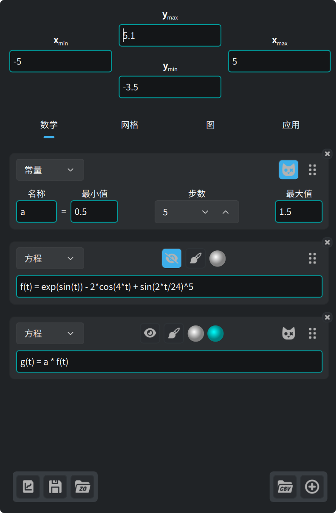

面板顶部的四个输入框是视图的边界。下面是四个标签页：

| 标签页 | 内容 |
|--------|------|
| **数学** | 你要绘制的对象：方程、常量、参数方程、数据 |
| **网格** | 刻度、网格和子网格 |
| **图** | 尺寸、字体、背景、坐标轴 |
| **应用** | 语言、字体、语法着色、更新 |

左下角的三个按钮用于[文件](#22-文件)。

面板边上的箭头可以把它收起，再点一次展开。右缘的那条线用来改变它的宽度。

箭头下方的书签按钮打开这份文档，再点一次关上。

### 2.1. 视图范围

面板顶部的四个输入框接受表达式，而不只是数字。最小值必须小于对应的最大值，
其他值输入框一律不收。

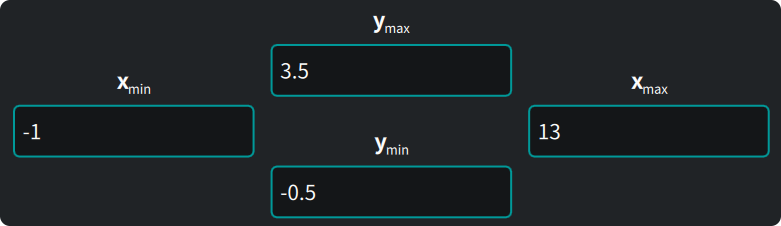

### 2.2. 文件


面板左下角的三个按钮，依次是：

1. **导出**你看到的图，存为矢量格式（`svg`、`pdf`）或图像
   （`png`、`jpeg`、`bmp`、`ppm`）。导出的结果和屏幕上的图完全一致。
2. **保存**全部内容——对象、数据、视图、设置——为一个 ZeGrapher 文档（`.zg`）。
3. **打开**这样的文档。

下次启动时，ZeGrapher 会重新打开你上次的工作。如果在命令行里给出一个 `.zg`
文件，应用就改为打开那个文件。

## 3. 数学标签页

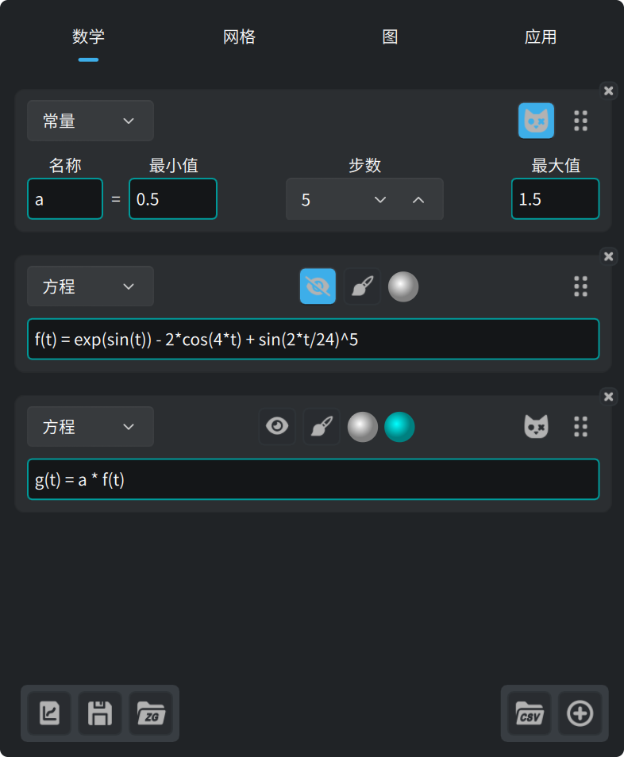

这个标签页定义要绘制的对象，或供其他对象使用的对象：函数、数列、
常量（从不绘制）、参数方程，以及数据列。

### 3.1. 添加对象

数学标签页底部的这个按钮用来添加对象。


新卡片顶部的下拉框决定对象的类型。

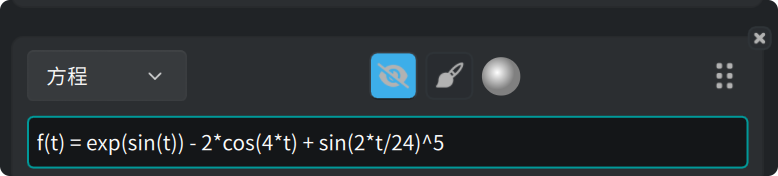

每张卡片都有同样的一组按钮：

- 眼睛按钮显示或隐藏曲线。
- 画笔按钮打开[绘制样式](#36-绘制样式)。
- 圆点是曲线的颜色。
- 拖动右边的手柄可以调整对象的顺序。
- 角上的 **×** 删除该对象。

### 3.2. 函数与数列

函数用它自然的等式来定义：

```
f(x) = 2 + cos(x)
```

以下函数是内置的，可以在任何表达式里使用：

| 类别 | 函数 |
|------|------|
| 三角函数 | `cos`、`sin`、`tan`、`acos`、`asin`、`atan` |
| 双曲函数 | `cosh`、`sinh`、`tanh`、`acosh`、`asinh`、`atanh` |
| 双曲函数简写 | `ch`、`sh`、`th`、`ach`、`ash`、`ath` |
| 幂与对数 | `sqrt`、`exp`、`ln`（以 e 为底）、`log`（以 10 为底）、`lg`（以 2 为底） |
| 取整 | `floor`、`ceil` |
| 双参数 | `max`、`min` |
| 其他 | `abs`、`erf`、`erfc`、`gamma`（也可写作 `Γ`） |

以下常量是内置的：

| 名称 | 值 |
|------|-----|
| `math::pi`、`math::π` | 3.141592653589793 |
| `physics::kB` | 玻尔兹曼常量，1.380649e-23 |
| `physics::h` | 普朗克常量，6.62607015e-34 |
| `physics::c` | 真空中的光速，299792458 |

这三个物理常量的值都用国际单位制。

数列是一串用 `,` 或 `;` 分开的表达式。前面几个表达式是数列的前几项，
**最后**一个是通项，此后的每个下标应用都用它来算。

```
u(n) = 0 ; 1 ; 0.5*(u(n-2) + u(n-1))
```

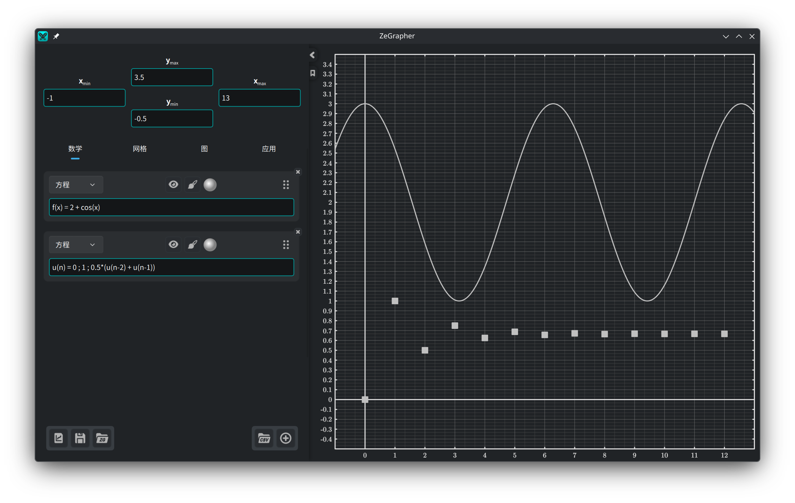

输入框的边框会用颜色标出表达式是否有效。表达式无效时，下方会给出原因。

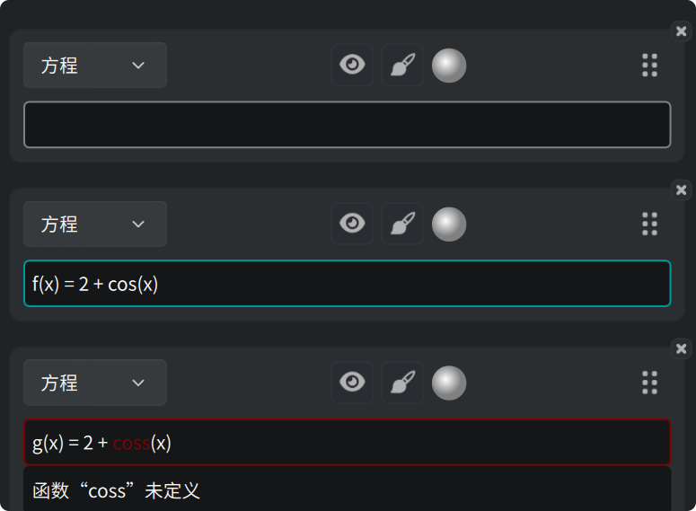

需要给出数值的输入框，例如视图的边界，可能转为警告色：
表达式本身有效，但算不出数来。

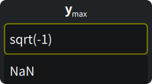

这三种颜色可以在[应用标签页](#6-应用标签页)里自己设定。

### 3.3. 常量

**常量**是一个带数值的名字。除了别的常量，任何对象都能在表达式里用到它。

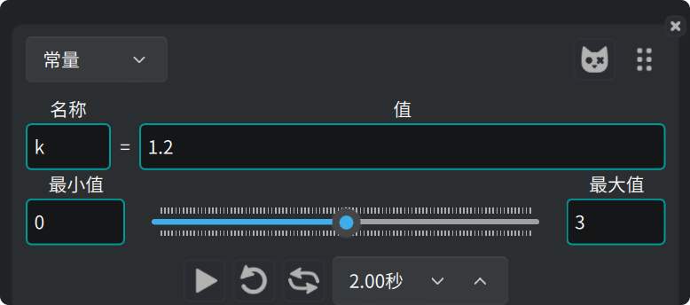

#### 3.3.1. 动画

下方的滑块让值在**最小值**和**最大值**之间变化，用到该常量的每条曲线
都会跟着动。你可以手动拖滑块，也可以让它自己播放。滑块下面那一排是动画控制：
播放、循环、往返，以及走完一趟所用的时间。

#### 3.3.2. 同时取多个值

常量卡片上的这个按钮把常量变成**薛定谔常量**。


常量于是取 `步数 + 1` 个值，在最小值和最大值之间等距分布。
用到该常量的每个对象，应用都会按值逐一绘制。

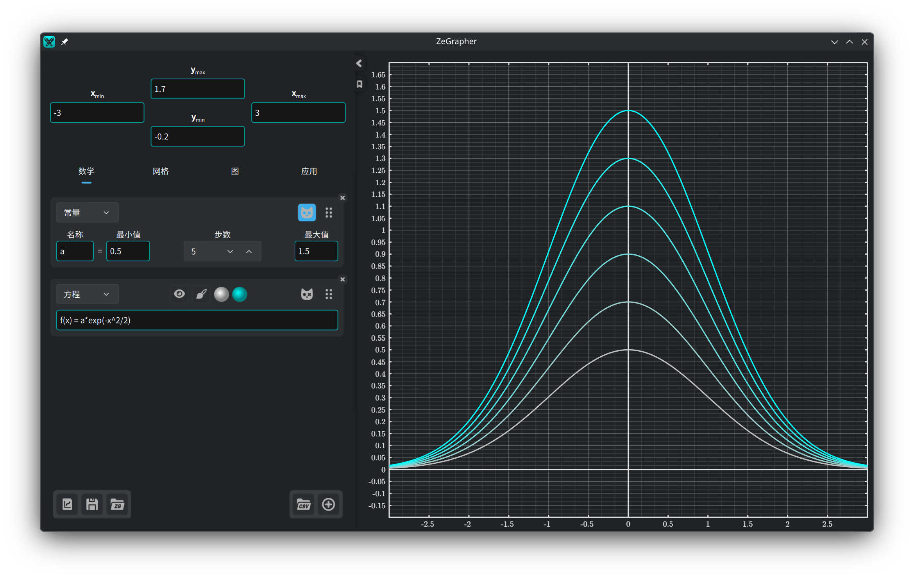

这些对象会多出一个颜色圆点。应用把这一族曲线画成从第一种颜色到第二种颜色的渐变。

### 3.4. 参数方程

参数方程是一对对象，它们给出所得曲线上每个点的坐标。在两个输入框里写上它们的名字：

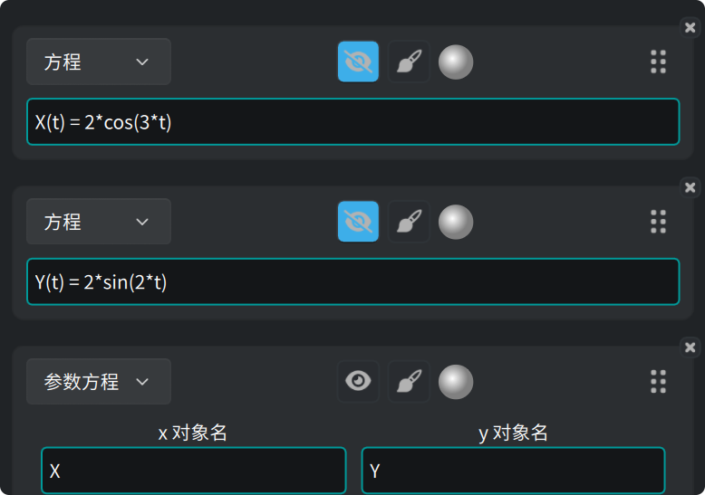

应用在**起点**和**终点**之间绘制这一对对象，两者在该参数方程的
[绘制样式](#36-绘制样式)里设定。

### 3.5. 数据

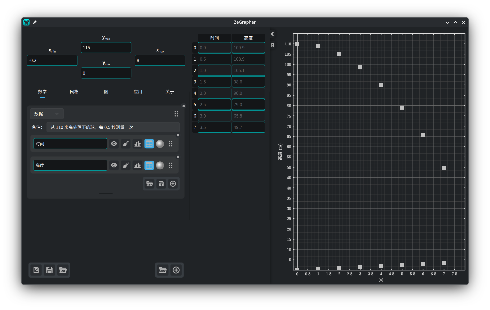

数据对象是一张由具名列组成的表。每一列本身就是一个数学对象。
它有名字、眼睛按钮、绘制样式、颜色、用来调整顺序的手柄，
以及角上删除它的 **×**。

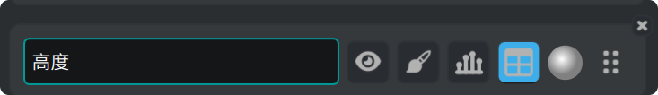

应用把一列的值按下标绘制：第一个值在 x = 0，第二个在 x = 1，依此类推。
若想把一列对着另一列画，请用[参数方程](#34-参数方程)。

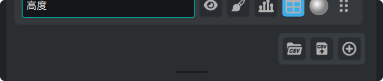

表右下角的按钮分别用来导入 CSV 文件、把各列导出为 CSV 文件，以及添加一列。
下面那条横杠可以调整这张表的高度。双击它可恢复默认高度。

#### 3.5.1. 数据表格

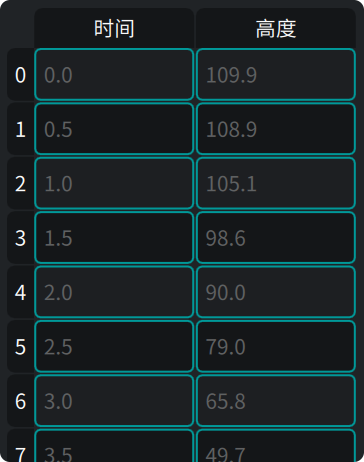

一列上的**表格**按钮把该列显示在面板旁边的表格里。在表格里：

- 点击一个单元格然后直接输入即可修改，或按 `Enter` 打开编辑器，
- 点击表头可选中整行或整列，
- 按住并拖动可选中一块矩形区域，
- 按 `Backspace` 清空选中的单元格，按 `Delete` 删除它们，
- 右键菜单里同样有这两个操作，对应*清除*和*删除*，
  还有*在上方插入行*和*在下方插入行*。两个插入操作都作用于当前单元格。

如果你删掉了一整列，对应的列对象也会被删除。

#### 3.5.2. 用对象填充一列

一列上的柱状图按钮会打开一个小表单：写上一个对象，再给出**起点**、
**终点**和**步长**。确认按钮会对该对象采样，并把结果写进这一列。

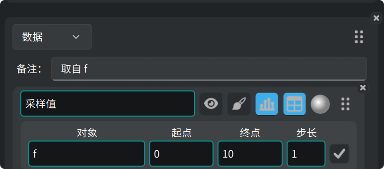

#### 3.5.3. 导入 CSV 文件

CSV 按钮在数据表上；数学标签页底部也有一个，用来新建一张表。

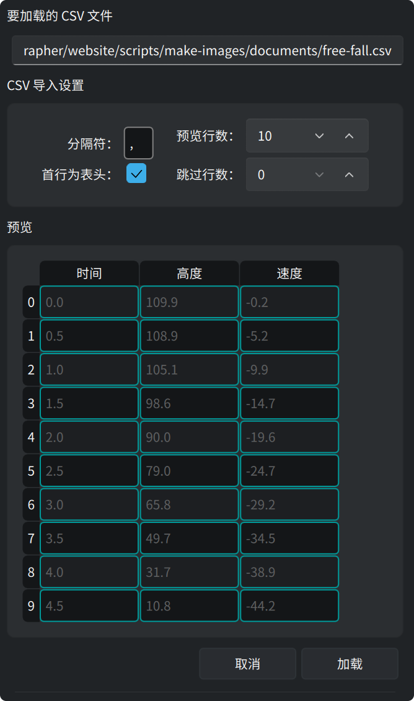

它会打开文件选择框。随后侧栏显示文件的预览和读取选项。每改一项，预览就跟着变：

- 设定分隔符（制表符写 `\t`）。
- 设定文件开头要跳过的行数（比如注释或额外参数）。
- 指明第一行是否为列名。
- **预览行数**是预览显示的行数。
- **加载**按预览的内容建出各列。
- **取消**则什么都不改。

我们在数百万单元格的 CSV 文件上测试过 ZeGrapher。

### 3.6. 绘制样式

画笔按钮打开一个对象的绘制设置：

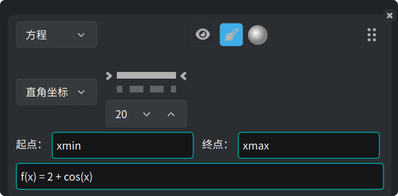

- **直角坐标**或**极坐标**。
- 线型——实线、虚线、点划线、点线，或者不画线——以及线宽。
- 对于画成点的对象（数列和数据），可设点的形状和大小。
- **起点**和**终点**：应用绘制该对象的区间。默认值是 `xmin` 和 `xmax`，
  也就是视图的边界。两个输入框都接受任意表达式，例如 `-math::pi` 和
  `4*math::pi`。

## 4. 网格标签页：刻度与网格

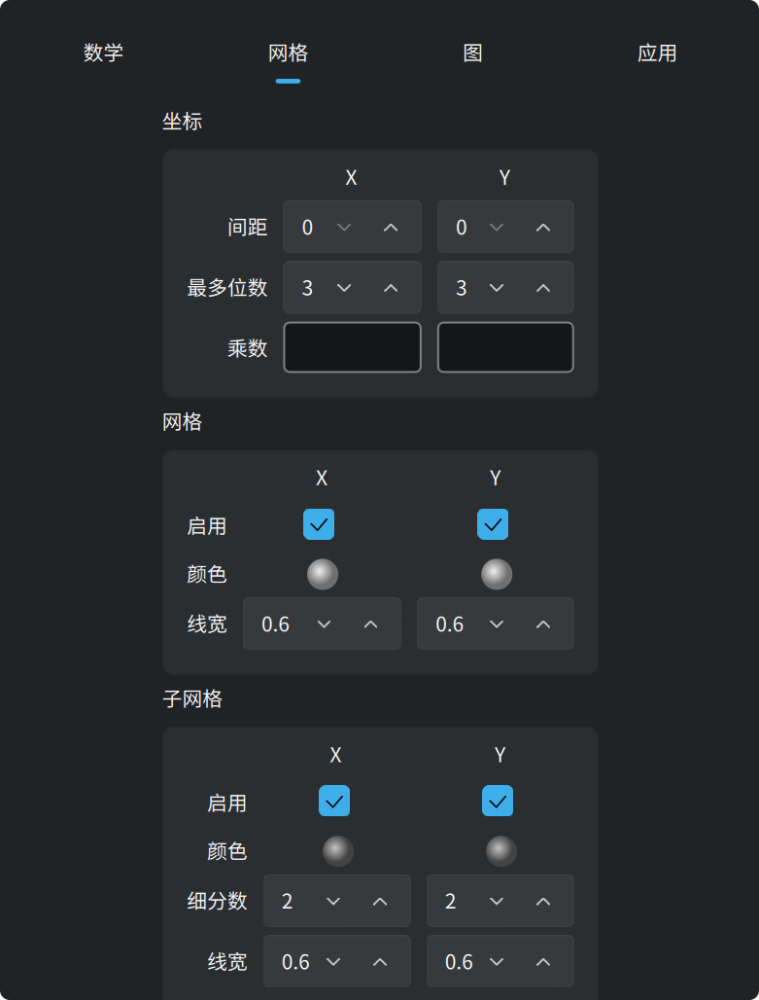

**坐标**决定沿轴排列的那些数字：它们的间距、可用的位数，以及一个**乘数**。
乘数是一个表达式，所以刻度可以取 `math::pi` 的倍数，标签也就写成它的倍数。

**网格**和**子网格**的 x 和 y 分开设定。每一项都有颜色、线宽，
以及显示或隐藏它的开关。子网格还能设定每格切成几份。

## 5. 图标签页：外观与精度

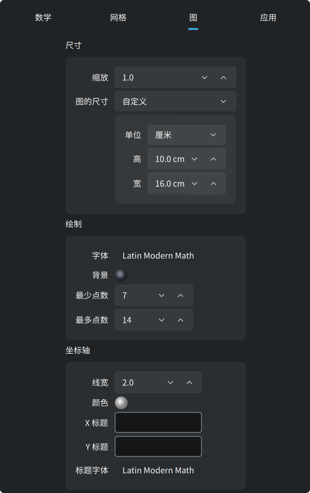

默认情况下，图铺满整个窗口。把顶部**尺寸**框里的**图的尺寸**设为*自定义*，
图就变成一张你指定大小的纸。这个大小按像素计，也可以按**真实厘米**计。
一厘米在屏幕上就是真实的一厘米，导出为 `pdf` 或 `svg` 后依然如此。
同一个框里的**缩放**用一个设置放大或缩小整幅画。

应用把这张纸当作窗口里的一页来画，上方带一条缩放条：


这条缩放条把纸在屏幕上放大或缩小，也接受一个缩放百分比。最后一个按钮
让整张纸正好装进窗口。这个缩放只改变应用画这张纸的大小，视图的边界保持不变。

**尺寸**下面的两个框：

- **绘制**：图的**字体**和**背景**颜色。**最少点数**和**最多点数**
  是应用为每条连续曲线计算的点数，按 2 的幂给出。点越多，曲线越细腻，
  画得也越慢。
- **坐标轴**：线宽、颜色、沿 x 和 y 写的标题，以及这些标题用的字体。

## 6. 应用标签页

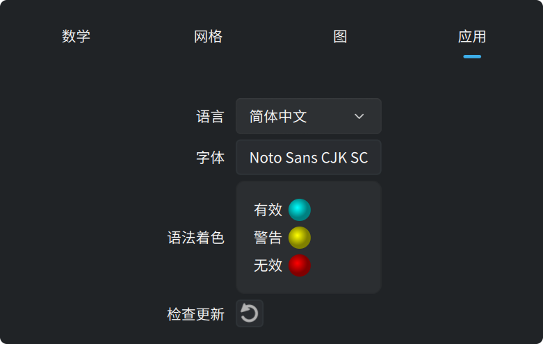

这个标签页有界面的语言和字体，还有输入框的三种颜色：有效、警告和无效。
最后一个按钮向 zegrapher.com 询问有没有更新的版本。
